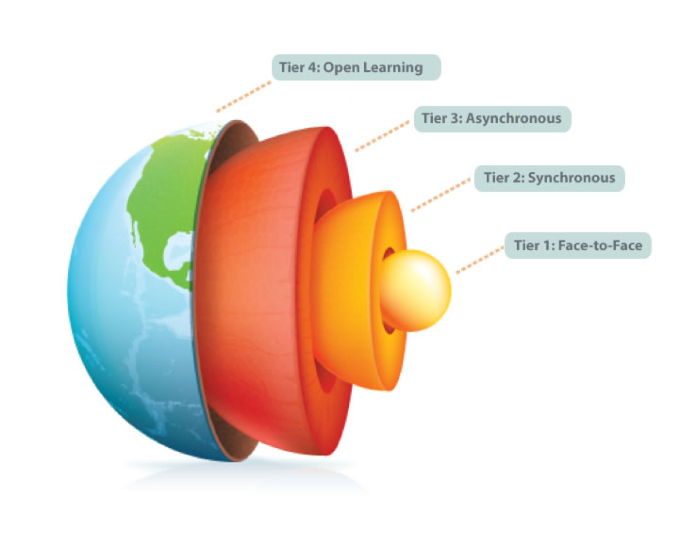

# Online Teaching and Learning
## Trinity Western University

[ui-tabs position="top-left" active="0" theme="lite"]
[ui-tab title="What is Multi-Access Learning"]

Traditionally, learning modalities have been presented as a binary of face-to-face or online learning. Blended learning emerged as a term that focused on the consecutive mixing of face-to-face and online modalities. For example ½ of the instructional hours being held face-to-face and the other half being designed for online learning experiences, which were mostly asynchronous, meaning interactions were not happening at the same time.

As communication technologies became more advanced, online interactions started to become more synchronous, which means interactions were happening live, or at the same time. This blurred the boundaries of face-to-face and online modalities. Blended became a term that could not capture all of the interaction designs, so new terms emerged to communicate to remote learners that they, in fact, had a chance to participate fully online, even though the course had a physical presence on campus.

Multi-access learning was first introduced in 2009 by Dr. Valerie Irvine at the University of Victoria to capture this emerging design. She describes it as supporting learner personalization of modality preferences and it comes with many positive impacts for addressing social justice and human rights issues, such as accessibility and inclusivity – for remote and rural learners, for learners with disabilities that might otherwise prevent them from physically attending classes, and for supporting flexibility to those with child or elder care commitments. Other models have also emerged trying to capture the the same idea, calling their models HyFlex, Blended Synchronous, Synchronous Hybrid, and more.

Multi-access learning proposes that learners can personalize their modality preferences, which may include face-to-face on campus, synchronous online, asynchronous online, and extends even to open access. Our learning community already exists, so the focus is on helping our community do what it needs to do, which is to learn together, albeit in diverse ways.

Often multi-access learning looks like at least one video-enabled classroom with remote or co-located learners joining in via synchronous video. Decentralized synchronous video meets among learning pods are encouraged to support rich discourse and community-building. Audio-only access with shared resources for any synchronous sessions is an option for those in locations with poor bandwidth. Asynchronous access is also supported. This can take the form of recorded video and other educational resources, learner blogs, a backchannel for text communication, and perhaps public engagement via social media and sharing open educational resources publicly. What makes multi-access unique is the consideration of asynchronous and open access. As we consider more open scholarship in research activities as a responsibility to taxpayers and to the global good, multi-access learning also proposes we consider expanding open access to course or learner materials and/or instructor or learner engagement within the limits for supporting ethical practices recognizing privacy and digital consent.

As we work and learn together in more ways online, the idea of setting a modality for a class unravels. Some learners will experience what feels more like a face-to-face course as they gather together in person on campus. Others will be remote online learners accessing the course individually from afar and may “feel more online” as a result. Some might be gathering in a small pod remotely, so may get a sense of having physical presence, but will be engaging with the majority of class online. Lastly, some learners may experience a blended course as they choose to switch between online and on campus access. Ultimately, we are one community of learners, learning together.

If we designed for multi-access courses at the beginning, our institutions would be more resilient to pivots to online, such as we have experienced with COVID-19 and we could support more inclusive and accessible practice simultaneously.

We won’t know when we will be able to reopen for learning on campus again, but that return may not be a uniform pathway for everyone – for both instructors and learners - due to risk assessment for those immunosuppressed, those living with a vulnerable family member, or those international arrivals having to quarantine.

<!---
[Learn more about Multi-Access Learning](https://multi-access.twu.ca/info)
--->

[/ui-tab]
[ui-tab title="Teaching ONline Effectively (TOnE)"]

We have developed a mini-course called Teaching ONline Effectively (TOnE) to help you think about and design the scenarios that we will be attending to in the Fall semester.

The course is designed intentionally to develop and nurture a Community of Reflection and Practice (CORP) and connect you with colleagues (inside and outside your department) who are working on many of the same issues as you will be. This structure of learning pods is a high impact teaching practice that we hope you will implement in your own courses.

[You are encouraged to view the course materials online](http://multi-access.twu.ca/tone/), as they provide helpful links on course design, assessments, and digital tools, as well as providing an example of a developed online course.

[/ui-tab]
[ui-tab title="Course Design"]

sample text

[/ui-tab]
[ui-tab title="Other Resources"]

We also provide a self-serve, just-in-time resource for faculty and students looking for assistance with teaching and learning technologies. [You can view the Online Learning On-Ramp here.](https://create.twu.ca/help/online-learning-on-ramp/multi-access)

Scott Macklin hosts a podcast called [*Learning Matters: A Bridge to Practice*](https://tinyurl.com/learningmatters-twu) with Season 1 dedicated to *Teaching with Care and Building Community During a Pandemic*.

[Take a peek behind the scene in *Backstage to a Course*](https://create.twu.ca/help/online-learning-on-ramp/multi-access), a web-story about an example Multi-Access course.

[/ui-tab]
[/ui-tabs]
