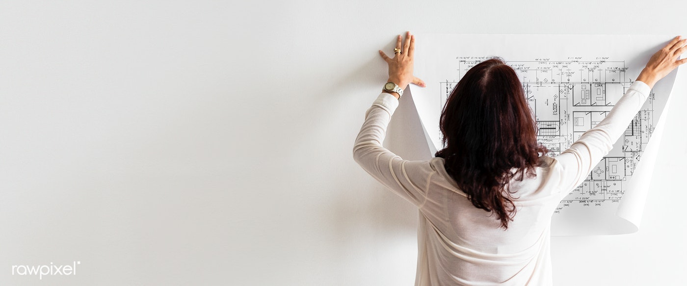

## Topic 1: Course Design Process

Imagine you win the lottery and have a couple million dollars to design your dream house.  What would it look like?  Where would it be?  Who would live in it with you?

If you actually had to do the work to map out the blueprint of your house, what are the components?  What is the layout and design?  What motivates you to make those design choices?

Designing a course is like planning, building, and moving into a house.  You start with asking some key questions:
- What is the course?  What are the ‘big picture‘ ideas, or the main take-aways?
- How does this course fit in with the program?
- If a previous course exists, has there been any feedback from students and instructors?
…and the most important questions:
- Who are the students?  What is the typical age, gender, work experience, culture, etc.? What are their interests, learning styles, and needs?​

Another strategy to use before getting into the details of a course is identifying the **Big Ideas** (Wiggins & McTighe, 2005). Below is an image from Stanford University (adapted) that takes us through the process of deciding the big ideas, essential questions, key knowledge and skills, and learning activities.

### Learning Activities
[plugin:content-inject](../_2-1)

In the next sections, we'll have a closer look at the design models that influence us, as well as the course design process at TWU.
