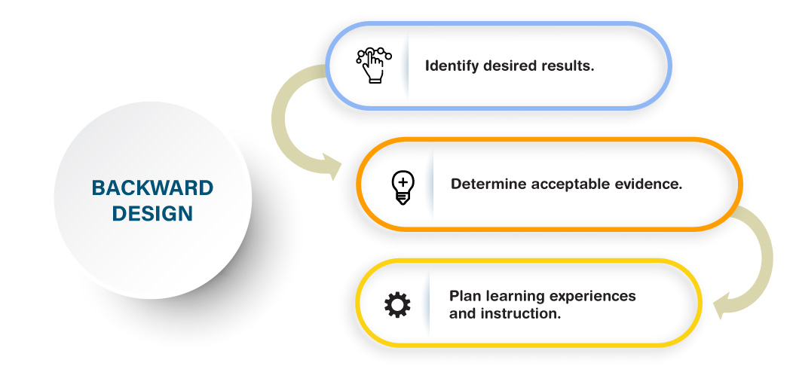

### Backward Design
**Backward Design** (Fink, 2003; Wiggins & McTighe, 2005) is a contrast to the traditional method of designing curriculum, which often starts with identifying the topics (or chapters in a textbook), and then maps out the weekly lessons according to those resources. With the backward approach, we focus first on the end results, which helps map out the course and leads to more productive activities and assessments.

**To plan your course, here are the 3 stages using Backward Design:**
1. We first focus on the *target*: what knowledge, skills or attitudes do we want students to have at the end of the course? Essentially, what are the course **learning outcomes**?
2. Second, how will learners *demonstrate* that they have the knowledge, skills or attitudes identified?  What **assessment** strategy will show students level of understanding of the course learning outcomes?
3. Finally, what learning *experiences* will help students achieve this?  What **activities** will scaffold students' learning, engage them in the topics, and allow them to practice or develop their understanding of the course learning outcomes?

&nbsp;

📺 Watch the following 5 minute video on Backward Design.  

<iframe width="1120" height="630" src="https://www.youtube.com/embed/XwlUhS_hxBY" title="YouTube video player" frameborder="0" allow="accelerometer; autoplay; clipboard-write; encrypted-media; gyroscope; picture-in-picture" allowfullscreen></iframe>

Note in the video how they emphasize the connections between the three key components of the course: **Outcomes**, **Assessment**, **Activities**.  Learning outcomes inform assessment and activity choice; activities are designed to prepare students for assessments to demonstrate understanding of the outcomes.

As you design your course outcomes, assessments, and learning activities, keep in mind what will motivate and inspire your students.

🔎 For more on Backward Design, view the website and video [Understanding by Design](https://cft.vanderbilt.edu/guides-sub-pages/understanding-by-design/).
