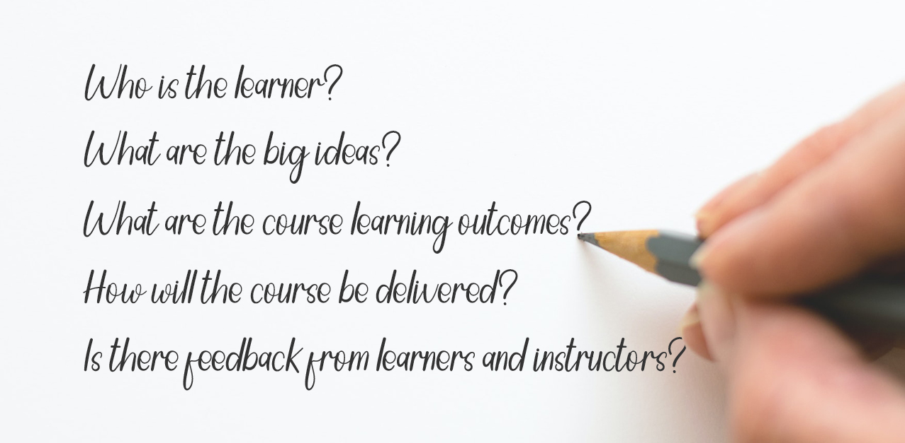
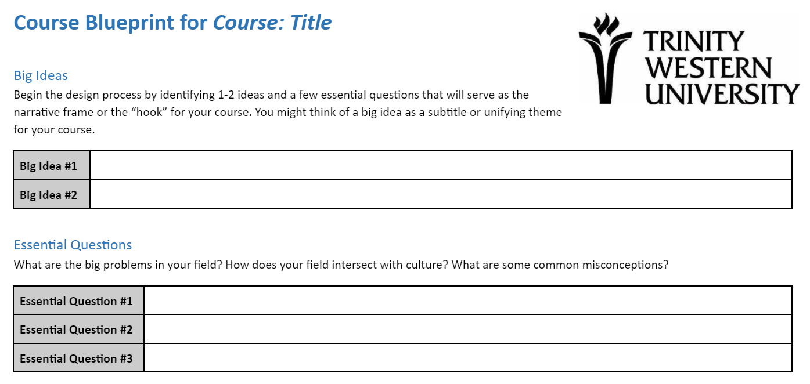
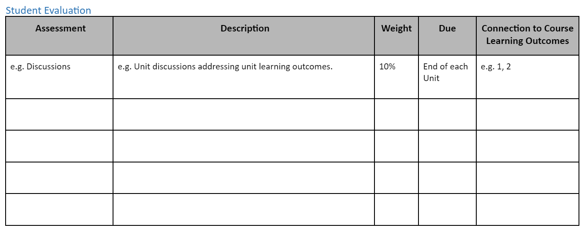
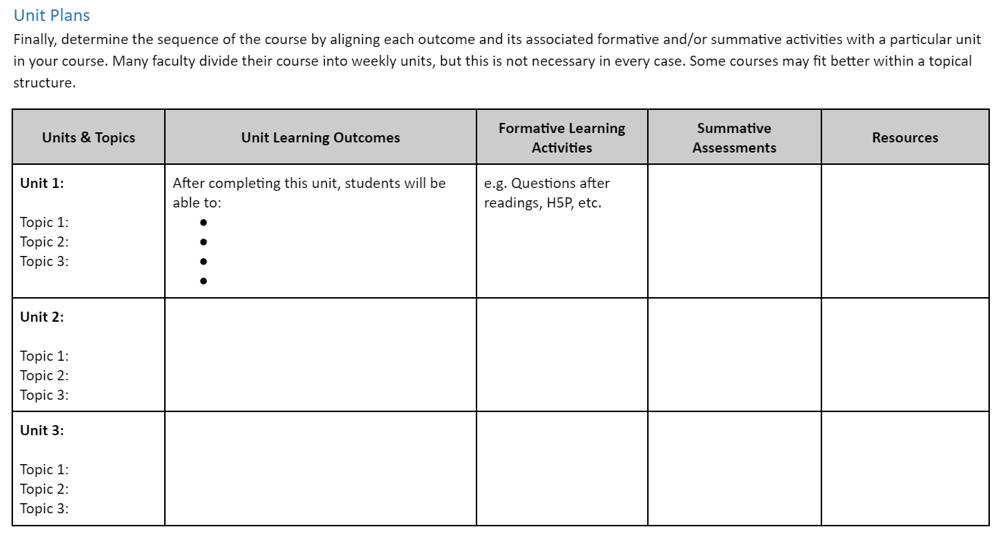

# Planning Your Online Courses

[ui-tabs position="top-left" active="0" theme="lite"]
[ui-tab title=Key Planning Questions"]

[/ui-tab]
[ui-tab title="Key Planning Questions"]

Designing a course is like planning to build a house. There are a lot of details to think through, and you start with asking some key questions, such as who is the house for, what features are required, what support is needed, what will make it feel like a home?, etc.
### Key Planning Questions

Similarly, for course design, we ask:

❔ Who is the **learner**?  What is the average age, work experience, culture, etc.? What are their interests, learning styles, and needs? Why are they taking the course?  
❔ Why is this course important?  What are the **big ideas**, or the main take-aways for learners?   
❔ What are the course **learning outcomes?** How will students demonstrate their understanding of these outcomes?  
❔ How will the course be **delivered**?  How will students connect with their peers, with the instructor, and with the content?  
❔ If a previous course exists, has there been any **feedback** from students and instructors?

Notice, we didn't start with these questions...

📕 What textbook should I use for the course?  
📘 What topics are covered in the textbook chapters?  
📗 What publisher resources are available (e.g. testbank, PowerPoint presentations)?  
📙 What topics will fit into my 16 weeks course?  

Instead, we use what's called **[Backward Design](https://multi-access.twu.ca/learning-design/backward-design)** to develop the course.

[/ui-tab]
[ui-tab title="Backward Design"]
### Backward Design
**Backward Design** (Fink, 2003; Wiggins & McTighe, 2005) is a contrast to the traditional method of designing curriculum, which often starts with identifying the topics (or chapters in a textbook), and then maps out the weekly lessons according to those resources. With the backward approach, we focus first on the end results, which helps map out the course and leads to more productive activities and assessments.

**To plan your course, here are the 3 stages using Backward Design:**
1. We first focus on the *target*: what knowledge, skills or attitudes do we want students to have at the end of the course? Essentially, what are the course **learning outcomes**?
2. Second, how will learners *demonstrate* that they have the knowledge, skills or attitudes identified?  What **assessment** strategy will show students level of understanding of the course learning outcomes?
3. Finally, what learning *experiences* will help students achieve this?  What **activities** will scaffold students' learning, engage them in the topics, and allow them to practice or develop their understanding of the course learning outcomes?

&nbsp;

📺 Watch the following 5 minute video on Backward Design.  

<iframe width="1120" height="630" src="https://www.youtube.com/embed/XwlUhS_hxBY" title="YouTube video player" frameborder="0" allow="accelerometer; autoplay; clipboard-write; encrypted-media; gyroscope; picture-in-picture" allowfullscreen></iframe>

Note in the video how they emphasize the connections between the three key components of the course: **Outcomes**, **Assessment**, **Activities**.  Learning outcomes inform assessment and activity choice; activities are designed to prepare students for assessments to demonstrate understanding of the outcomes.

As you design your course outcomes, assessments, and learning activities, keep in mind what will motivate and inspire your students.

🔎 For more on Backward Design, view the website and video [Understanding by Design](https://cft.vanderbilt.edu/guides-sub-pages/understanding-by-design/).

To continue with the next steps in course planning, see the [Blueprint Stage](https://multi-access.twu.ca/learning-design/blueprint)

[/ui-tab]
[ui-tab title="Course Blueprint"]
## Creating a Course Blueprint
To help you plan your course, we develop a course blueprint that maps out key components of the course.
Feel free to use/copy the [TWU Course Blueprint Template](https://docs.google.com/document/d/1EaxSXVEe8fwqXXRJITg-RCAdtD69Uaza7wSjwkXsQro/edit?usp=sharing) on Google docs.

Here are key steps in filling out a blueprint: (Click the title on the steps below)

[ui-accordion independent=true open=none]

[ui-accordion-item title="STEP 1: Big Ideas and Essential Questions"]

One strategy we use before getting into the details of a course is identifying the **Big Ideas** (Wiggins & McTighe, 2005). Below is an image from Stanford University (adapted) that takes us through the process of deciding the big ideas, essential questions, key knowledge and skills, and learning activities.

The first part of the blueprint asks you to identify 1-2 ideas and a few essential questions
that will serve as the narrative frame or the “hook” for your course. You might
think of a big idea as a subtitle or unifying theme for your course. In an inquiry-based approach to learning, what are some **essential questions** learners may ask throughout the course?

!!! As you consider your big ideas and essential questions, it might help to talk to your colleagues! Some departments suggest a literature review before you start the design process, so you can address these ideas and questions based on current research.

[/ui-accordion-item]

[ui-accordion-item title="STEP 2: Course Description"]

Next, we have a look at the course description.  Does the description cover the big ideas or themes of your course?  Does it address or align with the course learning outcomes (we'll address these in the next section)?  Does it have unnecessary information that may change with various versions of the course (e.g. class activities that may not apply to online cohorts, assignments or resources that may change, etc.)?

Consider your course description as a hook to get students interested in your course. It should summarize what they will learn, and should imply why it matters, or how they will apply this learning experience.

!! Note that if there are any changes to a course description, these need to be approved by Senate.  

[/ui-accordion-item]

[ui-accordion-item title="STEP 3: Course Learning Outcomes"]

Third, we identify the learning outcomes we want students to achieve. Learning outcomes describe what learners will be able to *know, do and value* after a learning experience. They clearly explain the knowledge, skills, and attitudes students will gain through a course.

It is crucial to have measurable learning outcomes listed on the course outline, as they communicate expectations to the learner and help guide the instructor.  

Note that for each course learning outcome, we need to identify the [TWU Student Learning Outcome](https://www.twu.ca/academics/student-learning-outcomes) it aligns with.  In this part of the blueprint we ask you to categorize your learning outcomes, and begin to think of possible learning artifacts, or evidence of learning.

## Writing Effective Learning Outcomes

The diagram above illustrates the five key principles in designing learning outcomes.  They must be specific and clear, instructors must be able to measure successful completion of an outcome, and learners must be able to achieve them.  Learning outcomes should also be relevant to the course and achievable within the time period allotted.

! By the end of the course, students will be able to...

The verb that follows in this sentence is crucial.  It identifies not only what students will **do** to show their understanding of the outcome (e.g. analyze, compare, create, etc.), but to **what level** of understanding they will have if they are successful in the assessment.  To help select the appropriate verb, here are some key resources we use in writing learning outcomes:

### Bloom’s Taxonomy
We often use Bloom’s Taxonomy to help write learning outcomes. The graphics below lists possible verbs to use in a learning outcome, as well as examples of activities and/or assessments.  Just to give one example, if you are assessing the domain of analysis by asking student to compare, you may ask them to create and administer a survey.  As you write your outcomes, what **[Higher Order Thinking Skills](https://en.wikipedia.org/wiki/Higher-order_thinking) (HOTS)** are you promoting?

See the following images that suggest key verbs related to learning activities.

*"Bloom's Taxonomy" [flickr photo by Vandy CFT](https://flickr.com/photos/vandycft/29428436431) shared under a Creative Commons (BY) license*

For more, see [Revised Bloom’s Taxonomy](https://www.celt.iastate.edu/teaching/effective-teaching-practices/revised-blooms-taxonomy/) from Iowa State University.

### Significant Learning
Fink (2003) described learning as change in the learner.  How can we tell what has changed in our students, or how the course has impacted them?
In his book, *Creating Significant Learning Experiences: An Integrated Approach to Designing Colleges Courses*, he asks instructors to consider what students will take away from the course.  What are the long-term goals?  What will they remember?

The image here shows Fink’s Taxonomy of Significant Learning.  Consider the various categories of learning as you write your outcomes.  Will students apply their learning?  Learn about themselves or others?  Value a new idea or perspective? Become a self-directed learner?
 <small><a title="Fink Significant Learning" href="https://flickr.com/photos/lauradahl/2897475124">Fink Significant Learning</a> flickr photo by <a href="https://flickr.com/people/lauradahl">Laura B. Dahl</a> shared under a <a href="https://creativecommons.org/licenses/by-nc/2.0/">Creative Commons (BY-NC) license</a> </small>

### SOLO Taxonomy
Another great resource that can help you write effective learning outcomes is the *Structure of Observed Learning Outcomes (SOLO)* created by John Biggs and K. Colis. The images below show the 5 levels of understanding.  As you write your outcomes, consider the increasing complexity of understanding students can demonstrate through assessments.  How will they know what level they are at?  Try to incorporate descriptions in a grading rubric that explain the connections you want students to make (e.g. analyze, compare, hypothesize, predict, etc.)  

Source: Diagram giving an overview of the SOLO Taxonomy approach. [Wikipedia](https://commons.wikimedia.org/wiki/File:Structure_of_Observed_Learning_Outcomes_SOLO_Taxonomy.png)

For more information, see [SOLO Taxonomy - John Biggs](https://www.johnbiggs.com.au/academic/solo-taxonomy/).

Other great resources:
- [Learning Outcome Generator](https://elearn.sitehost.iu.edu/courses/tos/gen2/)
- [Learning Objectives Maker](https://learning-objectives.easygenerator.com/)

[/ui-accordion-item]

[ui-accordion-item title="STEP 4: Course Assessment"]
Once we know where students are going (learning outcomes), we need to know how students will show that they've met the learning outcomes. There should be a clear link between what we ask students to do in the assignment, and what is stated in the related learning outcome.

### Alternative Forms of Assessment  
A summative assessment does not have to be an exam, but can instead be a
portfolio, website, video, conversation, research paper, presentation,
case study, plan, or project.  These often allow students to demonstrate prior learning and allow for more authentic assessment - that is personalized tasks that relate to their profession.

This section in the blueprint asks instructors to connect assessment to the course learning outcomes that are demonstrated.

[/ui-accordion-item]

[ui-accordion-item title="STEP 5: Unit Planning"]

Perhaps the most time-consuming part of the blueprint is the unit plan.  In this section, we determine the sequence of the course by aligning each outcome and its
associated formative and/or summative activities with a particular unit in your
course. Many instructors divide their course into weekly units, but it's important to have more of a topical structure. This allows for more flexibility for condensed courses, and helps to focus specific topics to their related unit learning outcomes.

!!!! *A note about Learning Activities*: Once you know what learners will do and how well they will do it, consider the formative learning activities which will **scaffold** the learners' progress towards the proficiency targets for each outcome. Upon completion of a formative learning activity, learners should know how they performed relative to the priority course outcome and specifically how they can close the gap between their actual performance and the expected performance. Faculty, likewise, should know what each learner needs to do to close the gap and they should also know how to differentiate future learning activities in order to address misconceptions.

**Blueprint Examples**
Below is one example of part of a blueprint document. Again, feel free to use/copy the [TWU Course Blueprint Template](https://docs.google.com/document/d/1EaxSXVEe8fwqXXRJITg-RCAdtD69Uaza7wSjwkXsQro/edit?usp=sharing) on Google docs.

[/ui-accordion-item]

[ui-accordion-item title="STEP 6: Resources"]

A final section of the blueprint is dedicated to a resource list.  As a blueprint is simply a planning document - one that can and will change as you develop the course - feel free to add resources you are thinking of using.

Our online team often encourages instructors to consider Open Educational Resources (OERs). If you're interested in exploring OERs and other course resources, please see the [Resources](https://multi-access.twu.ca/learning-design/resources) section.

[/ui-accordion-item]

[/ui-accordion]

!!! If you are a Course Developer working with an Instructional Designer, please see our Course Developer's page for more information on the course design process at TWU.

---

[/ui-tab]
[ui-tab title="Unit Writing"]

Image by <a href="https://pixabay.com/users/isdiva-657557/?utm_source=link-attribution&amp;utm_medium=referral&amp;utm_campaign=image&amp;utm_content=572776">Bonnie Taylor, EdD</a> from <a href="https://pixabay.com/?utm_source=link-attribution&amp;utm_medium=referral&amp;utm_campaign=image&amp;utm_content=572776">Pixabay</a>

### Setting the Stage

Imagine you're driving to the TWU Langley campus, reviewing in your head the lecture you're about to give your class.  It's on a topic you are stoked about - and you hope your students will understand the concepts and be inspired by the lesson.

You go over your opening: First, a welcome message to students, talk a bit about the previous lesson, perhaps some comments on a recent assignment submission.  And then, you introduce the topic.

How will you hook your learners so they stay motivated and engaged? Start with a story? A metaphor? Bring in a current event?  Play a video clip or song?

When describing what you'll go over in the lecture, what key points will you give them a preview of?  How will you summarize the topics in a way that learners are intrigued and want to know more?

Now, imagine you had to do this online...asynchronously.

### Unit Writing

When we write our units, we first consider our online learners. They may be sitting at a desk, after a long day of work/studies/  They have 2 hours to study tonight.  As they click on "Unit 1"...what do they see and read that will interest them in the topic?  How will they know what the unit is about and what activities they need to complete?

Our units typically follow a structure that allows for students to engage with the lesson, plan their time, and prepare for assignments.

See the details of the course unit template below, as well as [TWU Unit Template - ONLINE](https://docs.google.com/document/d/1XdNGUPgpYB_IKALdL7cEpwY5NH0z_ywqwxj4G-8rwYY/edit?usp=sharing) Google doc for you to copy.

### Unit Sample

<iframe scrolling="yes" style="border: 0px #ffffff none;" src="https://far.twu.ca/ba-lead/ldrs301/u3/overview/chromeless:true/hidepagetitle:true" allowfullscreen="allowfullscreen" width="100%" height="1000"></iframe>

### Unit Sections
Here are key section of a unit: (Click the title on the steps below)

[ui-accordion independent=true open=none]

[ui-accordion-item title="Overview"]
## Overview
Welcome to [*Course Title*]!  In this first unit, we begin the course by …

!!!! ***Design Note:*** Here is where we want to hook our students!  Consider what main ideas are in the unit, questions students may have, and how these apply to practice or the bigger picture.  The Overview should focus students on where the unit is heading, engage them in the content, and motivate them to succeed in the unit.

[/ui-accordion-item]

[ui-accordion-item title="Topics"]

## Topics
This unit is divided into the following topics:

Topic 1: Title
Topic 2: Title
Topic 3: Title

!!!! ***Design Note:*** There are typically 3-4 topics per unit.  Note that these will be explained in detail in the lesson below.  Here we simply list the topic titles.

[/ui-accordion-item]

[ui-accordion-item title="Learning Outcomes"]
## Learning Outcomes
When you have completed this unit, you should be able to:  
- Describe...
- Contrast...
- Analyze...
- Determine...
- Create...

!!!! ***Design Note:*** Be sure to write SMART learning outcomes!  See the Learning Outcomes section on the [Blueprint page](https://multi-access.twu.ca/learning-design/blueprint), as it has helpful verb ideas, as well as learning outcome generators!

[/ui-accordion-item]

[ui-accordion-item title="Activity Checklist"]
## Activity  Checklist
Here is a checklist of learning activities you will benefit from in completing this unit. You may find it useful for planning your work.  

!!! **Activity 1.1:** Read...   
!!! **Activity 1.2:** Watch...  
!!! **Activity 1.3:** Explore...  
!!! **Assessment:** Complete the Unit Quiz on...  

!!!! ***Design Note:*** This checklist is a quick overview so learners get a preview of activities in the unit and can plan their time.  See options for the learning activities in the next sections.

[/ui-accordion-item]

[ui-accordion-item title="Resources"]
## Resources
Here are the resources you will need to complete this unit.  
- [Textbook]  
- Other online resources will be provided in the unit.  

!!!! ***Design Note:*** Since it's an online course, we usually just add the title of the main textbook here that students may need to purchase in order to complete the unit.

[/ui-accordion-item]

[ui-accordion-item title="Topic 1"]

## Topic 1: Title
We begin Unit 1…

!!!! ***Design Note:*** Topic content can be 1-2 paragraphs or several pages, depending of course on the topic!  Consider using graphics, charts, or other images to convey information and appeal to visual learners.

[/ui-accordion-item]

[ui-accordion-item title="Learning Activities"]

### Learning Activities

#### Activity 1.1: Title (e.g. Read, Reflect and View)

[add content]

1. View the following resources about...
2. Next, watch the following videos that illustrate...

#### Questions to Consider

After completing the activities above, consider the following questions:
- ...?
- ...?

*Note that the learning activities in this course are ungraded, unless specified. They are designed to help you succeed in your assessments in this course, so you are strongly encouraged to complete them.*

!!!! ***Design Note:*** Learning Activities are usually non-graded, and can be optional for students, however they are designed to help students learn the material and prepare for the assignments.
!!!! Here are some common activities: (see more in activities section below)
!!!! - Icebreakers (connect students to other learners/instructors/content)
!!!! - Readings (text, articles, websites)
!!!! - Videos (youtube, instructor videos)
!!!! - Reflection questions to consider

!!!! ***Design Note:*** The "Questions to Consider" feature gives students an opportunity to reflect on readings and make connections, encouraging higher order thinking.
!!!! You may also want to include notes for learners to remind them why a specific activity is important – not just for the grade, but perhaps applicable to their personal or professional lives.

[/ui-accordion-item]

[ui-accordion-item title="Topic 2"]

Let's explore our next topic on...

[/ui-accordion-item]

[ui-accordion-item title="Learning Activities"]

#### Activity 1.2: Case Study
Read the following case study and consider what you would do in the situation.
What ethical issues arise?

! As a manager, you discover that one of your employees is on Facebook during the workday. Whether it is a quick check for messages or spending minutes reading the news feed, this constitutes stealing from the company.  What should you do as a manager and why? What perspectives should you consider and why? For example, consider how your response to this situation may vary depending upon whether you think moral value is objectively true or only subjectively true. What are the consequences of the actions you feel you must take?

*Note that you may be asked to review this case or similar cases in your class discussion groups. You may want to prepare by relating the case to your readings. Specifically, identify the ethical issues and terms to help explain the case.*

!!!! ***Design Note:*** Case studies are great application activities. Consider how learners can apply the topic the their personal or professional contexts. These ungraded learning activities can also help learners prepare for any synchronous class activities (e.g. zoom sessions or Learning Labs).

[/ui-accordion-item]

[ui-accordion-item title="Topic 3"]

Our final topic of the unit focuses on...

[/ui-accordion-item]

[ui-accordion-item title="Learning Activities"]

#### Activity 1.3: Title

!!!! ***Design Note:*** In each unit, consider having 2-3 recommended activities, and perhaps 1-3 optional activities. Again, these should engage students in the content and prepare them for the graded assessments. Other activities include:
!!!! -	Case Studies
!!!! -	Simulations / Role Plays
!!!! -	Problems / Debates
!!!! -	Current Events
!!!! -	Graphic Organizers
!!!! -	Short-write  (ex. Muddy/clear point)
!!!! -	Interviews (friends/family)
!!!! -	Field Trip (do something in the community /workplace)
!!!! -	Survey / poll
!!!! -	Social media
!!!! -	Experiments
!!!! -	Games
!!!! -	Textbook online resources (flashcards, quizzes, etc.)

#### Activity 1.4: Key Terms Quiz (ungraded)
In order to review some of the major concepts from the text, take the following unmarked  quiz.  Although you will not be evaluated on these terms, they will assist you in the assignments for this course.

Match the following terms to their correct definition.
1.	Term – definition…
2.	Term – definition…
3.	Term – definition…

!!!! ***Design Note:*** If learners need to memorize vocabulary in your course, whether for exams, quizzes , or other assignments, you may want to provide an opportunity for them to practice and identify what needs further study.  Quizzes can be multiple choice, matching, true-false, or short answer.  We often use H5P in our courses for vocabulary practice.  Check out some [H5P examples](https://create.twu.ca/h5p/), or see the assessment section for more ideas.

[/ui-accordion-item]

[ui-accordion-item title="Summary"]
### Unit 1 Summary
In this first unit , you have had the opportunity to learn about…
[add content]

!!!! ***Design Note:*** Remind students of a few key points and how they apply to a greater context.  You can mention the assignment or perhaps prepare them for what is in the next unit.

[/ui-accordion-item]

[ui-accordion-item title="Assessment"]
### Assessment
#### Assignment 1:

After completing this unit, including the learning activities, you are asked to…

[add content]

##### Grading Criteria:

…

!!!! ***Design Note:*** Please provide detailed instructions and a grading rubric so students know how what to expect, and the instructor will know how to mark each assessment.  See the Assessment section for example rubrics.

[/ui-accordion-item]

[ui-accordion-item title="Checking your Learning"]

### Checking your Learning
Before you move on to the next unit, you may want to check to make sure that you
are able to:

-   Describe…
-   Contrast…
-   Analyze…
-   Determine…
-   Create…

!!!! ***Design Note:*** Use the Learning Outcomes from the beginning of the unit as a checklist of understanding before students move to the next unit.

[/ui-accordion-item]

[/ui-accordion]

Again, feel free to copy the [TWU Unit Template - ONLINE](https://docs.google.com/document/d/1XdNGUPgpYB_IKALdL7cEpwY5NH0z_ywqwxj4G-8rwYY/edit?usp=sharing) as you write your unit.

[/ui-tab]

[/ui-tabs]