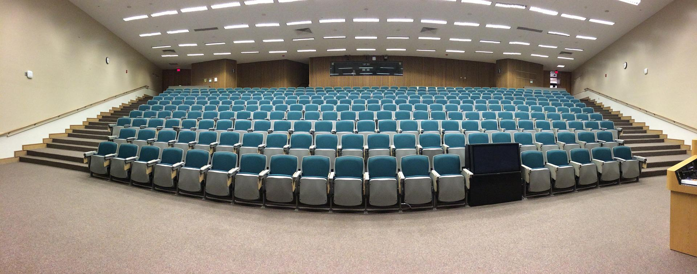

Image by <a href="https://pixabay.com/users/isdiva-657557/?utm_source=link-attribution&amp;utm_medium=referral&amp;utm_campaign=image&amp;utm_content=572776">Bonnie Taylor, EdD</a> from <a href="https://pixabay.com/?utm_source=link-attribution&amp;utm_medium=referral&amp;utm_campaign=image&amp;utm_content=572776">Pixabay</a>

### Setting the Stage

Imagine you're driving to the TWU Langley campus, reviewing in your head the lecture you're about to give your class.  It's on a topic you are stoked about - and you hope your students will understand the concepts and be inspired by the lesson.

You go over your opening: First, a welcome message to students, talk a bit about the previous lesson, perhaps some comments on a recent assignment submission.  And then, you introduce the topic.

How will you hook your learners so they stay motivated and engaged? Start with a story? A metaphor? Bring in a current event?  Play a video clip or song?

When describing what you'll go over in the lecture, what key points will you give them a preview of?  How will you summarize the topics in a way that learners are intrigued and want to know more?

Now, imagine you had to do this online...asynchronously.

### Unit Writing

When we write our units, we first consider our online learners. They may be sitting at a desk, after a long day of work/studies/  They have 2 hours to study tonight.  As they click on "Unit 1"...what do they see and read that will interest them in the topic?  How will they know what the unit is about and what activities they need to complete?

Our units typically follow a structure that allows for students to engage with the lesson, plan their time, and prepare for assignments.

See the details of the course unit template below, as well as [TWU Unit Template - ONLINE](https://docs.google.com/document/d/1XdNGUPgpYB_IKALdL7cEpwY5NH0z_ywqwxj4G-8rwYY/edit?usp=sharing) Google doc for you to copy.

### Unit Sample

<iframe scrolling="yes" style="border: 0px #ffffff none;" src="https://far.twu.ca/ba-lead/ldrs301/u3/overview/chromeless:true/hidepagetitle:true" allowfullscreen="allowfullscreen" width="100%" height="1000"></iframe>

### Unit Sections
Here are key section of a unit: (Click the title on the steps below)

[ui-accordion independent=true open=none]

[ui-accordion-item title="Overview"]
## Overview
Welcome to [*Course Title*]!  In this first unit, we begin the course by …

!!!! ***Design Note:*** Here is where we want to hook our students!  Consider what main ideas are in the unit, questions students may have, and how these apply to practice or the bigger picture.  The Overview should focus students on where the unit is heading, engage them in the content, and motivate them to succeed in the unit.

[/ui-accordion-item]

[ui-accordion-item title="Topics"]

## Topics
This unit is divided into the following topics:

Topic 1: Title
Topic 2: Title
Topic 3: Title

!!!! ***Design Note:*** There are typically 3-4 topics per unit.  Note that these will be explained in detail in the lesson below.  Here we simply list the topic titles.

[/ui-accordion-item]

[ui-accordion-item title="Learning Outcomes"]
## Learning Outcomes
When you have completed this unit, you should be able to:  
- Describe...
- Contrast...
- Analyze...
- Determine...
- Create...

!!!! ***Design Note:*** Be sure to write SMART learning outcomes!  See the Learning Outcomes section on the [Blueprint page](https://multi-access.twu.ca/learning-design/blueprint), as it has helpful verb ideas, as well as learning outcome generators!

[/ui-accordion-item]

[ui-accordion-item title="Activity Checklist"]
## Activity  Checklist
Here is a checklist of learning activities you will benefit from in completing this unit. You may find it useful for planning your work.  

!!! **Activity 1.1:** Read...   
!!! **Activity 1.2:** Watch...  
!!! **Activity 1.3:** Explore...  
!!! **Assessment:** Complete the Unit Quiz on...  

!!!! ***Design Note:*** This checklist is a quick overview so learners get a preview of activities in the unit and can plan their time.  See options for the learning activities in the next sections.

[/ui-accordion-item]

[ui-accordion-item title="Resources"]
## Resources
Here are the resources you will need to complete this unit.  
- [Textbook]  
- Other online resources will be provided in the unit.  

!!!! ***Design Note:*** Since it's an online course, we usually just add the title of the main textbook here that students may need to purchase in order to complete the unit.

[/ui-accordion-item]

[ui-accordion-item title="Topic 1"]

## Topic 1: Title
We begin Unit 1…

!!!! ***Design Note:*** Topic content can be 1-2 paragraphs or several pages, depending of course on the topic!  Consider using graphics, charts, or other images to convey information and appeal to visual learners.

[/ui-accordion-item]

[ui-accordion-item title="Learning Activities"]

### Learning Activities

#### Activity 1.1: Title (e.g. Read, Reflect and View)

[add content]

1. View the following resources about...
2. Next, watch the following videos that illustrate...

#### Questions to Consider

After completing the activities above, consider the following questions:
- ...?
- ...?

*Note that the learning activities in this course are ungraded, unless specified. They are designed to help you succeed in your assessments in this course, so you are strongly encouraged to complete them.*

!!!! ***Design Note:*** Learning Activities are usually non-graded, and can be optional for students, however they are designed to help students learn the material and prepare for the assignments.
!!!! Here are some common activities: (see more in activities section below)
!!!! - Icebreakers (connect students to other learners/instructors/content)
!!!! - Readings (text, articles, websites)
!!!! - Videos (youtube, instructor videos)
!!!! - Reflection questions to consider

!!!! ***Design Note:*** The "Questions to Consider" feature gives students an opportunity to reflect on readings and make connections, encouraging higher order thinking.
!!!! You may also want to include notes for learners to remind them why a specific activity is important – not just for the grade, but perhaps applicable to their personal or professional lives.

[/ui-accordion-item]

[ui-accordion-item title="Topic 2"]

Let's explore our next topic on...

[/ui-accordion-item]

[ui-accordion-item title="Learning Activities"]

#### Activity 1.2: Case Study
Read the following case study and consider what you would do in the situation.
What ethical issues arise?

! As a manager, you discover that one of your employees is on Facebook during the workday. Whether it is a quick check for messages or spending minutes reading the news feed, this constitutes stealing from the company.  What should you do as a manager and why? What perspectives should you consider and why? For example, consider how your response to this situation may vary depending upon whether you think moral value is objectively true or only subjectively true. What are the consequences of the actions you feel you must take?

*Note that you may be asked to review this case or similar cases in your class discussion groups. You may want to prepare by relating the case to your readings. Specifically, identify the ethical issues and terms to help explain the case.*

!!!! ***Design Note:*** Case studies are great application activities. Consider how learners can apply the topic the their personal or professional contexts. These ungraded learning activities can also help learners prepare for any synchronous class activities (e.g. zoom sessions or Learning Labs).

[/ui-accordion-item]

[ui-accordion-item title="Topic 3"]

Our final topic of the unit focuses on...

[/ui-accordion-item]

[ui-accordion-item title="Learning Activities"]

#### Activity 1.3: Title

!!!! ***Design Note:*** In each unit, consider having 2-3 recommended activities, and perhaps 1-3 optional activities. Again, these should engage students in the content and prepare them for the graded assessments. Other activities include:
!!!! -	Case Studies
!!!! -	Simulations / Role Plays
!!!! -	Problems / Debates
!!!! -	Current Events
!!!! -	Graphic Organizers
!!!! -	Short-write  (ex. Muddy/clear point)
!!!! -	Interviews (friends/family)
!!!! -	Field Trip (do something in the community /workplace)
!!!! -	Survey / poll
!!!! -	Social media
!!!! -	Experiments
!!!! -	Games
!!!! -	Textbook online resources (flashcards, quizzes, etc.)

#### Activity 1.4: Key Terms Quiz (ungraded)
In order to review some of the major concepts from the text, take the following unmarked  quiz.  Although you will not be evaluated on these terms, they will assist you in the assignments for this course.

Match the following terms to their correct definition.
1.	Term – definition…
2.	Term – definition…
3.	Term – definition…

!!!! ***Design Note:*** If learners need to memorize vocabulary in your course, whether for exams, quizzes , or other assignments, you may want to provide an opportunity for them to practice and identify what needs further study.  Quizzes can be multiple choice, matching, true-false, or short answer.  We often use H5P in our courses for vocabulary practice.  Check out some [H5P examples](https://create.twu.ca/h5p/), or see the assessment section for more ideas.

[/ui-accordion-item]

[ui-accordion-item title="Summary"]
### Unit 1 Summary
In this first unit , you have had the opportunity to learn about…
[add content]

!!!! ***Design Note:*** Remind students of a few key points and how they apply to a greater context.  You can mention the assignment or perhaps prepare them for what is in the next unit.

[/ui-accordion-item]

[ui-accordion-item title="Assessment"]
### Assessment
#### Assignment 1:

After completing this unit, including the learning activities, you are asked to…

[add content]

##### Grading Criteria:

…

!!!! ***Design Note:*** Please provide detailed instructions and a grading rubric so students know how what to expect, and the instructor will know how to mark each assessment.  See the Assessment section for example rubrics.

[/ui-accordion-item]

[ui-accordion-item title="Checking your Learning"]

### Checking your Learning
Before you move on to the next unit, you may want to check to make sure that you
are able to:

-   Describe…
-   Contrast…
-   Analyze…
-   Determine…
-   Create…

!!!! ***Design Note:*** Use the Learning Outcomes from the beginning of the unit as a checklist of understanding before students move to the next unit.

[/ui-accordion-item]

[/ui-accordion]

Again, feel free to copy the [TWU Unit Template - ONLINE](https://docs.google.com/document/d/1XdNGUPgpYB_IKALdL7cEpwY5NH0z_ywqwxj4G-8rwYY/edit?usp=sharing) as you write your unit.
