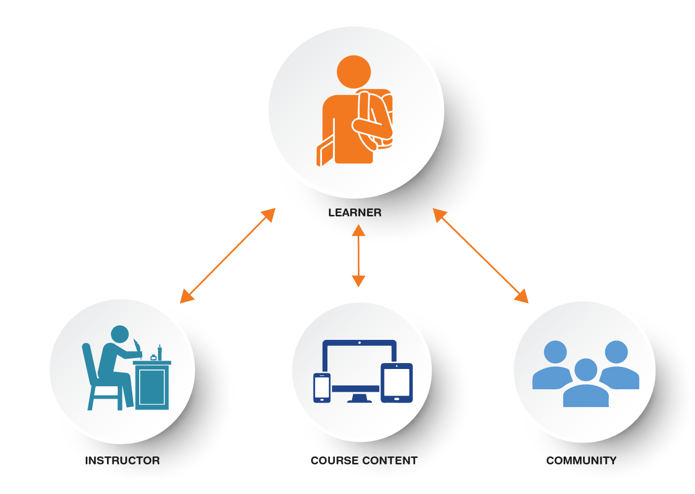

# What Makes a Quality Online Course at TWU?

Trinity Western University is recognized for its commitment to excellence in teaching and learning. As you navigate through this section of our website, we invite you to explore and gain valuable insights into the nature of TWU Online courses.

Built upon a robust quality framework, our online courses are designed to provide an engaging and enriching educational experience. We focus on three essential pillars: structure, connection, and inclusion.

> **STRUCTURE**: Our courses are thoughtfully crafted within a well-organized learning environment. Learners benefit from clear instructions, well-defined expectations, and intuitive navigation, ensuring a seamless and structured learning journey.

> **CONNECTION**: We prioritize meaningful connections within our online courses. Learners have opportunities to engage with instructors, foster a sense of community with fellow students, and actively interact with course content in ways that promote deep understanding and engagement.

> **INCLUSION**: Our commitment to inclusion is at the heart of our online courses. We strive to create an accessible and supportive learning environment that embraces diversity, promotes cultural responsiveness, and nurtures a sense of belonging for all learners.

We invite you to delve into the sections below to gain a comprehensive understanding of how Trinity Western University approaches online course design, fosters connections, and cultivates an inclusive and welcoming learning environment for all participants.

[ui-tabs position="top-left" active="0" theme="lite"]
[ui-tab title="Learning Environment"]

At TWU, we primarily use Moodle as our Learning Management System (LMS).  We also support WordPress, as well as other ways to display course content (Bookdown, Pressbooks, etc.).  In this section we want to provide some examples of structured courses with clear and intuitive navigation.  Note that there is not one "Master Structure" at Trinity, as each instructor brings their own unique teaching presence into the online environment.  Rather, as you explore the course samples below, consider whether your course structure is easy to navigate and whether students can find what they are looking for.

### Sample course: LDRS 500: Leadership Foundations 
Welcome to LDRS 500, an online course designed to equip learners with the essential leadership skills needed in the dynamic landscape of the 21st century. In the slideshow presentation below, we will walk you through the structure this course, highlighting the key elements that make learning with us a seamless and enriching experience.

*Course Highlights:*

**Ease of Navigation**: We understand the importance of a user-friendly interface when it comes to online learning. Our course platform provides intuitive navigation, allowing learners to easily access course materials, units, and resources. With just a few clicks, learners can navigate through the course, find what they need, and focus on their learning journey.

**Clarity for Students**: Clarity is paramount in our online courses. Each unit is carefully structured to provide clear objectives, instructions, and learning outcomes. Within each unit, you will find organized lessons, multimedia content, and interactive activities that guide learners through the course material. Our goal is to ensure that learners have a clear understanding of what is expected and how to succeed in their learning.

**Engaging Course Content**: Engagement is key to effective learning, and LDRS 500 is designed to keep learners captivated throughout the course. We incorporate diverse and interactive content, such as videos, case studies, quizzes, and real-world examples, to enhance understanding of leadership principles. Leaners are encouraged to actively participate, share insights, and engage in thought-provoking discussions with their peers. Each unit follows a similar structure, so students know what to expect and how to engage with the course content and with their peers.

**Community**: At TWU, we believe that a strong community enhances the learning experience. Throughout LDRS 500, learners have the opportunity to connect with fellow students, instructors, and industry professionals. Discussion boards, group projects, and learning labs foster a sense of belonging and encourage collaborative learning. Learners are encouraged to engage with their peers, learn from instructors' experiences, and build lasting connections. 

Please see the presentation below, highlighting the ease of navigation, clarity for students, engaging course content, and a strong sense of community. 

<iframe src="https://create.twu.ca/h5p/wp-admin/admin-ajax.php?action=h5p_embed&id=551" width="959" height="620" frameborder="0" allowfullscreen="allowfullscreen" title="Course Structure of FNDN 101: The Liberal Arts Journey"></iframe>

---
### Sample course: FNDN 101: The Liberal Arts Journey 
Foundations 101 is an engaging course designed to introduce students to a Christian Liberal Arts education as well as imparting knowledge, skills, and attitudes that will set up students for success at TWU. This course is delivered through our user-friendly WordPress platform, offering an interactive and enriching learning experience. By leveraging the WordPress structure, we have created a seamless navigation system, fostering strong connections between students, instructors, peers, and the course content.

*Course Highlights:*

**Clear Navigation**: Navigating through the course materials should be intuitive and straightforward. Our WordPress structure ensures a user-friendly interface, allowing students to easily access and locate relevant content. Whether it's viewing course lectures, accessing learning resources, or submitting assignments, our navigation system simplifies the learning experience.

**Engaging Learning Experience**: Foundations 101 is designed to captivate students' interest from the start. Through interactive multimedia elements, thought-provoking discussions, and engaging activities, the course ensures a dynamic and enjoyable learning journey.

**Personal Connections**: We believe in the power of building relationships in the learning process. Foundations 101 facilitates connections between students, instructors, and peers, encouraging collaboration, communication, and the exchange of ideas. The WordPress platform enables students to interact through various channels, including discussion forums, live chats, and student blogs.

**E-Portfolios**: As part of the course, students have the opportunity to create their own blogs and e-Portfolios within the WordPress platform. This feature promotes active reflection, knowledge sharing, and peer feedback. By expressing their thoughts and insights through blogging, students develop a deeper understanding of the subject matter and engage in meaningful discussions with their peers.

**Learner Support Pages**: We understand that students may require additional assistance and guidance during their learning journey. Foundations 101 provides comprehensive learner support pages within WordPress, offering a wealth of resources, FAQs, and access to dedicated support channels. Our goal is to ensure that students receive the necessary assistance and thrive academically.

See snapshots of FNDN 101 below as an example of engaging content, meaningful connections, and seamless navigation. 

<iframe src="https://create.twu.ca/h5p/wp-admin/admin-ajax.php?action=h5p_embed&id=547" width="959" height="620" frameborder="0" allowfullscreen="allowfullscreen" title="Course Structure of FNDN 101: The Liberal Arts Journey"></iframe>

---
### Sample course: LDRS 664: Creating Authentic Learning Communities (made with Bookdown)
Another 

<iframe scrolling="yes" style="border: 0px #ffffff none;" src="https://ma-lead.github.io/ldrs664/learning-communities.html#learning-communities/chromeless:true/hidepagetitle:true" allowfullscreen="allowfullscreen" width="100%" height="1000"></iframe>

[/ui-tab]
[ui-tab title="Course Connections"]

Online courses at Trinity Western University are designed so learners can make meaningful connections in their learning journey.  This  involves connections between the instructor and learners, learners and the course content, and between learners and their peers.

<!--
trying to resize.  Doesn't seem to work:

{: width="50%" height="50%"}

-->

Facilitating meaningful connections in online courses is crucial for several reasons:

- Connecting with instructors allows students to establish a personal and supportive relationship with someone who can guide them through their learning journey. Instructors can provide valuable insights, clarify doubts, and offer individualized feedback, fostering a deeper understanding of the course material. 
   
- Connections with the course content enable students to engage more actively and meaningfully with the subject matter, promoting a sense of relevance and applicability. 
   
- Connecting with peers in online courses creates a collaborative and inclusive learning environment. Peer interactions facilitate knowledge exchange, the sharing of diverse perspectives, and the development of critical thinking skills. Building connections with instructors, course content, and peers not only enhances the learning experience but also promotes motivation, engagement, and a sense of belonging, ultimately leading to improved academic outcomes.

Below are some ways instructors can facilitate meaningful connections in online courses:

### Learners Connecting to Instructors

- Warmly welcome students to the course with a self-introduction (video or written form). Outline what they can expect and highlight key aspects of the course.
- Stay connected with students by offering ongoing support throughout the course.
- Utilize different channels such as emails, assessment feedback, welcome videos, weekly debriefing sessions, and regular updates to provide assistance and address any concerns.
- Ensure students diverse opportunities for formative feedback. This helps them gauge their progress and make necessary improvements.

See examples in the following slideshow:

<iframe src="https://create.twu.ca/h5p/wp-admin/admin-ajax.php?action=h5p_embed&id=559" width="959" height="620" frameborder="0" allowfullscreen="allowfullscreen" title="Course Structure of FNDN 101: The Liberal Arts Journey"></iframe>

---

<!--
Here's a sample welcoming students to a new term at TWU:
<iframe src="https://player.vimeo.com/video/659409173?h=a2ea571efc&amp;badge=0&amp;autopause=0&amp;player_id=0&amp;app_id=58479" width="600" height="338" frameborder="0" allow="autoplay; fullscreen; picture-in-picture" allowfullscreen title="H5P"></iframe>
-->

### Learners Connecting to Course Content

- Establish a clear relationship between the course/unit learning outcomes, learning activities, and assessments. This alignment creates a cohesive learning experience and helps students understand the purpose and relevance of their activities and assessments.
- Develop assessments that effectively measure the achievement of the course learning outcomes and align with the course activities and resources.
- Design learning activities that scaffold and support students in building foundational knowledge and skills within the course.
- Provide opportunities for gradual progression and reinforcement of concepts and skills.
- Create engaging instructional materials (written/oral content, videos, graphics, readings, etc.), to support learners in achieving the learning outcomes.
- Use appropriate educational technology to promote student engagement and active learning. (e.g. [H5P](https://create.twu.ca/h5p/), e-portfolios, etc.)
  
The following slideshow provides practical examples of how to establish clear connections between learning outcomes, activities, and assessments, ensuring a cohesive learning experience.

<iframe src="https://create.twu.ca/wrsh-template/wp-admin/admin-ajax.php?action=h5p_embed&id=8" width="959" height="565" frameborder="0" allowfullscreen="allowfullscreen" title="Connecting Students to Content"></iframe>

---

### Learners Connecting to Peers

- Encourage learners to introduce themselves to the class. This helps foster a sense of connection and community among students.
- Provide a peer support forum where learners can engage with each other for course-related questions or community-building activities. This forum serves as a platform for students to seek assistance, share insights, and foster collaborative learning. Encouraging participation in such forums enhances peer support and strengthens the sense of community within the course.
- Design learning activities and assessment to encourage student interactions.  E.g. group activities, team projects, peer assessment, interviews, presentation feedback, etc.

[/ui-tab]

[ui-tab title="Supporting Students"]

### Inclusion

TWU Online courses promote accessibility, culturally responsiveness, and relatedness.  To check for accessibility, instructors are encourage to connect with Trinity's [Accessibility Services](https://www.twu.ca/learning-commons/centre-accessible-learning/accessibility-services) and/or our Online team to help ensure all course materials are accessible and inclusive.

[ui-accordion independent=true open=none]

[ui-accordion-item title="Accessibility"]

- The course provides accessible text, videos and images for diverse learners.
- Blackboard Ally is a tool that can help you identify areas of your course that could be improved to support accessibility for all learners.  Please see [What is Blackboard Ally?](https://trinitywestern.teamdynamix.com/TDClient/1904/Portal/KB/ArticleDet?ID=141400) for instructions.
- Another resource you may find useful is the [Accessibility Checklist](https://opentextbc.ca/accessibilitytoolkit/back-matter/appendix-checklist-for-accessibility-toolkit/) from BC Campus.

- Instructions for accessing support (instructor, IT, library, student services), are clearly stated in the course overview and when appropriate, throughout the course.
  - Please let students know where they can access support: 
  - [The Learning Commons](https://learningcommons.twu.ca/) 
  - [The Writing Centre](https://www.twu.ca/academics/academic-professional-support/learning-commons/writing-centre)
  - [Online Learning Resources](https://www.twu.ca/academics/academic-support/online-learning-resources) (Tips for learning online) 
  - [TWU Library](https://www.twu.ca/academics/library)
  - [Student Services](https://www.twu.ca/life-twu/student-services)

[/ui-accordion-item]

[ui-accordion-item title="Inclusion"]

- Learners are able to participate in a peer support forum (e.g. Learning Café), for course-related questions or community-building activities.
- The instructional materials are free of bias, culturally inclusive, and provide flexibility and choice.  

[/ui-accordion-item]
[/ui-accordion]

!!! Please note that our Instructional Design Team at TWU-OL is here to support you!  Whether you are developing a course for Global, or setting up your own online course, please reach out if you have questions about your course design.

[/ui-tab]

[ui-tab title="Course Review Checklist"]
## Quality Checklist for Online Course Review 

As an online course instructor, your dedication to providing a high-quality learning experience for your students is essential. Building upon the strengths of your course and enhancing its effectiveness can lead to a more engaging and enriching learning environment. By systematically evaluating various aspects of your course, you can identify areas for enhancement, make necessary adjustments, and ultimately create a more inclusive and impactful learning journey for your students.

Below is a checklist we hope is a useful tool for reviewing your online course materials.

---
### Structuring your Online Learning Environment  
**Course Navigation:**  
- Does the course navigation facilitate ease of use for your students?  
- Are your instructions clear on how to navigate the course and how to get started?  

**Instructions:**  
- Does the Course Overview provide a course description, learning outcomes, and a list of assessments?  
- Are your instructions clear, including the rationale for activities and assessments, and do they provide seamless connections between the various elements in the course?  

**Expectations:**  
- Have you provided specific and descriptive criteria (rubrics, marking schemes) for the evaluation of your students' work and participation?  
- Are the requirements for learner interaction clearly stated?  

---
### Providing Learners with Opportunities to Connect  
**Connecting to You, the Instructor:**  
- Have you introduced yourself, welcoming your students to the course and explaining key aspects of what to expect?  
- Do you provide support for your students throughout the course (e.g. through emails, assessment feedback, welcome videos, weekly debriefing, and other updates)?  
- Have you provided sufficient and varied opportunities for formative feedback?  
  
**Connecting to Course Content:**  
- Do your course learning outcomes reflect the course description and level, and are they measurable?  
- Is there a clear relationship between the course/unit learning outcomes, learning activities, and assessments?  
    
**Course Materials:**  
- Do the instructional materials (written/oral content, videos, graphics, readings, etc.) support learners in achieving the learning outcomes?  
- Have you utilized a variety of instructional materials in the course?  
  
**Assessment:**
- Are the assessments sequenced, varied, flexible, and appropriate to the content being assessed?  
- Do the assessments measure the achievement of the course learning outcomes and align with course activities and resources?  
- Is the learner workload appropriate and reasonable for the level and number of credits for the course?  
  
**Learning Activities:**  
- Do the learning activities support your learners in achieving the learning outcomes and completing assessments?  
- Do the learning activities provide scaffolding opportunities for building foundational knowledge and skills within the course?  
  
**Educational Technology:**  
- Does the technology used in the course support the learning outcomes, activities, and assessments?  
- Do the tools you employ promote student engagement and active learning?  
  
**Connecting to Peers:**  
- Have you asked your learners to introduce themselves to the class?  
- Do the learning activities foster interactions between peers?  
- Have you provided a peer support forum (e.g., Learning Café) for course-related questions or community-building activities?  
- Does learner interaction (student-instructor, student-student, student-content) promote a sense of community aligned with Trinity Western University core values?  
  
---
### Ensuring Accessible and Inclusive Learning: Supporting All Students  

**Accessibility:**  
- Does your course provide accessible text, videos, and images for diverse learners?  
- Have you clearly stated instructions for accessing support (instructor, IT, library, student services) in the course overview and when appropriate, throughout the course?  
  
**Inclusion:**  
- Are your instructional materials free of bias, culturally inclusive, and do they provide flexibility and choice?  

---

We hope that this checklist serves as a valuable resource for you as you design or revise your online course. By considering and addressing the questions posed, you can create engaging and effective online courses that meet the diverse needs of your students and provide an exceptional learning experience.

[/ui-tab]

[/ui-tabs]

Key Resource: [Checklist for Quality Online Courses at Trinity Western University](https://docs.google.com/document/d/13TD6ZdTnCX3AQjxlHLoPZGCAGTZMRBzvGkKww1IcbpY/edit) or a simplified [Quick Checklist & Tips](https://docs.google.com/document/d/17Jvo3B5fRrKj3ymu72gqFfd2tZv7NqHcN89VTKV55Pc/edit?usp=sharing)