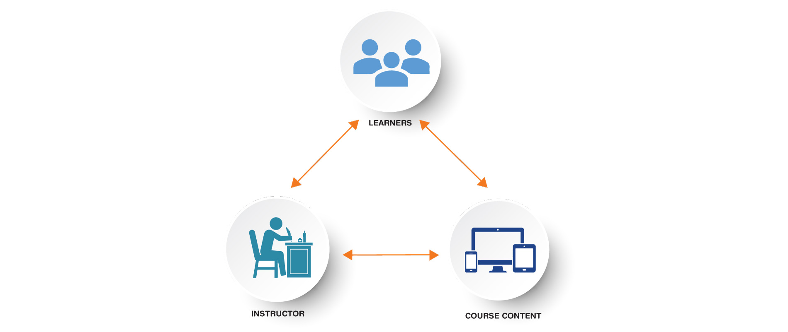

# What Makes a Quality Online Course at TWU?

Trinity Western University is known for its high quality of teaching and learning.  What does quality teaching and learning look like online?  Our team at TWU Online is committed to helping instructors design high quality, inquiry-based transformational educational experience for all students.

In order to support faculty facilitate an engaging online experience for students, we follow a quality framework focusing on structure, connection, and inclusion.

- **STRUCTURE**: Courses are built in a structured learning environment that provides learners with clear instructions, expectations, and navigation.
- **CONNECTION**: Learners are provided opportunities to connect to instructors, build community with their peers, and engage with the course content in meaningful ways. 
- **INCLUSION:** Courses promote accessibility, culturally responsiveness, and relatedness.

In the sections below you will find examples and suggestions for structuring your content, planning for connections, and creating a welcoming and inclusive learning environment for your learners.

[ui-tabs position="top-left" active="0" theme="lite"]
[ui-tab title="Learning Environment"]

At TWU, we primarily use Moodle as our Learning Management System (LMS).  We also support WordPress, as well as other ways to display course content (Bookdown, Pressbooks, etc.).  In this section we want to provide some examples of structured courses with clear and intuitive navigation.  Note that there is not one "Master Structure" at Trinity, as each instructor brings their own unique teaching presence into the online environment.  Rather, as you explore the course samples below, consider whether your course structure is easy to navigate and whether students can find what they are looking for.

### Sample course: LDRS 500: Leadership Foundations (Moodle)

### Sample course: LDRS 664: Creating Authentic Learning Communities (made with Bookdown)

<iframe scrolling="yes" style="border: 0px #ffffff none;" src="https://ma-lead.github.io/ldrs664/learning-communities.html#learning-communities/chromeless:true/hidepagetitle:true" allowfullscreen="allowfullscreen" width="100%" height="1000"></iframe>

### Sample course: FNDN 101: The Liberal Arts Journey (designed in WordPress)

<iframe src="https://create.twu.ca/h5p/wp-admin/admin-ajax.php?action=h5p_embed&id=547" width="959" height="620" frameborder="0" allowfullscreen="allowfullscreen" title="Course Structure of FNDN 101: The Liberal Arts Journey"></iframe>

[/ui-tab]
[ui-tab title="Course Connections"]

Key to successful online learning is a connection - between learners, between the instructor and learners, and between the learner and the content.  See the graphic below as well as the [Community of Inquiry](https://coi.athabascau.ca/coi-model/) website for more details.

Below are some ways instructors can facilitate meaningful connections in online courses:

[ui-accordion independent=true open=none]
[ui-accordion-item title="Connecting to Instructors"]

- Warmly welcome students to the course with a self-introduction (video or written form). Outline what they can expect and highlight key aspects of the course.
- Stay connected with students by offering ongoing support throughout the course.
- Utilize different channels such as emails, assessment feedback, welcome videos, weekly debriefing sessions, and regular updates to provide assistance and address any concerns.
- Ensure students diverse opportunities for formative feedback. This helps them gauge their progress and make necessary improvements.

Here's a sample welcoming students to a new term at TWU:
<iframe src="https://player.vimeo.com/video/659409173?h=a2ea571efc&amp;badge=0&amp;autopause=0&amp;player_id=0&amp;app_id=58479" width="600" height="338" frameborder="0" allow="autoplay; fullscreen; picture-in-picture" allowfullscreen title="H5P"></iframe>

[/ui-accordion-item]

[ui-accordion-item title="Connecting to Course Content"]

- Establish a clear relationship between the course/unit learning outcomes, learning activities, and assessments.
- Ensure that the learning outcomes are aligned with appropriate activities and assessments, creating a cohesive learning experience. This alignment helps students understand the purpose and relevance of their activities and assessments.
- Develop assessments that effectively measure the achievement of the course learning outcomes and align with the course activities and resources.
- Make sure that the assessments are consistent with the knowledge and skills students are expected to acquire through their engagement with the course.
- Design learning activities that scaffold and support students in building foundational knowledge and skills within the course.
- Provide opportunities for gradual progression and reinforcement of concepts and skills.

[/ui-accordion-item]

[ui-accordion-item title="Connecting to Peers"]

- Encourage learners to introduce themselves to the class. This helps foster a sense of connection and community among students.
- Encourage student-instructor, student-student, and student-content interactions that reflect Trinity Western University core values.
- Provide a peer support forum (announcements???) where learners can engage with each other for course-related questions or community-building activities.
- This forum serves as a platform for students to seek assistance, share insights, and foster collaborative learning. Encouraging participation in such forums enhances peer support and strengthens the sense of community within the course.

[/ui-accordion-item]

[/ui-accordion]

[/ui-tab]

[ui-tab title="Supporting Students"]

### Inclusion

TWU Online courses promote accessibility, culturally responsiveness, and relatedness.  To check for accessibility, instructors are encourage to connect with Trinity's [Accessibility Services](https://www.twu.ca/learning-commons/centre-accessible-learning/accessibility-services) and/or our Online team to help ensure all course materials are accessible and inclusive.

[ui-accordion independent=true open=none]

[ui-accordion-item title="Accessibility"]
- The course provides accessible text, videos and images for diverse learners.
  - Blackboard Ally is a tool that can help you identify areas of your course that could be improved to support accessibility for all learners.  Please see [What is Blackboard Ally?](https://trinitywestern.teamdynamix.com/TDClient/1904/Portal/KB/ArticleDet?ID=141400) for instructions.
  - Another resource you may find useful is the [Accessibility Checklist](https://opentextbc.ca/accessibilitytoolkit/back-matter/appendix-checklist-for-accessibility-toolkit/) from BC Campus.

- Instructions for accessing support (instructor, IT, library, student services), are clearly stated in the course overview and when appropriate, throughout the course.
  - Please let students know where they can access support: 
  - [The Learning Commons](https://learningcommons.twu.ca/) 
  - [The Writing Centre](https://www.twu.ca/academics/academic-professional-support/learning-commons/writing-centre)
  - [Online Learning Resources](https://www.twu.ca/academics/academic-support/online-learning-resources) (Tips for learning online) 
  - [TWU Library](https://www.twu.ca/academics/library)
  - [Student Services](https://www.twu.ca/life-twu/student-services)

[/ui-accordion-item]

[ui-accordion-item title="Inclusion"]
- Learners are able to participate in a peer support forum (e.g. Learning Café), for course-related questions or community-building activities.  
- The instructional materials are free of bias, culturally inclusive, and provide flexibility and choice.  

[/ui-accordion-item]
[/ui-accordion]

!!! Please note that our Instructional Design Team at TWU-OL is here to support you!  Whether you are developing a course for Global, or setting up your own online course, please reach out if you have questions about your course design.

[/ui-tab]

[/ui-tabs]

Key Resource: [Checklist for Quality Online Courses at Trinity Western University](https://docs.google.com/document/d/13TD6ZdTnCX3AQjxlHLoPZGCAGTZMRBzvGkKww1IcbpY/edit) or a simplified [Quick Checklist & Tips](https://docs.google.com/document/d/17Jvo3B5fRrKj3ymu72gqFfd2tZv7NqHcN89VTKV55Pc/edit?usp=sharing)