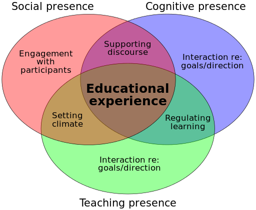

# What Makes a Quality Online Course at TWU?

## Quality Framework
At TWU, we have a commitment to student success - on campus and online.  As a campus instructor, you may measure a successful term by hearing stories from your students, reviewing your SETL surveys, comparing the grades you give, or by other means.

At TWU Online we want to support faculty in creating quality online courses to help students thrive in the online environment.  We structure our framework for quality around three themes:

- **STRUCTURE**: Courses have clear instructions, expectations, and navigation.
- **CONNECTION**: Students connecting to content, instructors, and peers
- **INCLUSION:** Courses promote accessibility, culturally responsiveness, relatedness.

Below you will find suggestions for structuring your content, planning for connections, and creating a welcoming and inclusive learning environment for your learners.

Also see the [Checklist for Quality Online Courses at Trinity Western University](https://docs.google.com/document/d/13TD6ZdTnCX3AQjxlHLoPZGCAGTZMRBzvGkKww1IcbpY/edit) with standards adapted from [Quality Matters](https://www.qualitymatters.org/qa-resources/rubric-standards/higher-ed-rubric).

!!! For more detailed instructions and tips for design, see the [Instructor's Guide for Online Courses at TWU](https://multi-access.twu.ca/teach/instructor-guide).

---

### Structure
Intuitive course navigation and clear instructions are key factors of a well-designed online course.  Below is a suggested way to organize your material in Moodle (or WordPress). 

[ui-accordion independent=false open=none]
[ui-accordion-item title="Navigation"]
- Instructions are clear on how to navigate the course and how to get started.
- The course navigation facilitates ease of use.
- The overall course is structured in a logical, consistent, sequenced, and efficient manner. 

[/ui-accordion-item]
[ui-accordion-item title="Instructions"]

- The Course Overview provides a course description, learning outcomes, and list of assessments.
- Specific and descriptive criteria (rubrics, marking schemes) are provided for the evaluation of students’ work and participation.
- The requirements for learner interaction are clearly stated.
- Students are instructed on how to protect their data and privacy.
- Instructions are clear, include rationale for activities and assessments, and provide seamless connections between the various elements in the course.
[/ui-accordion-item]

[/ui-accordion]

### Connection
Now that you have your basic structure set up for your online course, how do you design a quality online learning experience for your students?  Key to successful online learning is a connection - between learners, between the instructor and learners, and between the learner and the content.  See the graphic below as well as the [Community of Inquiry](https://coi.athabascau.ca/coi-model/) website for more details.

!!! Please note that our Instructional Design Team at TWU-OL is here to support you!  Whether you are developing a course for Global, or setting up your own online course, please reach out if you have questions about your course design.

[ui-accordion independent=false open=none]

[ui-accordion-item title="Connecting to Instructors"]
- Provide support for students throughout the course (e.g. through emails, assessment feedback, welcome videos, weekly debriefing, and other updates).
- Introduce yourselve to the class, welcoming students to the course and explaining key aspects of what to expect in the course.
- Throughout the course, provide various opportunities for formative feedback.

[/ui-accordion-item]

[ui-accordion-item title="Connecting to Course Content"]
!!! Note that if you have designed your course with an Instructional Designer, these are the quality standards used to ensure your students have a well designed course. 
#### Course Learning Outcomes
- The course learning outcomes should be measurable and reflect the course description and level of the course.
- Also include module/unit/week learning outcomes that are measurable and consistent with the course-level outcomes.
- There should be a clear relationship between the course/unit learning outcomes, learning activities, and assessments.
- All learning outcomes should be stated clearly and written from the learner’s perspective.

#### Course Materials
- The instructional materials (written/oral content, videos, graphics, readings, etc.), should support learners in achieving the learning outcomes.
- Course materials and resources should be up-to-date, relevant, and appropriate for the level of the course.
- Consider using a variety of instructional materials in the course (text, graphics, videos, interviews, activities). 
- Course design and instructional materials meet academic standards for Higher Education (online) learning.
- All third-party materials are identified, cited and permission requested if necessary.

#### Assessment
- The assessments are sequenced, varied, flexible, and appropriate to the content being assessed.
- The assessments measure the achievement of the course learning outcomes and are consistent with course activities and resources.
- The learner workload is appropriate and reasonable for the level and number of credits for the course.

#### Learning Activities
- Learning activities support learners in achieving the learning outcomes and completing assessments.
- Learning activities provide scaffolding opportunities for building foundational knowledge and skills within the course.

#### Educational Technology
- The technology used in the course supports the learning outcomes, activities and assessments.
- Tools promote student engagement and active learning.
- A variety of technology is used in the course.

[/ui-accordion-item]
[ui-accordion-item title="Connecting to Peers"]

- Ask your students to introduce themselves to the class.
- Learner interaction (student-instructor, student-student, student-content) should promotes a sense of community aligned with Trinity Western University core values.
- Learning activities should foster student-instructor, student-content, and if appropriate to the course, student-student interaction.
[/ui-accordion-item]
[/ui-accordion]

### Inclusion

All TWU Online courses should meet accessibility standards. Please connect with Trinity's [Accessibility Services](https://www.twu.ca/learning-commons/centre-accessible-learning/accessibility-services) and/or our [Online team](mailto:online@twu.ca) to help ensure all course materials are accessible and inclusive.

[ui-accordion independent=false open=none]

[ui-accordion-item title="Accessibility"]
- The course provides accessible text, videos and images for diverse learners.
  - Blackboard Ally is a tool that can help you identify areas of your course that could be improved to support accessibility for all learners.  Please see [What is Blackboard Ally?](https://trinitywestern.teamdynamix.com/TDClient/1904/Portal/KB/ArticleDet?ID=141400) for instructions.
  - Another resource you may find useful is the [Accessibility Checklist](https://opentextbc.ca/accessibilitytoolkit/back-matter/appendix-checklist-for-accessibility-toolkit/) from BC Campus.

- Instructions for accessing support (instructor, IT, library, student services), are clearly stated in the course overview and when appropriate, throughout the course.
  - Please let students know where they can access support: 
  - [The Learning Commons](https://learningcommons.twu.ca/) 
  - [The Writing Centre](https://www.twu.ca/academics/academic-professional-support/learning-commons/writing-centre)
  - [Online Learning Resources](https://www.twu.ca/academics/academic-support/online-learning-resources) (Tips for learning online) 
  - [TWU Library](https://www.twu.ca/academics/library)
  - [Student Services](https://www.twu.ca/life-twu/student-services)

[/ui-accordion-item]

[ui-accordion-item title="Inclusion"]
- Learners are able to participate in a peer support forum (e.g. Learning Café), for course-related questions or community-building activities.  
- The instructional materials are free of bias, culturally inclusive, and provide flexibility and choice.  

[/ui-accordion-item]
[/ui-accordion]