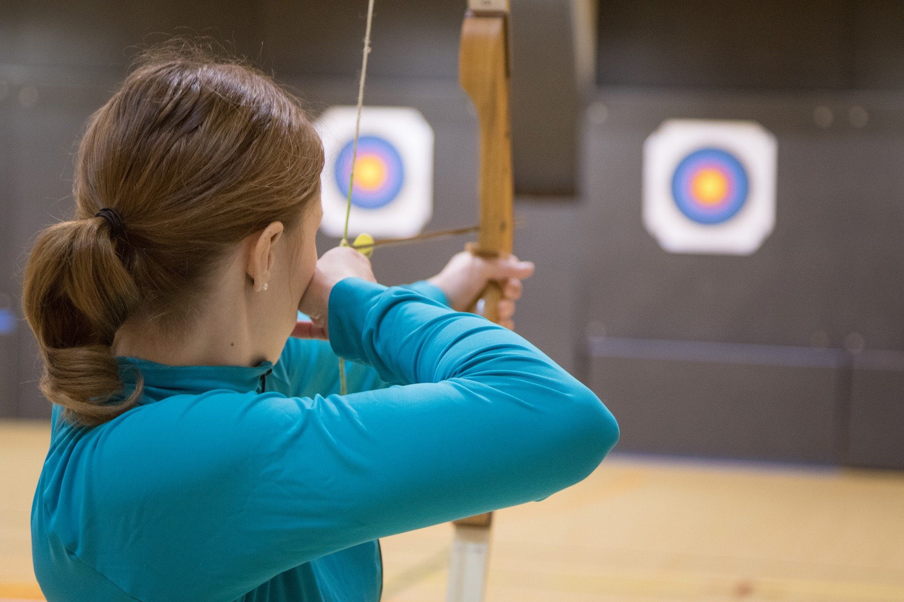

## Activities and Assessment

Once you know where you want your students to go (course learning outcomes), how will they get there?  How will they demonstrate their learning and show you their level of understanding?  What will help them be successful in meeting or exceeding your expectations for their learning? How will students reflect on and improve upon their own achievements?

In this section, we'll present a number of ways to assess students, including providing formative learning activities to scaffold their learning and help them succeed in the summative (graded) assessments.

!! Add blocks for these sections:
1. Purpose of Assessment
1. Activity & Assessment Ideas
1. Grading Rubrics
1. Self & Peer Assessment

---

## Purpose of Assessment

It all starts with the course learning outcomes. For example, in designing this section of our Course Design site, we have the following learning outcomes in mind for you, our reader:

#### Learning Outcomes
After completing this readings and activities in this section, you will be able to:
1. explain the difference between formative and summative assessment;
1. connect assessments to learning outcomes and learning activities;
1. design activities that promote skills including: critical and creative thinking, quantitative and qualitative reasoning, communication, research, and information literacy;
1. explore practical assessment strategies that you can implement in your classes;
1. evaluate the effectiveness of activities, resources and technology to support learning;
1. create a grading rubric and/or detailed assignment guidelines.
1. use self and peer feedback to foster reflection and critical thinking

With these outcomes in mind, how might you demonstrate your understanding of them? Consider these learning artifacts:
- a quiz on key terms, such as formative and summative assessment
- a Venn Diagram that explains the connection between assessment, outcomes and  activities
- a critical thinking project to assess your creative thinking and communication skills.
- a reflective paper sharing how you implemented a new activity or assessment strategy and evaluated its effectiveness
- a literature review on assessment strategies and their effectiveness
- a grading rubric
- a group presentation on feedback, including using self and peer feedback
