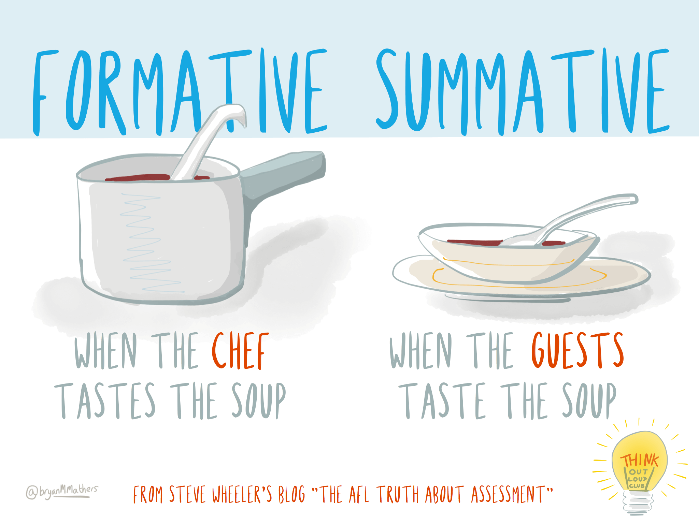
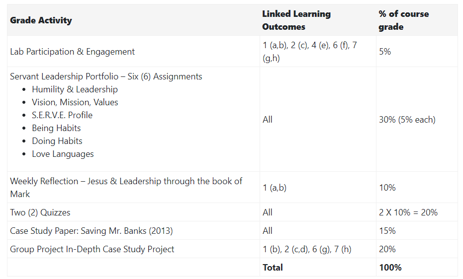

## Learning Activities and Assessment

As we design a course, we first identify the course learning outcomes, then we plan how students show their learning (assessment) and provide ways to practice and reflect on their learning (activities). As in the picture below, learners must know what to aim for, how to hit the target, and be given ample practice to be successful.

In this section, we'll present a number of ways to assess students, including providing formative learning activities to scaffold their learning and help them succeed in the summative (graded) assessments.

!! Add blocks for these sections:
1. Purpose of Assessment
1. Activity & Assessment Ideas
1. Grading Rubrics
1. Self & Peer Assessment

---

## Purpose of Assessment

It all starts with the course learning outcomes. For example, in designing this section of our Course Design site, we have the following learning outcomes in mind for you, our reader:

- changing content - to add these 2 sections to H5P to make interactive.  e.g. how would you assess the following options.
#### Learning Outcomes
After completing this readings and activities in this section, you will be able to:
1. explain the difference between formative and summative assessment;
1. connect assessments to learning outcomes and learning activities;
1. design activities that promote skills including: critical and creative thinking, quantitative and qualitative reasoning, communication, research, and information literacy;
1. explore practical assessment strategies that you can implement in your classes;
1. evaluate the effectiveness of activities, resources and technology to support learning;
1. create a grading rubric and/or detailed assignment guidelines.
1. use self and peer feedback to foster reflection and critical thinking

With these outcomes in mind, how might you demonstrate your understanding of them? Consider these learning artifacts:
- a quiz on key terms, such as formative and summative assessment
- a Venn Diagram that explains the connection between assessment, outcomes and  activities
- a critical thinking project to assess your creative thinking and communication skills.
- a reflective paper sharing how you implemented a new activity or assessment strategy and evaluated its effectiveness
- a literature review on assessment strategies and their effectiveness
- a grading rubric
- a group presentation on feedback, including using self and peer feedback

## Why Assess?
Think about why assessment is a part of your course.  How does it benefit you and your learners?

Assessment demonstrates whether, and to what degree, the learner has met the learning outcomes for the course. It often lets the instructor know what concepts students struggle with which informs their teaching.  Common assessments include tests, essays, discussions, but there are a number of other ways we can measure students’ understanding.
First, let’s focus on what assessment is.

### Understanding Assessment: Formative & Summative

In our courses, we often think first of the **summative assessments** – the final test, unit quiz, essay, etc. that sums of students' knowledge.  These assessments allow students to demonstrate their learning of the course and we give them a final grade.

**Formative assessments** involve giving feedback and helping students learn from the assessment.  This ‘forms’ students knowledge so they can further show their understanding of a topic.  For example, practice quizzes before a final exam, peer reviews of an essay before the final paper, reflective journals, 1 minute papers, muddiest point, etc.,  There are numerous effective formative activities to help students and instructors assess learning before being graded.

|                    | **Summative Assessment**                                                             | **Formative Assessment**                                              |
|--------------------|--------------------------------------------------------------------------------------|-----------------------------------------------------------------------|
| When               | At the end of a learning activity                                                    | During a learning activity                                            |
| Goal               | To make a decision                                                                   | To improve learning                                                   |
| Feedback           | Final judgement                                                                      | Return to material                                                    |
| Frame of Reference | Sometimes normative (comparing each student against all others); sometimes criterion | Always criterion (evaluating students according to the same criteria) |

*Table from [Wikipedia](https://en.wikipedia.org/wiki/Formative_assessment#cite_note-11) citing Charting your course: How to prepare to teach more effectively, Atwood, 2000.*

---
### FOR / OF / AS Learning
Assessment can also be *for, of,* and *as* learning.

! **Assessment for Learning**, a type of formative assessment, is utilized by teachers in order to gain an understanding of their students' knowledge and skills in order to guide instruction.

!!! **Assessment as learning** is also a formative assessment which focuses on teaching students the metacognitive processes to evaluate their own learning and make adjustments.

!!!! **Assessment of Learning** is a summative assessment used primarily to compare students and report progress.

*Source: UBC's [Assessment as Learning](http://etec.ctlt.ubc.ca/510wiki/Assessment_as_Learning)*

---

### Alignment in Course Design
So how do we choose formative and summative assessments for our course?  An important part of course design is checking that there is alignment between assessments and learning outcomes.  If your learning outcome asks students to compare two theories, for example, how do they show you they can do that?  Often instructors will have their assessments in mind before they write their learning outcomes.  Whatever process you have, make sure that your course learning outcomes are assessed in your assignments.  Try to include these connections in your syllabus, as in the example below:

### Learning Activities: Preparing for Assessments
One other alignment check that needs to be made in your course design is the connection between the assessments and the learning activities.  Learning activities are designed to help students engage with the course topics.  They are often ungraded and optional, so in order to motivate students to complete them, we need to emphasize the connections to the assignments and how the activities will help students succeed in their assessments.

Another reason to include learning activities in your online course is so that learners can practice the key concepts/questions and get *messy* with their learning.  Learning is a process, and activities allow for students to work through questions, organize their learning, explore solutions, and prepare for assessments.   

---

### Engagement & Accessibility Check!

So how do you decided what activities or assessment to include in your course?  In [Engaging Adult Learners: Philosophy, Principles and Practices](http://northernc.on.ca/leid/docs/engagingadultlearners.pdf), Jim Bryson suggest 5 questions to ask yourself when choosing activities/assessments:  

! 1. Are the instructions, the purpose and the intended learning outcome(s) for this activity clear enough to be correctly understood by all students?
! 1. Is this activity fair? Will all students be able to understand and participate in it as a learning exercise? What choices do they have? Is it related to course content and laid out in a logical manner?
! 1. Will this activity add to my students' interest in content? Will they find it engaging and motivating? Will it stimulate curiosity and participation?
! 1. Is this activity relevant to the intended learning outcomes for the course? Is it relevant to student expectations? To my instructional goals?
! 1. Have I provided support for success in terms of information, curriculum content, discussion, interaction, activities and available resources?

As you decide what activities/assessments are appropriate for your course, refer back to these questions.

Finally, consider the Inquiry-Based Learning approach at TWU. How do we carefully design exercises (activities & assessments) that engage, and even transform learners?  How do we give them opportunities to explore and challenge their thinking?

Ask the following questions:
!! ‘Can transformative learning theory be put into practice, and if yes, what are some of the differences it makes to the lives of learners?’...
!! ‘Can disorienting dilemmas be triggered by carefully designed exercises, and, if yes, what are the effects on student transformative learning?’
!! *From [Putting transformative learning theory into practice](https://files.eric.ed.gov/fulltext/EJ1059138.pdf)*.

To learn more about Trinity's Inquiry-Based Learning approach, watch the following video:

[plugin:youtube](https://www.youtube.com/watch?v=SCa9Nt3X1vU)

### Resources on Assessment of Learning

- Section 6.8 [Assessment of learning](https://pressbooks.bccampus.ca/teachinginadigitalagev2/chapter/5-8-assessment-of-learning/) from Bates, T. (2019). [Teaching in a digital age](https://pressbooks.bccampus.ca/teachinginadigitalagev2/). 2nd Edition. Victoria : BCcampus, BC Open Textbook Project.
- [Learner Assessment in Online Courses: Best Practices & More](https://www.learnworlds.com/learner-assessment-best-practices-course-design/)
- [The Messy and Unpredictable Classroom](https://www.facultyfocus.com/articles/teaching-and-learning/the-messy-and-unpredictable-classroom/)
- [Assessing Student Learning Online](https://ep.jhu.edu/faculty/learning-roadmap-for-new-online-instructors/assessing-student-learning-online)
- [Best Practices: Alternative Assessments](https://www.ryerson.ca/content/dam/learning-teaching/teaching-resources/assessment/alternative-assessments.pdf)
- [Guiding Principles for Assessment of Students' Learning](http://studentassessment.ucalgaryblogs.ca/files/2017/06/Guiding-Principles-for-Assessment-of-Student-Learning-FINAL.pdf)
