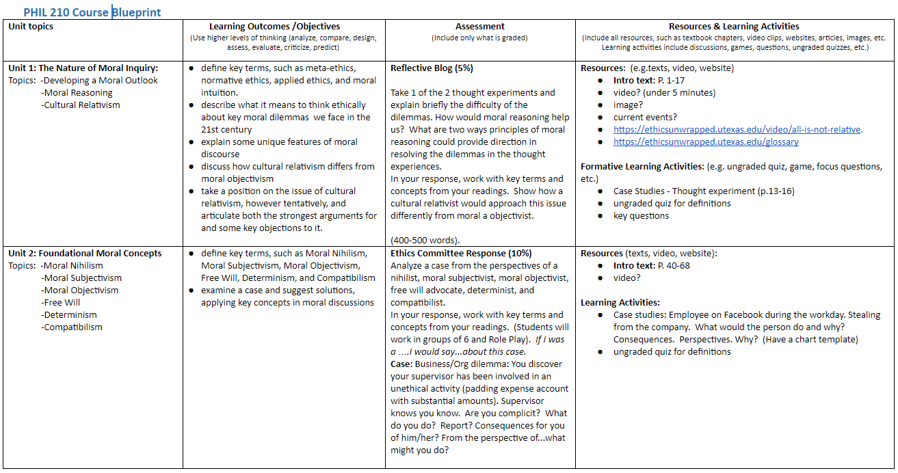

## Planning Your Course

In this section we discuss the course design process and share techniques you can use in planning your online, face-to-face, or blended courses at TWU.

### Key Planning Questions

Designing a course is like planning, building, and moving into a house.  You start with asking some key questions:

 💡 What is the course?  What are the **Big Ideas**, or the main take-aways?

 ❓ In an inquiry-based approach to learning, what are some **Essential Questions** learners may ask throughout the course?

 🎯 Where are we heading? What are key course **Learning Outcomes** that students will be able to demonstrate

 🧩 At a program level, how does this course fit in with the program? What skills do they need to be a successful graduate of the program?

 🤔 If a previous course exists, has there been any feedback from students and instructors?

…and the most important questions:
 🧑‍🎓 Who are the students?  What is the typical age, work experience, culture, etc.? What are their interests, learning styles, and needs?​

All of these questions impact the planning phase of creating a course.  

Notice, we didn't start with...
📕 What textbook should I use for the course?
📘 What topics are covered in the textbook chapters?
📗 What publisher resources are available (e.g. testbank, PowerPoint presentations)
📙 What topics will fit into my 16 weeks course?

Instead, we use what's called **Backward Design** to develop the course.

### Backward Design
**Backwards Design** (Fink, 2003; Wiggins & McTighe, 2005) is where we first focus on the *target*: what knowledge, skills or attitudes do we want students to have at the end of the course?  Second, how will they *demonstrate* this?  Finally, what learning *experiences* will help students achieve this?

Backward design is a contrast to the traditional method of designing curriculum with the topics as the focus.  With the backwards approach, the end results help map out the course and leads to more productive activities and assessments.
![]Backward Design Model

📺 Watch the following 5 minute video on Backwards Design.  
[plugin:youtube](https://www.youtube.com/watch?v=XwlUhS_hxBY)

Note in the video how they emphasize the connections between the three key components of the course: **Outcomes**, **Assessment**, **Activities**.  Learning outcomes inform assessment and activity choice; activities are designed to prepare students for assessments to demonstrate understanding of the outcomes.

 As you design your course outcomes, assessments, and learning activities, keep in mind what will motivate and inspire your students.

🔎 For more on Backward Design, view the website and video [Understanding by Design](https://cft.vanderbilt.edu/guides-sub-pages/understanding-by-design/).

### Course Design Process at TWU
Every course is different, and every course design experience is different.  In this section we'd like to briefly share a typical process we follow in creating and revising our online courses at TWU.

*Please note: This process may not apply to your course! Often with time constraints, we speed things up to make sure the course is ready for students. During/after the course runs, we make further adjustments based on instructor and student feedback.*

In a typical full course design, here are some things you might expect:

#### Creating a Course Blueprint
A first crucial step in course planning is to develop a course blueprint which maps out key components of the course.

In developing this document we focus on the development of learning outcomes that are measurable, and then ensure that the supporting activities and assessments are mapped directly to these outcomes.

Here are key steps in filling out a blueprint:

##### STEP 1: Big Ideas and Essential Questions
One strategy we use before getting into the details of a course is identifying the **Big Ideas** (Wiggins & McTighe, 2005). Below is an image from Stanford University (adapted) that takes us through the process of deciding the big ideas, essential questions, key knowledge and skills, and learning activities.

##### STEP 2: Course Description
Next, we have a look at the course description.  Note that if there are any changes, these need to be approved by Senate.  

##### STEP 3: Course Learning Outcomes
Third, we identify the learning outcomes we want students to understand. Learning outcomes describe what learners will be able to *know, do and value* after a learning experience. They clearly explain the knowledge, skills, and attitudes students will gain through a course.

It is crucial to have measurable learning outcomes listed on the course outline, as they communicate expectations to the learner and help guide the instructor.  

Note that for each course learning outcome, we need to identify the TWU Student Learning Outcome it addresses as well

[ui-accordion independent=true open=none]
[ui-accordion-item title=Want to know more about writing effective Learning Outcomes? Click to Open!"]

The diagram above illustrates the five key principles in designing learning outcomes.  They must be specific and clear, instructors must be able to measure successful completion of an outcome, and learners must be able to achieve them.  Learning outcomes should also be relevant to the course and achievable  within the time period allotted.

For more examples of learning outcomes, see our course text *[Teaching in a Digital Age](https://pressbooks.bccampus.ca/teachinginadigitalagev2/part/chapter-2-the-nature-of-knowledge-and-the-implications-for-teaching/)* by Tony Bates.

**Bloom’s Taxonomy**

Instructional designers often use Bloom’s Taxonomy to help write learning outcomes. The graphics below lists possible verbs to use in a learning outcome, as well as examples of activities and/or assessments.  Just to give one example, if you are assessing the domain of analysis by asking student to compare, you may ask them to create and administer a survey.  As you write your outcomes, what **[Higher Order Thinking Skills](https://en.wikipedia.org/wiki/Higher-order_thinking) (HOTS)** are you promoting?

*"Bloom's Taxonomy" [flickr photo by Vandy CFT](https://flickr.com/photos/vandycft/29428436431) shared under a Creative Commons (BY) license*

For more, see [Revised Bloom’s Taxonomy](https://www.celt.iastate.edu/teaching/effective-teaching-practices/revised-blooms-taxonomy/) from Iowa State University.

**Significant Learning**

Fink (2003) described learning as change in the learner.  How can we tell what has changed in our students, or how the course has impacted them?
In his book, *Creating Significant Learning Experiences: An Integrated Approach to Designing Colleges Courses*, he asks instructors to consider what students will take away from the course.  What are the long-term goals?  What will they remember?

The image here shows Fink’s Taxonomy of Significant Learning.  Consider the various categories of learning as you write your outcomes.  Will students apply their learning?  Learn about themselves or others?  Value a new idea or perspective? Become a self-directed learner?
 <small><a title="Fink Significant Learning" href="https://flickr.com/photos/lauradahl/2897475124">Fink Significant Learning</a> flickr photo by <a href="https://flickr.com/people/lauradahl">Laura B. Dahl</a> shared under a <a href="https://creativecommons.org/licenses/by-nc/2.0/">Creative Commons (BY-NC) license</a> </small>

**SOLO Taxonomy**

Another great resource that can help you write effective learning outcomes is the *Structure of Observed Learning Outcomes (SOLO)* created by John Biggs and K. Colis. The images below show the 5 levels of understanding.  As you write your outcomes, consider the increasing complexity of understanding students can demonstrate through assessments.  How will they know what level they are at?  Try to incorporate descriptions in a grading rubric that explain the connections you want students to make (e.g. analyze, compare, hypothesize, predict, etc.)  

Source: Diagram giving an overview of the SOLO Taxonomy approach. [Wikipedia](https://commons.wikimedia.org/wiki/File:Structure_of_Observed_Learning_Outcomes_SOLO_Taxonomy.png)

For more information, see [SOLO Taxonomy - John Biggs](https://www.johnbiggs.com.au/academic/solo-taxonomy/).

Other great resources:
- [Learning Outcome Generator](https://elearn.sitehost.iu.edu/courses/tos/gen2/)
- [Learning Objectives Maker](https://learning-objectives.easygenerator.com/)

[/ui-accordion-item]
[/ui-accordion]

##### STEP 4: Course Assessment
   - Note to connect assessment to the course learning outcomes that are demonstrated

##### STEP 5: Unit Planning

##### STEP 6: Resources

#### Blueprint Examples
Below are some examples of part of a blueprint document.  For a current blueprint template for TWU courses, click on the following links: [TWU Course Blueprint Template - Google doc](https://docs.google.com/document/d/1XJ27S2OeEW01JFpICjWtvsYLj1a0SpD9dy7yoX8ttAQ/edit?usp=sharing); [TWU Course Blueprint Template - Word version](TWU-Course-Blueprint-Template.docx)

!!! Note in the blueprint that there is a table for 10 units.  This does not apply to all courses!!  If you happen to work with an Instructional Designer in planning out your course, a key question will be how to organize the learning/content.  This may work out to be 10 key units for a 12 week course, but each course is different.
