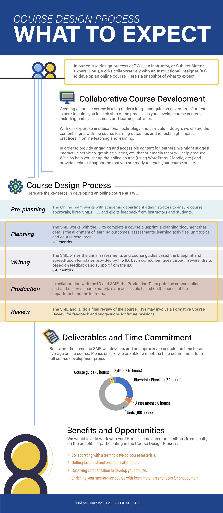
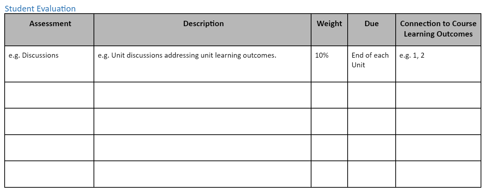
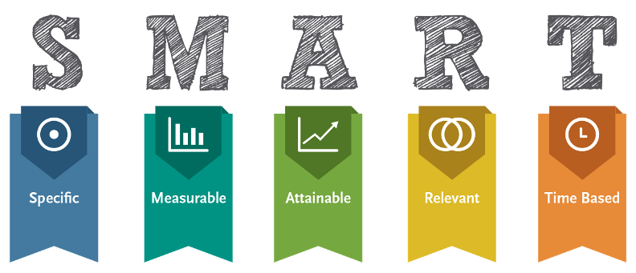

## Planning Your Course

In this section we discuss the course design process and share techniques you can use in planning your online, face-to-face, or blended courses at TWU.
- add intro video

Here are the topics we'll cover (feel free to jump ahead!)

<a href="#Key_Planning_Questions">- Key Planning Questions</a>

<a href="#Backward_Design">- Backward Design</a>

<a href="#Course_Design_Process_at_TWU">- Course Design Process at TWU</a>

<a href="#Creating_a_Course_Blueprint">- Creating a Course Blueprint</a>

### Key Planning Questions

Designing a course is like planning to build a house. There are a lot of details to think through, and you start with asking some key questions, such as who is the house for, what features are required, what support is needed, what will make it feel like a home?, etc.

Similarly, for course design, we ask:

[add graphic from Mara - Questions to Ask When Planning Your Course:]

...
All of these questions impact the planning phase of creating a course.  

Notice, we didn't start with...
📕 What textbook should I use for the course?  
📘 What topics are covered in the textbook chapters?  
📗 What publisher resources are available (e.g. testbank, PowerPoint presentations)?  
📙 What topics will fit into my 16 weeks course?  

Instead, we use what's called **Backward Design** to develop the course.

---

### Backward Design
**Backward Design** (Fink, 2003; Wiggins & McTighe, 2005) is a contrast to the traditional method of designing curriculum, which often starts with identifying the topics (or chapters in a textbook), and then maps out the weekly lessons according to those resources. With the backward approach, we focus first on the end results, which helps map out the course and leads to more productive activities and assessments.

In planning a course, here are three key questions we start with:
1. We first focus on the *target*: what knowledge, skills or attitudes do we want students to have at the end of the course? Essentially, what are the course learning outcomes?
2. Second, how will learners *demonstrate* that they have the knowledge, skills or attitudes identified?  What assessment strategy will show students level of understanding of the course learning outcomes?
3. Finally, what learning *experiences* will help students achieve this?  What activities will scaffold students' learning, engage them in the topics, and allow them to practice or develop their understanding of the course learning outcomes?

📺 Watch the following 5 minute video on Backward Design.  

<iframe width="1120" height="630" src="https://www.youtube.com/embed/XwlUhS_hxBY" title="YouTube video player" frameborder="0" allow="accelerometer; autoplay; clipboard-write; encrypted-media; gyroscope; picture-in-picture" allowfullscreen></iframe>

Note in the video how they emphasize the connections between the three key components of the course: **Outcomes**, **Assessment**, **Activities**.  Learning outcomes inform assessment and activity choice; activities are designed to prepare students for assessments to demonstrate understanding of the outcomes.

As you design your course outcomes, assessments, and learning activities, keep in mind what will motivate and inspire your students.

🔎 For more on Backward Design, view the website and video [Understanding by Design](https://cft.vanderbilt.edu/guides-sub-pages/understanding-by-design/).

---

## Course Design Process at TWU
Every course is different, and every course design experience is different.  In this section we'd like to briefly share a typical process we follow in creating and revising our online courses at TWU.

*Please note: This process may not apply to your course! Often with time constraints, we speed things up to make sure the course is ready for students. During/after the course runs, we make further adjustments based on instructor and student feedback.*

In a typical full course design, here are some things you might expect:

---

### Creating a Course Blueprint
To help you plan your course, we develop a course blueprint that maps out key components of the course.

Here are key steps in filling out a blueprint: (Click the title on the steps below)

---
[ui-accordion independent=true open=none]
[ui-accordion-item title=STEP 1: Big Ideas and Essential Questions"]

One strategy we use before getting into the details of a course is identifying the **Big Ideas** (Wiggins & McTighe, 2005). Below is an image from Stanford University (adapted) that takes us through the process of deciding the big ideas, essential questions, key knowledge and skills, and learning activities.

The first part of the blueprint asks you to identify 1-2 ideas and a few essential questions
that will serve as the narrative frame or the “hook” for your course. You might
think of a big idea as a subtitle or unifying theme for your course.

!!! As you consider your big ideas and essential questions, it might help to talk to your colleagues! Some departments suggest a literature review before you start the design process, so you can address these ideas and questions based on current research.

[/ui-accordion-item]

[ui-accordion-item title=STEP 2: Course Description"]

Next, we have a look at the course description.  Note that if there are any changes, these need to be approved by Senate.  

[/ui-accordion-item]

[ui-accordion-item title=STEP 3: Course Learning Outcomes"]
Third, we identify the learning outcomes we want students to understand. Learning outcomes describe what learners will be able to *know, do and value* after a learning experience. They clearly explain the knowledge, skills, and attitudes students will gain through a course.

It is crucial to have measurable learning outcomes listed on the course outline, as they communicate expectations to the learner and help guide the instructor.  

Note that for each course learning outcome, we need to identify the [TWU Student Learning Outcome](https://www.twu.ca/academics/student-learning-outcomes) it addresses as well.  In this part of the blueprint we ask you to categorize your learning outcomes, and begin to think of possible learning artifacts, or evidence of learning.

[/ui-accordion-item]

[ui-accordion-item title=STEP 4: Course Assessment"]
Once we know where students are going (learning outcomes), we need to know how students will show that they've met the learning outcomes. There should be a clear link between what we ask students to do in the assignment, and what is stated in the related learning outcome.

**Alternative forms of assessment**
A summative assessment does not have to be an exam, but can instead be a
portfolio, website, video, conversation, research paper, presentation,
case study, plan, or project.  These often allow students to demonstrate prior learning and allow for more authentic assessment - that is personalized tasks that relate to their profession.

This section in the blueprint asks instructors to connect assessment to the course learning outcomes that are demonstrated.

[/ui-accordion-item]

[ui-accordion-item title=STEP 5: Unit Planning"]
Perhaps the most significant part of the blueprint is the unit plan.  In this section, we determine the sequence of the course by aligning each outcome and its
associated formative and/or summative activities with a particular unit in your
course. Many instructors divide their course into weekly units, but it's important to have more of a topical structure. This allows for more flexibility for condensed courses, and helps to focus specific topics to their related unit learning outcomes.

*A note about Learning Activities*

Once you know what learners will do and how well they will do it, consider the
formative learning activities which will scaffold the learners' progress towards
the proficiency targets for each outcome. Upon completion of a formative
learning activity, learners should know how they performed relative to the
priority course outcome and specifically how they can close the gap between
their actual performance and the expected performance. Faculty, likewise, should
know what each learner needs to do to close the gap and they should also know
how to differentiate future learning activities in order to address
misconceptions.

**Blueprint Examples**
Below is one example of part of a blueprint document.  For a current blueprint template for TWU courses, click on the following links: [TWU Course Blueprint Template - Google doc](https://docs.google.com/document/d/1EaxSXVEe8fwqXXRJITg-RCAdtD69Uaza7wSjwkXsQro/edit?usp=sharing); [TWU Course Blueprint Template - Word version](TWU Course Blueprint Template-2022.docx)

[/ui-accordion-item]

[ui-accordion-item title=STEP 6: Resources"]
A final section of the blueprint is dedicated to a resource list.  As a blueprint is simply a planning document - one that can and will change as you develop the course - feel free to add resources you are thinking of using.

As Instructional Designers (not the Subject Matter Experts) we often direct instructors to Open Educational Resources (OERs), or case study repositories. If you're interested in exploring OERs and other course resources, please see the Resources section.

[/ui-accordion-item]
[/ui-accordion]

---

### Final Thoughts

In many ways, "building" a course is no different than building a house - one does not simply put a bunch of pieces of wood together and call it a house. Designing an effective course that focuses on student learning is no different - one cannot simply "dump" content onto a page and expect students to learn.

Much like building a house, course design requires intentional thought and sequential, logical planning. First, one must consider ***who*** we are "building" the course for; next, we can begin planning ***how*** we will go about delivering a positive, intuitive learning experience (the Blueprint). As our planning evolves, we can begin to add details that will engage learners and promote learning - the Blueprint will provide a contextual overview of how each component fits together. Once we have a sense of how all the pieces work together, we can add our assessments with a sense of confidence that they align with the rest of the content in our course.

While the course design process is intended to be flexible and fluid, it is also intended to be intentional and purposeful. Laying the groundwork (Blueprint) is a critical component to ensure we have a strong foundation that cultivates an environment of learning.

(this next part goes on a separate page)

Writing Effective Learning Outcomes

The diagram above illustrates the five key principles in designing learning outcomes.  They must be specific and clear, instructors must be able to measure successful completion of an outcome, and learners must be able to achieve them.  Learning outcomes should also be relevant to the course and achievable  within the time period allotted.

**Bloom’s Taxonomy**
We often use Bloom’s Taxonomy to help write learning outcomes. The graphics below lists possible verbs to use in a learning outcome, as well as examples of activities and/or assessments.  Just to give one example, if you are assessing the domain of analysis by asking student to compare, you may ask them to create and administer a survey.  As you write your outcomes, what **[Higher Order Thinking Skills](https://en.wikipedia.org/wiki/Higher-order_thinking) (HOTS)** are you promoting?

See the following images that suggest key verbs related to learning activities.

### add gallery of images - or h5p

*"Bloom's Taxonomy" [flickr photo by Vandy CFT](https://flickr.com/photos/vandycft/29428436431) shared under a Creative Commons (BY) license*

For more, see [Revised Bloom’s Taxonomy](https://www.celt.iastate.edu/teaching/effective-teaching-practices/revised-blooms-taxonomy/) from Iowa State University.

**Significant Learning**
Fink (2003) described learning as change in the learner.  How can we tell what has changed in our students, or how the course has impacted them?
In his book, *Creating Significant Learning Experiences: An Integrated Approach to Designing Colleges Courses*, he asks instructors to consider what students will take away from the course.  What are the long-term goals?  What will they remember?

The image here shows Fink’s Taxonomy of Significant Learning.  Consider the various categories of learning as you write your outcomes.  Will students apply their learning?  Learn about themselves or others?  Value a new idea or perspective? Become a self-directed learner?
 <small><a title="Fink Significant Learning" href="https://flickr.com/photos/lauradahl/2897475124">Fink Significant Learning</a> flickr photo by <a href="https://flickr.com/people/lauradahl">Laura B. Dahl</a> shared under a <a href="https://creativecommons.org/licenses/by-nc/2.0/">Creative Commons (BY-NC) license</a> </small>

**SOLO Taxonomy**
Another great resource that can help you write effective learning outcomes is the *Structure of Observed Learning Outcomes (SOLO)* created by John Biggs and K. Colis. The images below show the 5 levels of understanding.  As you write your outcomes, consider the increasing complexity of understanding students can demonstrate through assessments.  How will they know what level they are at?  Try to incorporate descriptions in a grading rubric that explain the connections you want students to make (e.g. analyze, compare, hypothesize, predict, etc.)  

Source: Diagram giving an overview of the SOLO Taxonomy approach. [Wikipedia](https://commons.wikimedia.org/wiki/File:Structure_of_Observed_Learning_Outcomes_SOLO_Taxonomy.png)

For more information, see [SOLO Taxonomy - John Biggs](https://www.johnbiggs.com.au/academic/solo-taxonomy/).

Other great resources:
- [Learning Outcome Generator](https://elearn.sitehost.iu.edu/courses/tos/gen2/)
- [Learning Objectives Maker](https://learning-objectives.easygenerator.com/)
