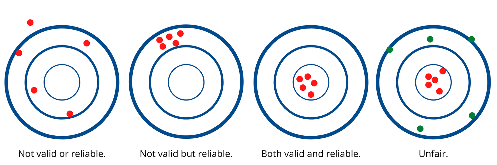

# Measurement

Recall that [educational assessment is not a direct measurement](https://multi-access.twu.ca/assessment/what-is-assessment/defining-assessment#interpretation) of a definite quantity of something, but rather it is an inference about what a learner knows, understands, or is able to do based on data gathered from performance tasks. For example, we can directly measure (with variable degrees of specificity) the length of a segment of rope, the mass of a basketball, or the velocity of a train. We cannot directly measure a learner's ability in relation to any given learning outcome. So educational assessment is an inference about a learner's ability, which is a latent construct. Even the most 'objective' of exams, where every item has a definite correct response is not a direct measurement of a latent construct.

This does not mean that all exams are bad or that we should abandon examinations altogether. It does mean that we should express sufficient epistemic humility when considering what we can learn about what learners know. Many will be familiar with the ideas of *validity* and *reliability* in relation to research findings. Since educational assessment is a matter of reasoning based on evidence and thus an example of research, validity and reliability are relevant constructs.

Reliability is a measurement of the *precision* of a given instrument for a given sample of examinees.  Reliability is most often expressed as `coefficient alpha`, or a measure of the instrument's internal consistency. An unreliable test cannot support valid inferences. Validity refers to the evidence presented to support the meaning and interpretation of results from a measurement instrument. Validity does ***NOT*** refer to a quality of an instrument or a score, but rather whether the ***inference is supported by the data***.

Evidence for validity depends on what inferences are being drawn and what assumptions are being made.

Examples:

| Instrument  | Construct  | Measurement process |
|---|---|---|
| ruler | reading ability | measure foot length and make an inference about reading ability |
| essay | writing ability | count the number of words an examinee writes and make an inference about writing ability |

# Psychometrics

The fundamental equation in classical test theory is  

$$
X = T + E
$$

  Where:
- $X$ - observed or raw score
- $T$ - unobserved true score
- $E$ - error

The observed score ($X$) is the learner's grade as assessed by the instructor. This score can sometimes seem like it is an objective rating of a learner's ability, but there are multiple reasons that this is not the case, even if the assessment consists of only selected-response items and is completely objectively scored. First, as noted elsewhere, [a score is always an inference](https://multi-access.twu.ca/assessment/what-is-assessment). A score of 8/10 on a selected-response test does not mean that the learner knows 80% of the material or has mastered 80% of the objectives. The true score ($T$) is what the learner *would* score if there were no measurement errors. Theoretically it represents the average of an infinite number of attempts on the test, assuming that there is no learning effect between attempts. The true score is always *unknown*. The reason the observed score is not an objective measure and that the true score is always unknown is that all tests and testing situations contain measurement error ($E$). Error might come from poorly designed (unreliable) items, the testing environment (room too hot, cold, noisy, dark, bright, etc.), or from the learner being tired, hungry, anxious, depressed, distracted, etc.

So, from the example in the preceding paragraph, a learner might have answered 8 items correctly, but if we calculate the error to be +/-1, then we can only say with any confidence that the learner's ability score is [somewhere between 7 and 9 on a scale of 10](https://multi-access.twu.ca/assessment/what-is-assessment#interpretation). This is why a certain degree of *epistemic humility* is in order when it comes to interpreting assessment data.
