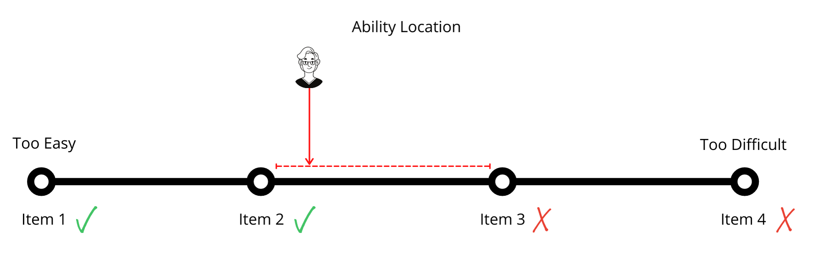

Assessment is fundamentally a process of reasoning from evidence (Pellegrino et al., 2001). The evidence is produced by learners as they create artifacts that demonstrate some degree or another of alignment with an intended learning outcome. This can come in the form of an answer to a quiz question, administering a medication, creating a website, recording an interview, conducting an experiment, writing or performing a play, singing a song, painting a landscape, teaching a class, executing a physical skill, programming an app, or any number of other tasks that might be imagined. The end result of this process is an *inference* related to what the learner knows, believes, or can do.

Pellegrino et al. (2001) describe this process of assessment in terms of a triangle, with each side of the triangle representing a critical component of the process (see figure 1). 

> Figure 1. Assessment Triangle (Pellegrino et al., 2001)

## Cognition
The assessment of learning begins with a clearly defined construct or cognitive model of what is to be learned. This is, at minimum, articulated in a learning outcome during the design of the course, but ideally is situated within a larger view of the topic of the course. The process for situating a given construct within the topic of the course is called 'curriculum mapping', which involves identifying not only the topics of the course, but the prerequisite knowledge for learner success. For example, learners need to demonstrate competence in construct A before they will be able to demonstrate competence in construct B. 

## Observation

The second pillar of the assessment triangle is an observation of some sort. This requires a clear connection to the cognitive model of the construct through the identification of proficiency indicators. Instructors must understand what constitutes a competent demonstration of ability in relation to the construct. This is often operationalized as a rubric, which can take a number of forms. We recommend that rubrics be task neutral, allowing them to be reused in multiple contexts. 

### SOLO Taxonomy

A good example of a task neutral rubric is Biggs and Collis' (1982) SOLO Taxonomy, which outlines five levels of competence in relation to a wide variety of cognitive constructs: prestructural, unistructural, multistructural, relational, and extended abstract. 

SOLO stands for *Structure of the Observed Learning Outcome* and is a gauge to help you (and me) ensure that you are writing at an appropriate level.

#### Pre-Structural  
A pre-structural response completely ***misses the point*** of the assessment.

#### Uni-Structural  
A uni-strucutral response displays knowledge or ability in ***one dimension of the construct***.

#### Multi-Structural  
A multi-structural response displays knowledge or ability in ***multiple dimensions of the construct***, but each dimension is ***disconnected*** from the others.

#### Relational  
A relational response displays knowledge or ability in ***multiple dimensions of the construct, and how they are related to each other***.

#### Extended Abstract  
An extended abstract response displays knowledge or ability in ***multiple dimensions of the construct, how thy are related to each other, and how that construct can be applied to help us understand different constructs***.

### EMRN Rubric

Another context-independent rubric is the EMRN rubric  first published by Stutzman and Race (2004) as the EMRF rubric and supbsequently revised by Talbert (2022) and reproduced here under the terms of the original Creative Commons license.

[mermaid]
flowchart TD
    A([Does the work demonstrate thorough understanding of the concepts? Does the work meet the expectations outlined in the assignment?]) --YES--> B([Is the work complete and well communicated?])
        B([Is the work complete and well communicated?]) --YES--> C([E - Excellent/Exemplary])
        B([Is the work complete and well communicated?]) --NO--> D([M - Meets Expectations])
    A([Does the work demonstrate thorough understanding of the concepts? Does the work meet the expectations outlined in the assignment?]) --NO--> E[Is there evidence of partial understanding?]
        E([Is there evidence of partial understanding?]) --YES--> F([R - Revision Needed])
        E([Is there evidence of partial understanding?]) --NO--> G([N - Not Assessable])
[/mermaid]

#### Performance Indicators

**E - Excellent/Exemplary**  
- The work meets of exceeds the expectations of the assignment. Communication is clear and complete. Mastery of the concepts is evident. There are no nontrivial errors. This work could be used as a classroom example.  

**M - Meets Expectations**
- Understanding of the concepts is evident through correct work and clear, audience-appropriate explantations. Some revision or expansion is needed, but no significant gaps or errors are present. No additional instruction on the concepts is needed.  

**R - Revision Needed**
- Partial understanding of the concepts is evident, but there are significant gaps that remain. Needs further work, more review, and/or improved explanations.  

**N - Not Assessable**
- Not enough information is present in the work to determin whether there is understanding of the concepts. The work is fragmentary or contains significant omissions, or there are too many issues to justify correcting each one.

 EMRN Rubric by <a xmlns:cc="http://creativecommons.org/ns#" href="http://rtalbert.org/" property="cc:attributionName" rel="cc:attributionURL">Robert Talbert</a> is licensed under a <a rel="license" href="http://creativecommons.org/licenses/by-sa/4.0/">Creative Commons Attribution-ShareAlike 4.0 International License</a>. Based on a work at <a xmlns:dct="http://purl.org/dc/terms/" href="http://rtalbert.org/emrn/" rel="dct:source">http://rtalbert.org/emrn/</a>.

## Interpretation

The final pillar of the assessment triangle is an inference or interpretation based on the data gathered in the observation phase of the assessment process. It is critical to understand that a particular judgement about the quality of a learner's performance is ***not*** a direct *measurement* of their ability or knowledge. It is an *inference based on the data*. An analogy for the process might be thinking about how you would narrow down a person's physical location by asking them a series of questions.

If someone was riding their bicycle from the Devries Building, you could approximate their location by asking them which landmarks they have passed:

- Q: Have you left the Devries Building?
- A: Yes
- Q: Have you passed the Kuhn Building?
- A: Yes
- Q: Have you passed the Reimer Students' Centre?
- No

In this case you can identify that the person is somewhere between two known points (Kuhn and Reimer), but not specifically where in relation to each.

In a parallel scenario, you might as a learner a series of questions. If they can successfully answer Items 1-2, but not 3-4, you know that their ability is somewhere between the difficulty levels of items 2 and 3. The  key is that you need to know the difficulty levels of the items, which is determined in the identification of the proficiency levels in the observation pillar.

## References

Biggs, J., & Collis, K. (1982). Evaluating the quality of learning: The SOLO taxonomy. Academic Press.

Pellegrino, J. W., Chudowsky, N., & Glaser, R. (2001). [Knowing What Students Know: The Science and Design of Educational Assessment](https://doi.org/10.17226/10019). National Academies Press.

Stutzman, R. Y., & Race, K. H. (2004). [EMRF: Everyday Rubric Grading](http://www.jstor.org/stable/20871497). The Mathematics Teacher, 97(1), 34–39.  

Talbert, R. (2022, April 14). [The EMRN Rubric](http://rtalbert.org/emrn/). Robert Talbert, Ph.D. 
