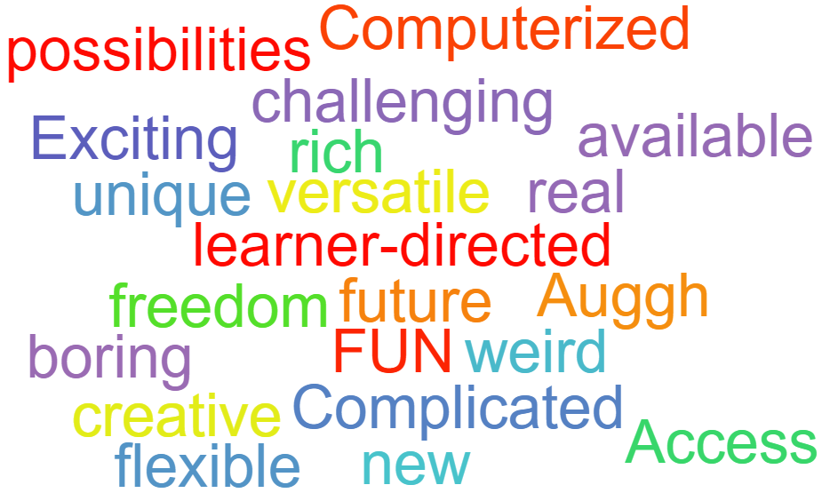

### Images & Graphic Organizers

Images and graphic organizers can be powerful tools in many types of assignments. Just as we use visuals in our teaching for various reasons, students can include them in assignments to engage the reader, present complex information quickly and clearly, and communicate effectively.

In the resources below you'll see several digital tools that may be useful for you in your teaching, as well as for your students in their assignments.  Be sure to give enough instructions and guidance when recommending a tool, and ensure the focus is on demonstrating the mastery of a course learning outcome (not the technology).

*Wordcloud of TONE participants answers "What do you think of when we say online?" - made with [WordItOut](https://worditout.com/)*

#### Digital Tools for Images & Graphic Organizers

:fa-book: Browse the following resources:

**Graphic Organizers / Concept Maps**
- [Cmap](https://cmap.ihmc.us/): concepts maps to construct, navigate, share and criticize knowledge models
- [Mind Meister](https://www.mindmeister.com/): Collaborate on mind maps in real time.
- [Draw Io](https://app.diagrams.net/): create diagrams by dragging and dropping pre-existing icons and shapes from a menu
- [Cacoo](https://cacoo.com/): Create diagrams online real time collaboration.
- [ZeeMaps](https://www.zeemaps.com/)

**Timelines**
- [H5P Timeline](https://h5p.org/timeline): Plug in for Moodle or WordPress.
- [When in Time](http://ww7.whenintime.com/): Create, view, share interactive digital timelines.
- [Time Toast](https://www.timetoast.com/): A bullet point centered timeline w/ text and pictures.
- [Preceden](https://www.preceden.com/?utm_source=timerime&utm_campaign=homepage): A fun easy site to use to create interactive timelines.
- [Office Timeline](https://www.officetimeline.com/): To integrate into PowerPoint.
- [Neatline](http://neatline.org/)

**Infographics**
- [easel.ly](http://www.easel.ly/)
- [Infogram](https://infogram.com/)
- [Canva](https://www.canva.com/create/infographics/)

**Mindmaps/Word Clusters:**
- [Word It Out](http://worditout.com/)
- [Wordle](http://www.wordle.net/)
- [Word Art](https://wordart.com/)
