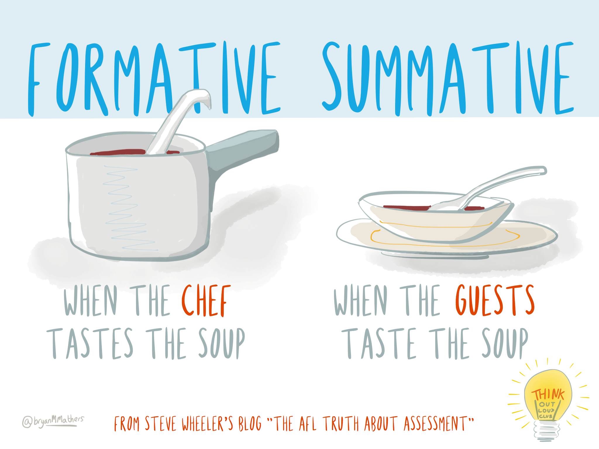

# Why Assess?
Think about why assessment is a part of your course.  How does it benefit you and your learners?

Assessment demonstrates whether, and to what degree, the learner has met the learning outcomes for the course. It often lets the instructor know what concepts students struggle with which informs their teaching.  Common assessments include tests, essays, discussions, but there are a number of other ways we can infer students’ understanding.

First, let’s focus on what assessment is.

## Understanding Assessment: Formative & Summative

In our courses, we often think first of **summative assessment** – the final test, unit quiz, essay, etc., the results of which we use to infer what each student knows, understands, or is able to do.  These assessments allow students to demonstrate their achievement in relation to the learning outcomes and based on our interpretation of their performance, we certify their achievement in the form of a final grade.

**Formative assessment** involves giving feedback and helping students learn from the assessment. Formative feedback on assessment tasks is intended to provide information to learners and instructors so that they can adjust their learning and teaching strategies in future attempts at demonstrating achievement. 

It is important to recognize that *activities* themselves are not formative or summative, but, rather, it is how the data generated by the performance task is used that determines whether it is formative or summative. For example, scores from a selected-response midterm exam can be used to provide feedback to learners on their current knowledge in the course so that they can adjust, or not, their learning approaches. The same exam can provide timely data for the instructor to show whether their teaching approach is effective or not. Additionally, that exam can also contribute to a final inference and be both formative and summative. Alternately, a one-on-one conversation about the muddiest idea in the course can be used as a summative assessment and lead to a final grade; or it can be purely formative for the learner and teacher.

|   | **Summative Assessment**| **Formative Assessment**|
|---|---|---|
| When| Sometime *after* the learning takes place | *During* the learning |
| Goal| To make a judgement about achievement | To improve learning |
| Feedback| Communicating a final judgement| Identifying gaps between *expected* and *actual* achievement and how to close them |
| Frame of Reference | Sometimes normative (comparing each student against all others); sometimes criterion | Always criterion (evaluating students according to the same criteria) |

*Table adapted from [Wikipedia](https://en.wikipedia.org/wiki/Formative_assessment#cite_note-11) citing Charting your course: How to prepare to teach more effectively, Atwood, 2000.*

---

[columns="3"]
## Assessment *OF*,  *FOR*, and *AS* Learning

Earl (2013) further clarified the role assessment can play in learning by highlighting a distinction between assessment *of* learning (summative assessment) and assessment *for* learning (formative assessment by way of feedback) and also distinguishing both of those from assessment *as* learning (a subset of assessment *for* learning in which learners employ metacognitive skills to regulate their own learning tasks). Earl's delineation between types of assessment reflects the modern view that assessment and learning are, or ought to be, tightly integrated.

| ### Assessment *of* Learning |### Assessment *for* Learning | ### Assessment *as* Learning |
|---|---|---|
|Assessment of learning is another term to describe *summative assessment*. The purpose in assessment *of* learning is to certify that a learner has achieved a particular level of ability in relation to the learning outcomes. | Assessment *for* learning is parallel to *formative assessment* where the purpose is to provide feedback to learners and teachers to inform future teaching and learning strategies. Because assessment for learning informs teaching, it is considered to be a part of teaching, rather than an event sometime after the teaching has taken place. | Assessment *as* learning is a subset of assessment *for* learning where the goal is to provide self-regulatory feedback to learners to encourage them to think about the strategies they engage in (metacognition) and how those strategies can be modified to support future learning. |

---

## Alignment in Course Design
So how do we choose formative and summative assessments for our course?  An important part of course design is checking that there is alignment between assessments and learning outcomes.  If your learning outcome asks students to compare two theories, for example, how do they show you they can do that?  Often instructors will have their assessments in mind before they write their learning outcomes.  Whatever process you have, make sure that your course learning outcomes are assessed in your assignments.  Try to include these connections in your syllabus, as in the example below:

| Grade Activity | Linked Learning Outcomes | % of course grade |
|:---:|:---:|:---:|
| Lab Participation and engagement\* | 1, 2, 4, 7 | 5 |
| Servant Leadership Portfolio | All | 30 |
| Weekly Reflections | 1 | 10|
| Two Quizzes | All | 10 each |
| Case Study Paper | All | 15 |
| Group Project | 1, 2, 6, 7 | 20 | 
|   | Total | 100 | 

! \* Please note that 'Participation' grades are one of the most significant sources of bias in grades and should be used only in conjunction with some sort of evidential artifact.

## Learning Activities: Preparing for Assessments
One other alignment check that needs to be made in your course design is the connection between the assessments and the learning activities.  Learning activities are designed to help students engage with the course topics.  They are often ungraded and optional, so in order to motivate students to complete them, we need to emphasize the connections to the assignments and how the activities will help students succeed in their assessments.

Another reason to include learning activities in your online course is so that learners can practice the key concepts/questions and get *messy* with their learning.  Learning is a process, and activities allow for students to work through questions, organize their learning, explore solutions, and prepare for assessments.   

---
