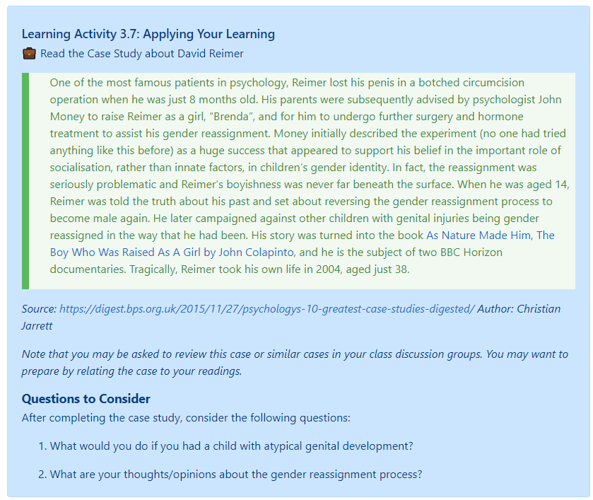
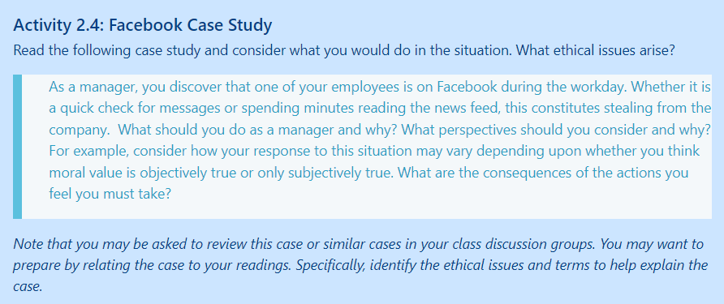

Case studies, simulations, and role plays are a great methods to strengthen students' critical thinking skills, as they often need to analyze issues, solve problems, and make decisions. They can be especially effective as group assignments, perhaps allowing for some "disorienting dilemmas" that cause transformational learning.

Consider having your students write and analyze case studies for an assignment.  Or better yet, contribute to [OPEN CASE STUDIES AT UBC](https://cases.open.ubc.ca/), an interdisciplinary, open educational resource with case studies that can be used by anyone.

#### Resources for Case Studies, Simulations & Role Plays

**Case Studies:**
- [Free cases from the Case Centre](https://www.thecasecentre.org/educators/casemethod/resources/freecasesoverview)

**Case Study Tips for Faculty & Students:**
- [Cengage Learning: Case Studies ](http://college.cengage.com/business/resources/casestudies/students/index.html)

**Simulations & Role Plays:**
- [Role Playing Activities​](https://academictechnologies.it.miami.edu/faculty-engagement/narrative-techniques-study/role-playing-activities/index.html)
- [​Role-Playing Scenarios](https://serc.carleton.edu/introgeo/roleplaying/scenario.html)

## Sample Case Study Activities

#### Activity 2.3: Case Study - Southwest Airlines
Watch the following 5 minute video from Herb Kelleher, Founder of Southwest Airlines - *How Southwest Airlines Built Its Culture*.  
<iframe width="1120" height="630" src="https://www.youtube.com/embed/8_CeFiUkV7s" title="YouTube video player" frameborder="0" allow="accelerometer; autoplay; clipboard-write; encrypted-media; gyroscope; picture-in-picture" allowfullscreen></iframe>

##### Questions to Consider  
1. Kelleher states, “If you focus on your people, your mission statement is eternal” (1:14-1:18). How does this philosophy align with transformational servant leadership principles?  
1. Why does Southwest Airlines value a positive attitude over education and skills when recruiting new employees?  
1. Does your hiring department embrace the same values as Southwest Airlines? If not, how would your work environment change if the focus shifted in this way?  
1. Write down at least three of Kelleher’s examples of a model Southwest Airlines employee. Consider how these traits could be applied in your vocational context.

### Research Ethics Case Study

Read the following case study and answer the questions below.

**Case Study #1: Respect for Persons (Informed Consent)**

A research project examining the dental hygiene practices of children in a rural community in Southern India is under way. The purpose of this study is to look at the effectiveness of an educational program about oral hygiene to improve hygiene practices among children between the ages of 5-10. Both the local Research Ethics Board (REB) and the university REB have approved this research and the consent process.

During a routine monitoring visit for this study, the lead investigator observes the consent process for several study participants. The lead investigator finds that the research assistants administering the informed consent do the explanation quickly without ensuring that parents understand what will happen to their children. One research assistant notes that he believes the parents will defer to authority anyway and, because he’s absolutely convinced the research will benefit the children, why does it matter? As a result, not all of the information on the consent form has been explained to the parents, as was planned at the staff training.

In fact, when a script is sought it was found that none exists. Some explanations are different than others. Furthermore, most of the consent form is paraphrased and several essential elements are omitted. All the parents signed the consent form.

When the research assistants are questioned about this, they state that the parents at this site are not capable of understanding everything in the consent form, so they have agreed to emphasize only the most important aspects of the consent form. The lead investigator does not feel that the research assistants were following the informed consent process correctly.

After reading this case study, answer the following questions:  
1. What is informed consent?  
2. Reflect on what went wrong and what could change.  
3. Should the investigator report her findings to the REB?  
4.
