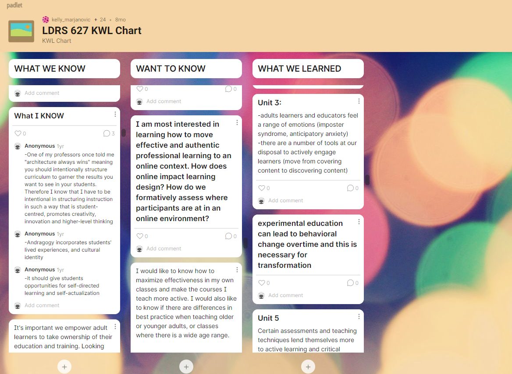
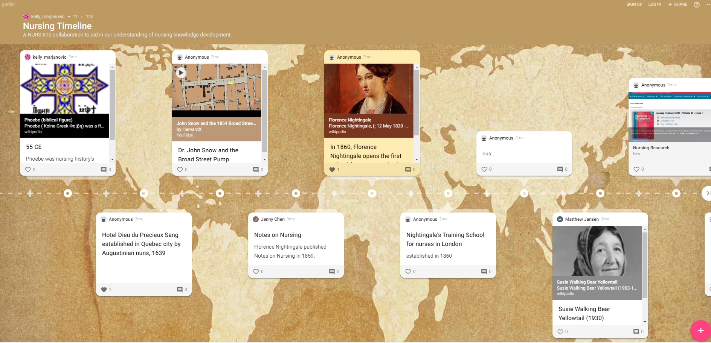

Consider using collaborative tools for your course assignments, synchronous sessions, and ungraded learning activities.  See below for the tools and course samples.

## Padlet
[Padlet](https://padlet.com/) is an online collaborative whiteboard, with a variety of templates to choose from.  Here are some examples from our courses:

<iframe src="https://player.vimeo.com/video/752743261?h=b847fd04bd&amp;badge=0&amp;autopause=0&amp;player_id=0&amp;app_id=58479" width="600" height="338" frameborder="0" allow="autoplay; fullscreen; picture-in-picture" allowfullscreen title="Padlet"></iframe>

## Google docs
Google docs is a favourite for many instructors and students. Consider using it for student notes during class, group projects, and other assignment documentation.

Here's an example from our [Leadership Spring Jam Collaborative Notes - May, 2022](https://docs.google.com/document/d/103df18ASQHJbcerH4N9MyXFieLc5qLEA94d3oSeY224/edit?usp=sharing)

## Google Slides
Another helpful tool for collaborative assignments is Google Slides.  Rather than a PowerPoint, you may want to suggest this option for students.
Here's an example presentation on [Flexible Course Design](https://docs.google.com/presentation/d/1cqSDiJBcXe7ImKCfe4VcQLj9u8FQTBL4bPDR_y7nsKA/edit?usp=sharing)
