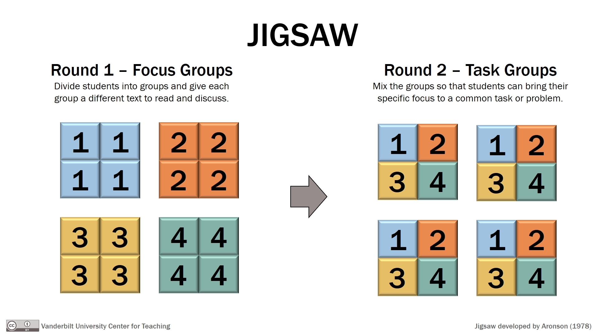

<iframe src="https://player.vimeo.com/video/752743283?h=489e3e3b35&amp;badge=0&amp;autopause=0&amp;player_id=0&amp;app_id=58479" width="600" height="338" frameborder="0" allow="autoplay; fullscreen; picture-in-picture" allowfullscreen title="Jigsaw Groups"></iframe>

Keep in mind general strategies for using group work, like the jigsaw approach. In a jigsaw, students participate in two rounds of small group activities. In the first round (sometimes called “focus groups”), each group of students is given a different reading or topic to discuss. In the second round (“task groups”), groups are reformed so that each new group has a representative from each of the first round groups. The tasks groups are then asked to bring to the conversation perspectives shared during the focus groups. In the hybrid classroom, each set of groups might be facilitated using the strategies mentioned above, and the second-round groups might be assigned intentionally so that in-person and virtual students interact.

From [Active Learning in Hybrid and Physically Distanced Classrooms](https://cft.vanderbilt.edu/2020/06/active-learning-in-hybrid-and-socially-distanced-classrooms/)
