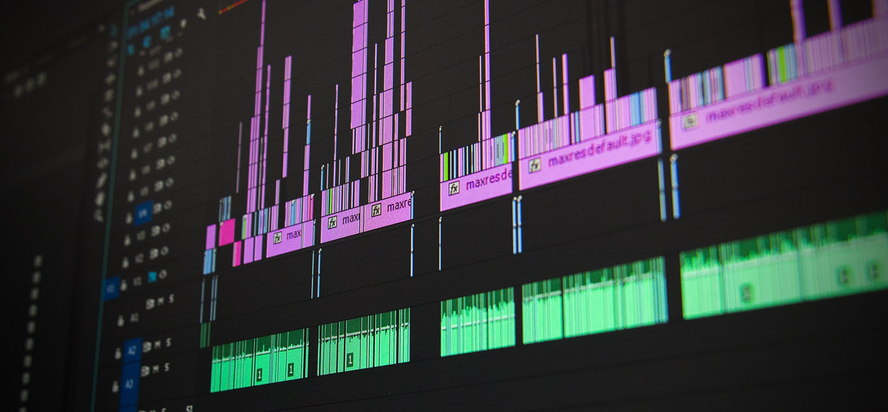

How do you currently integrate technology/media into your assignments?  Is there an opportunity for personalization or creativity in the way information is presented?  Let's discuss utilizing media in your assignments, such as video and audio applications.

### Video Assessments

Most students have access to a video recording device (their cell phones), so why not take advantage of that! Consider how you might use video assessments in your course. Students can record a video blog, give a presentation, show their field trip, demonstrate a procedure...the list goes on. Storytelling is a key feature of video assignments, so consider how students can connect the course content to their own personal or professional experience. Another way to use videos is for students to analyze videos online related to your course.

Check out the [Media Creation Section](https://trinitywestern.teamdynamix.com/TDClient/1904/Portal/KB/?CategoryID=6940) on the TWU Knowledge Base for technical instructions.

#### Audio Assessments

### Learning Activity: Sound Effect Story

In this two-part activity you will try to create a short story out of just sound effects (no dialogue), the [DS106 Sound Effect Story assignment](http://assignments.ds106.us/assignments/sound-effects-story/). To prepare for this, you can start trying to find or record five or more sounds you can piece together for a story. What can you tell in five sounds?

[Here is a sample story](https://soundcloud.com/a_motley92/sound-story).

Part 1: Find or record sounds you can edit together to create a story

The story can be about a project you are working on, or an accomplishment, or something related to a research project you may be engaged in (or just use sounds related to one of your personal interests).

You can either record sounds or find ones that are licensed for reuse. Some places to find sounds include:

[Freesound](http://www.freesound.org/) (free but you need to create an account to download)
[McCauley Library](http://macaulaylibrary.org/) (Cornell Lab of Ornithology) offers wildlife sounds.
[public domain sounds](http://www.pdsounds.org/) shared and recorded by people around the world.
[SoundBible](http://soundbible.com/free-sound-effects-1.html) free sound effects
[SoundTransit](http://turbulence.org/soundtransit/search/) field recordings
[Wikimedia Commons Sounds by Type](http://commons.wikimedia.org/wiki/Category:Sounds_by_type)

####Part 2: Create your story

In part 1, we suggested recording or finding sounds you can use to edit to a single piece; something that might introduce your eportfolio or web site readers to the environment of the place you work. The story can be about a project you are working on, or an accomplishment, or something related to a research project you may be engaged in (or just uses sounds related to one of your strong interests).

If you have not gathered sounds, see above for links to some resources.

Assemble the clips in Audacity to tell a story. Use multiple tracks so you can overlap as needed, and or use fade in / fade out so there are no abrupt changes. Think about using an ambient sound as a background. The basic steps for doing this (and some useful things to know about Audacity) [are shown here](https://www.youtube.com/watch?v=cTw9ZwL0CTA) (40 mins) and as well in [this screencast](https://www.youtube.com/watch?v=gXfVKSx7WtY) (15 mins).

Here is one such example done for a [school project](https://www.youtube.com/watch?v=7-7eekV9gPc)

Upload your final audio (exported as MP3) to [SoundCloud](http://soundcloud.com/) and then you can embed the sounds just by pasting it's SoundCloud URL into a blank line of your editor in Moodle or WordPress (other blog platforms can use the SoundCloud HTML embed code).

#### Podcasts
Podcasts can be another engaging alternative/addition to a typical essay, project, interview or presentation.

What sets some podcasts apart from others is the degree of production that goes into the final product. For some insight into how high quality podcasts are produced, listen to [this episode](https://transom.org/2012/dissecting-joanne-rosser-papermaker/) from HowSound (16m 17s), a podcast about producing podcasts. With that information in mind, while you listen to audio content on the radio or in a podcast, pay attention to the techniques that the producers used to tell their story. Here is an example of how the absence of sound can provide a significant emotional cue in an audio recording. [Pay attention at around the 3-minute mark](https://create.twu.ca/orientation/ted-radio-hour-audio-demo/). For some of the best examples of audio storytelling, check out a few episodes of [The Truth podcast](http://www.thetruthpodcast.com/). The episodes are short (~20min or less) and are described as 'movies for your ears'. Listen in a quiet place where you will be able to become immersed in the soundscapes of the story. For best results, use headphones.

See the following sample assignment from a TWU course, as well as the resources in the learning activity below.

---

### Learning Activity: Podcast

In this learning activity, you will create an idea for an action research project based on one of the practical problems you have identified from your professional life. You will present this project idea in a podcast for your colleagues. Audio I and Audio II in the Digital Literacy section of the orientation will explain how to set up your podcast. You can find the link to the orientation [here.](https://create.twu.ca/orientation/#Digital_Literacy)

If you know how to create video you are welcome to do that instead. It is your choice whether to create a podcast or video. This learning activity is intended to be informal, so do not spend too much time planning and researching your topic. Please note that if you are sharing confidential information from your place of employment that you should change the name of your employer or any people involved.

#### Instructions:

*   Using one of the practical problems you identified from learning activity 8.1, create an idea for an action research project following the steps described by Plano-Clark and Creswell (2015) on pp. 440-442.
*   Record that idea in a podcast so that it can be presented to your colleagues for feedback.
*   Your introduction should include your key problem and explain the structure of your presentation.
*   Your project idea should relate to a practical leadership issue you are currently facing.
*   Your project idea should be clear and well organized.
*   Your project should fit within 3-5 minutes but no more than 6 minutes.
*   Provide a conclusion that gives a call to action.
*   Upload your podcast to [soundcloud.com](https://soundcloud.com), [anchor.fm](https://anchor.fm), or another suitable online service and embed it in a new post on the discussion forum.

**Reminder:** Make sure you take some time to practice what you are going to say (I highly recommend creating a script) and give yourself lots of time to record, make mistakes, re-record, make more mistakes, take a break, re-record and then post it on the discussion forum.

*   Note this podcast is part of your assessment for this unit.  

---

#### Resources on Video & Audio Assignments:

:fa-book: Select from the following resources:

**Video Assignments**
- [Setting up for Success](https://trinitywestern.teamdynamix.com/TDClient/1904/Portal/KB/ArticleDet?ID=144493&SIDs=11366)
- [Media Creation Tips](https://trinitywestern.teamdynamix.com/TDClient/1904/Portal/KB/ArticleDet?ID=146721)
- [Microsoft Stream Guides](https://trinitywestern.teamdynamix.com/TDClient/1904/Portal/KB/?CategoryID=23454)
- [Best practices for video assignments](https://learninginnovation.duke.edu/blog/2010/03/2009-video-fellows-report/)
- [An Online Video Assignment (that is Fun to Grade!)](https://www.thesociologicalcinema.com/blog/an-online-video-assignment-that-is-fun-to-grade): See the video analysis examples for this assignment.
​- Sample Video Assignment: [GEOL 109 | The Earth and Life Through Time](https://sites.usask.ca/geol109/)
- Video Assignment Instructions: [OERu micro-course on Project Management](https://course.oeru.org/ipm103/learning-pathways/your-project/video-signpost-your-project/)
- [Powtoon](https://www.powtoon.com/): Create animated videos and presentations

**Podcasts**
- [Hear This! Podcasts as an assessment tool in higher education](https://arthropodecology.com/2013/08/28/hear-this-podcasts-as-an-assessment-tool-in-higher-education/)
- [Creative Assignments: Podcasting](https://academictech.uchicago.edu/2019/02/01/creative-assignments-podcasting/)
