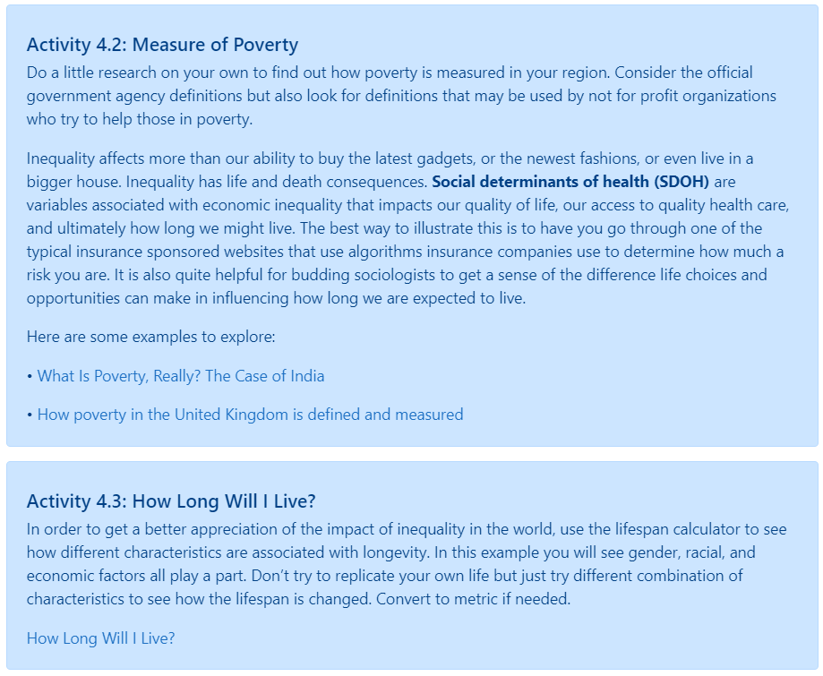
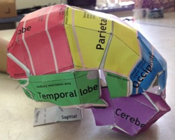

!!!! Read Chapter 1.  
!!!! Watch this video.  
!!!! Read this article.  

When we ask learners to engage with course resources, how do we set them up for success?  There are several [High Impact Practices (HIPS)](https://uwaterloo.ca/centre-for-teaching-excellence/support/integrative-learning/high-impact-practices-hips-or-engaged-learning-practices) that we suggest when introducing a student to a textbook chapter, article, or video.  

## Setting the Stage
When introducing a reading/video, consider adding the following:
- Who is the author/speaker?  Why are they an expert in the field?
- What is the resource about? What topics will the text/video cover?
- Why is this important?  How does it relate to the course/unit learning outcomes?  How does it impact the field of study?  How could it affect the learner?
- How much time will it take?  How long will it take to read/watch?

## Active Learning
After students have viewed the resource, what should they do?!  If we consider active learning in an online course, what does this look like when students read a chapter or watch a video?  
- **Reflect!** Add a "Questions to Consider" after the resource is presented.  What key questions should students reflect on.  Ask them to jot down notes in a reflective journal.
- **Go!** Does this reading/video support a field trip or observation?  For example, in a Worship Arts course at Trinity, students are asked to analyze their church's worship service. After they read an article, they can participate in a church service and apply the principles they learned.  Other courses ask students to get outside and consider environmental considerations, workplace interactions, school settings, etc.  The main idea is to apply what students have read/watched to a situation.
- **Ask!** At times we ask students to ask a co-worker, friend, family member about a course concept.  Talking about a resource/concept helps solidify ideas and presents students the opportunity not only to summarize content, but also learn from others about their experiences related to the course content.  
!! When suggesting ungraded interviews, remember to follow ethical practices. We instruct students to disclose the course, the purpose (e.g. general feedback), and place the info will be held (e.g. just conversation between coworkers, or used in an online discussion forum or assignment). If information from interviews is presented online, we encourage students to use pseudonyms.   
- **Do!** After students have engaged with a resource, you may want to ask them to do something!
  - create a graphic organizer comparing ideas
  - create a mind map connecting ideas
  - create a 3D model of what was presented ()

These additional tasks support students as they interact with these resources and help them engage in "deep approaches" to learning.

The next time you are tempted to simple add a pdf resource to Moodle...consider adding some context and some action items for students so they can truly engage with the content.

## High Impact Practices
Remember these characteristics (Kuh, 2013) which when incorporated into different academic practices, can engage students and have a high impact on their learning.

- Encourage students to invest significant and meaningful  time and effort on authentic, complex tasks over an extended period of time.  
- Add meaningful interactions amongst students and between faculty and students about substantive matters.
- Challenge students’ ways of thinking, increase interactions with individuals with experiences and life experiences different from their own.
- Provide frequent, timely and constructive feedback.
- Increase periodic, structured opportunities to reflect and integrate learning.
- Provide opportunities to discover relevance of learning through real-world applications, or add a real-world/authentic experience.
- Add a public demonstration of competence

## Sample Activities

## Additional Resources
[Characteristics of a High Quality, High Impact Practice](https://uwaterloo.ca/centre-for-teaching-excellence/support/integrative-learning/high-impact-practices-hips-or-engaged-learning-practices) from University of Waterloo
