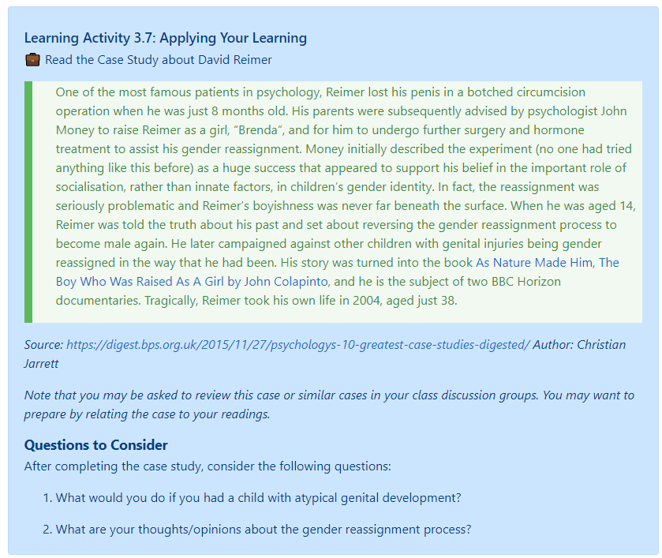

Case studies, simulations, and role plays are a great methods to strengthen students' critical thinking skills, as they often need to analyze issues, solve problems, and make decisions. They can be especially effective as group assignments, perhaps allowing for some "disorienting dilemmas" that cause transformational learning.

Consider having your students write and analyze case studies for an assignment.  Or better yet, contribute to [OPEN CASE STUDIES AT UBC](https://cases.open.ubc.ca/), an interdisciplinary, open educational resource with case studies that can be used by anyone.

## Sample Case Study Activities

#### Resources for Case Studies, Simulations & Role Plays

**Case Studies:**
- [Free cases from the Case Centre](https://www.thecasecentre.org/educators/casemethod/resources/freecasesoverview)

**Case Study Tips for Faculty & Students:**
- [Cengage Learning: Case Studies ](http://college.cengage.com/business/resources/casestudies/students/index.html)

**Simulations & Role Plays:**
- [Role Playing Activities​](https://academictechnologies.it.miami.edu/faculty-engagement/narrative-techniques-study/role-playing-activities/index.html)
- [​Role-Playing Scenarios](https://serc.carleton.edu/introgeo/roleplaying/scenario.html)
