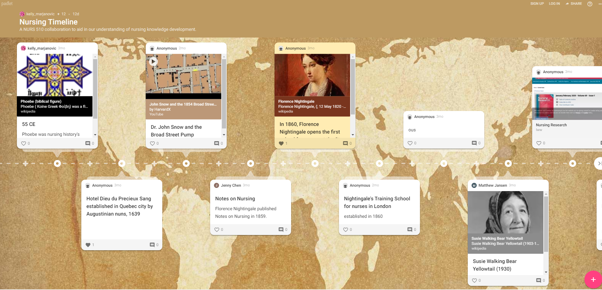

Consider using collaborative tools for your course assignments, synchronous sessions, and ungraded learning activities.  See below for the tools and course samples.

1. [Padlet](https://padlet.com/)

Google docs

Google Slides

etc.
