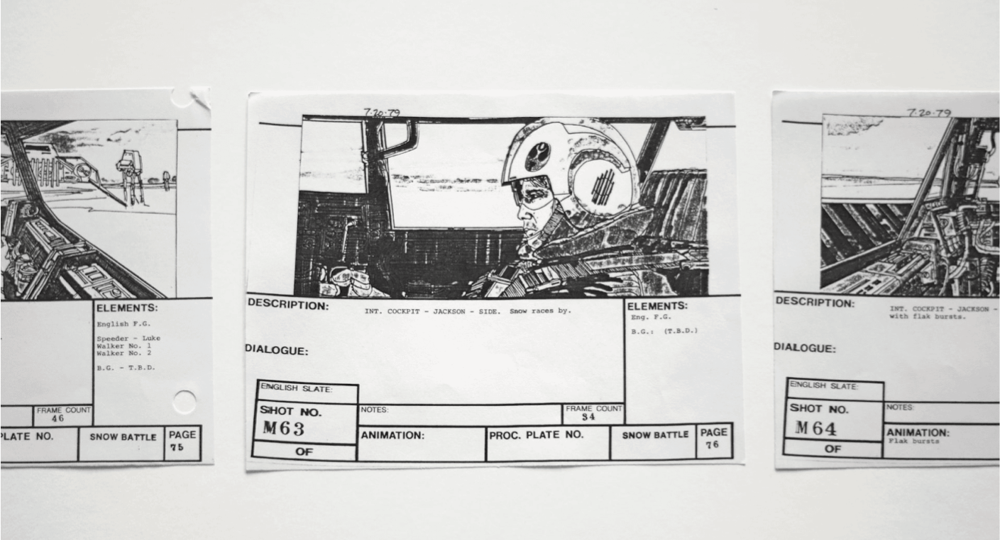

Storyboarding is a form of visual storytelling. Its purpose is to convey a series of events by using static panels. This form of storytelling is often used in animation and film production, where directors outline complex action scenes before shooting. Storyboarding for educational purposes builds on the idea of organizing events that occur over time. This type of assessment can allow students to creatively demonstrate their understanding of a concept, pattern, or step-by-step process. For example, in History this could entail historical events that must be placed in a timeline. In Physics, students may be required to visualize and explain the trajectory of a flight.
Storyboarding can also be a useful tool to gauge the learning that occurs throughout a course. For instance, students can begin by drafting a “scene” at the beginning of a unit or topic, and add details (such as dialogue or exposition) while their understanding of the concept evolves. Noting the detail that a student puts into their storyboard is a helpful way to assess their comprehension of a subject.

---

### Storyboarding Tools

The following storyboarding tools can help students “craft” their narrative.

*   [Download blank storyboard template](https://www.xinsight.ca/tools/storyboard_template_16x9.pdf)

*   Free storyboard software: [storyboardthat](https://www.storyboardthat.com/); [Miro](https://miro.com/aq/ps/templates/storyboard/?utm_source%3Dgoogle%26utm_medium%3Dcpc%26utm_campaign%3DS%7CGOO%7CNB%7CCA%7CEN-EN%7CPareto-DSA%26utm_adgroup=%26utm_custom%3D16870976802%26utm_content%3D592660485077%26utm_term%3D%26matchtype=%26device=c%26location=1002347&gclid=CjwKCAjwt7SWBhAnEiwAx8ZLaluloC1VpGBRYd7ynNjHBPPFPC2Ii8lfjTqVDjvOHjnLwV_EXgXFgRoC17EQAvD_BwE); [Milanote](https://milanote.com/product/storyboarding); [Wonderunit](https://wonderunit.com/storyboarder/); [Boords](https://boords.com/storyboard-creator)

### Tips and tricks for creating effective storyboards

*   Keep it simple: Your storyboard should be easy to follow

*   Don’t jampack your scenes with too many details OR leave out essential details so that no one knows what’s happening; Find a balance

*   Don’t worry about “making it pretty”; use simple drawings or pictures with clear dialogue

*   Convey context and location in at least a few of your scenes (such as a streetlight, storefront, or office)

*   “Is that a tree or giraffe?” If drawing isn’t one of your strengths, don’t be afraid to label your objects and characters so that it’s clear for the audience

*   If your scene includes action, remember to include some form of direction (either through dialogue or by adding simple arrows)

### Assignment Examples:

[Create a Storyboard - Columbia University](http://www.columbia.edu/itc/visualarts/r4110/f2000/week03/03_07_Assignment_2.pdf)

[Storyboard Assignment - StuDocu](https://www.studocu.com/en-au/document/university-of-technology-sydney/human-resource-management/storyboard-final-storyboard-assignment/18742694)

[Storyboard Assignment - Stanford HCI Group](https://hci.stanford.edu/courses/cs147/2008/assignments/4_storyboard.html)

### References / Guides:

[Evaluation Criteria for Storyboarding - University of Wisconsin-Madison](https://dept.writing.wisc.edu/wac/self-evaluation-criteria-for-a-storyboard-assignment/)

[Storyboarding Blueprint - University of Suffolk](https://libguides.uos.ac.uk/celt/cdb/begin_design/storyboarding)

[11 of the best storyboard templates & creative writing resources - Teachwire](https://www.teachwire.net/news/9-of-the-best-storyboard-templates-and-creative-story-writing-resources/)

[Digital Storytelling Rubric](http://www.facultysupport.com/resources/Digital_Story_Telling_Sample_Rubric.pdf)

[What is Storyboard and how does it work? Best Tips & Tricks](https://www.techlearning.com/how-to/what-is-storyboard-that-and-how-does-it-work-best-tips-and-tricks)
