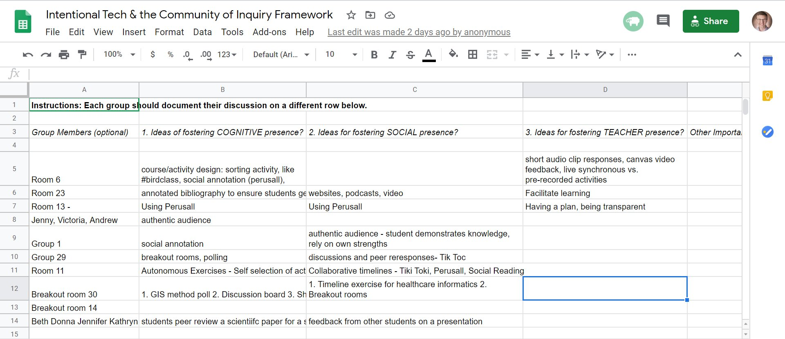
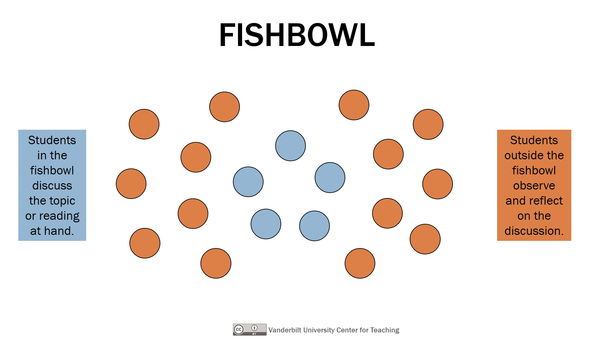
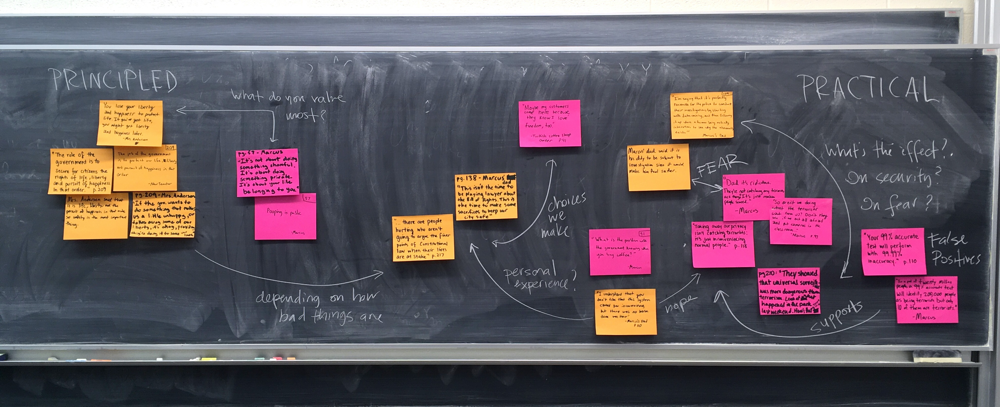

## What is Multi-Access Learning?

! Multi-access learning is "*a framework for enabling students in both face-to-face and online contexts to personalize learning experiences while engaging as a part of the same course*. Multi-access learning is different than blended learning because it places the **student at the center** of the learning experience as opposed to the instructor or the institution (Irvine, Code & Richards, 2013).

! "The core principle of the multi-access framework is one of enabling student choice in terms of the combination of course delivery methods through which the learning environment is accessed; that is, each individual learner decides how he/she wishes to take the course (e.g., face-to-face or online) and can then participate with other students and the instructor – each of whom have their own modality preferences – at the same time" (Irvine, Code & Richards, 2013).

Multi-access learning brings more choice to students and promotes a learner-centred course design and best practices in teaching and learning. However, it is important to recognize that multi-access courses do not necessarily allow for learners to switch between modalities. There is often confusion in this regard due to the large amount of press and public conversation around what is called HyFlex learning which ***does*** allow for learners to pick their modality at any time throughout the course. HyFlex is a type of multi-access, but multi-access is not necessarily HyFlex. To read more about the differences between course structures that merge modalities, please see Irvine's article in EDUcause, below.

<a class="embedly-card" href="https://er.educause.edu/articles/2020/10/the-landscape-of-merging-modalities">The Landscape of Merging Modalities</a>

View the following video that explains multi-access learning:

<iframe src="https://player.vimeo.com/video/412934070" width="640" height="360" frameborder="0" allow="autoplay; fullscreen" allowfullscreen></iframe>

<a href="https://vimeo.com/412934070">Multi Access</a> from <a href="https://vimeo.com/openhandreel">Scott Macklin</a> on <a href="https://vimeo.com">Vimeo</a>.

---

Read more about the 4 tiers of multi-access learning by clicking the following titles.

[ui-accordion independent=false open=none]

[ui-accordion-item title="Tier 1"]

The first tier of multi-access learning is what most of you have experienced (as learners and faculty) as the predominant modality of higher education, face-to-face (f2f). F2f learning environments are often assumed to be the preferred modality of learning because a f2f classroom allows for rich, multi-modal interactions and robust community-building. This is true to an extent, but only if class sizes are very small; large, lecture-based classrooms present significant challenges to building the kind of critical and safe community for engaged interaction.

[/ui-accordion-item]
[ui-accordion-item title="Tier 2"]

The second tier of access allows learners who cannot travel to a central campus (like during a worldwide pandemic) to participate in a learning community syncronously via video conferencing. Remote and local learners may exchange items and artifacts and may share video feeds and use software such as Etherpad or screensharing through the web-conferencing tool to collaborate on documents for co-creation of content.

[/ui-accordion-item]
[ui-accordion-item title="Tier 3"]

The third tier provides asynchronous access for remote learners who cannot join the scheduled class session due to any number of constraints (employment, child/elder care, time-zone, or even network bandwidth). Irvine, et al. acknowledge that simply viewing a recording of a synchronous session, regardless of how collaborative and engaging that session may have been, is a much leaner experience for learners and may not be optimal. This highlights the need to provide learning materials in formats beyond video and audio, perhaps including text-based materials and asynchronous tools for co-creation of content such as GitHub.

[/ui-accordion-item]
[ui-accordion-item title="Tier 4"]

The outermost tier of the model is for open participation from non-credit learners who are choosing to participate for their own interest and edification. It may seem anathema to some faculty to consider opening their course to the world, but the benefits can be significant, particularly in times like the spring of 2020.

[/ui-accordion-item]

[/ui-accordion]

---

## Designing A Multi-Access Course
So what does this look like in a course?  How do you deliver high quality and equitable lessons when there is a mix of students joining you face-to-face on campus, online through synchronous zoom sessions, and online asynchronously?

### Technical Set-up For a Multi-Access Class
Before we get into the design considerations, we want to address the technical issues involved.  When asked to teach a multi-access course, a common question faculty have is "What equipment do I need?"

☑️ Camera  
☑️ Microphone  
☑️ Internet  
☑️ Good lighting  
☑️ Zoom (or other video conferencing tool)  

For online students to see and hear you, you'll need a camera and a microphone.  You can use your computer that should have these features, but if your course is multi-access, you may want to consider an [OBSBOT camera](https://www.obsbot.com/obsbot-tiny-4k) and a [Lewinner wireless microphone](https://www.lewinnertech.com/collections/lavalier-microphone).

Here's a demo with Scott Macklin showing how to use this equipment:

<iframe src="https://player.vimeo.com/video/613908225?h=ec7404e57a" width="640" height="360" frameborder="0" allow="autoplay; fullscreen; picture-in-picture" allowfullscreen></iframe>

<a href="https://vimeo.com/613908225">Inclusive Classroom Demo</a> from <a href="https://vimeo.com/twuglobalonline">Trinity Western Online</a> on <a href="https://vimeo.com">Vimeo</a>.

On our help pages, we have all the technical requirements explained.  Please visit the [TWU Help Guide](http://create.twu.ca/help/video/video) for more information.

See the [Hardware Recommendations List ](https://trinitywestern.teamdynamix.com/TDClient/1904/Portal/KB/ArticleDet?ID=144490) to find out where to purchase recommended hardware.

### Activity Design For a Multi-Access Class
As you think about your courses, consider designing learning activities for different modalities and access points.  

Here are some common activities and considerations for each:

[ui-accordion independent=false open=none]

[ui-accordion-item title="Class Discussions"]
If we consider the three audience types: face-to-face (F2F), online synchronous (e.g. through live Zoom session), and online asynchronous, we need to plan our class discussions carefully.  Here's how they might expect to participate:

**F2F:** Discuss in small or large groups in the classroom.  
**OL Synchronous:** Discuss in Breakout groups in Zoom, or in the large Zoom session with all participants.  
**OL Asynchronous:** Watch the recorded class session and participate through discussion forums, posting responses and questions.    

However...how do you conduct the live class session with the F2F and Zoom groups?  Do the groups talk to each other?  Will there be audio/video complications?  See the following key tips to help your lesson go smoothly.

##### Key Tips:
- First, make sure you set up your classroom with the appropriate audio / video equipment. (see section above on technical considerations).
- Ask students who are coming to campus to bring their laptop to class.  During discussions (large or small group), ask them to log into the Zoom session, turn their **camera on**, and their **sound off**.  This allows the online students to interact with the campus students, and allows for mixed small group discussions.
- Use breakout rooms in Zoom, and small groups in the campus classroom.
- If you're up for a challenge, try mixing the groups! The audio will be an issue, so you'll want to make sure all campus students have earphones to listen to their online peers.

For more tips on class discussions and multi-access lessons, see the next activities.

[/ui-accordion-item]
[ui-accordion-item title="Live Polling"]

One simple way to engage students in the room and on the Zoom call is to use a live polling tool to ask them questions about the course material. Zoom polls, for instance, let you ask multiple-choice and multiple-mark questions pretty easily. This would mean your in-person students would need to be in the Zoom session, which has advantages. But if your Zoom screen is getting too busy, you could have your in-person students turn off their cameras; Zoom can hide participants who don’t have their cameras on.

If having your in-person students in the videoconference is hard, or if you’d like to ask more complex questions (free-response, clickable image questions, and so on), you could shift to a second platform like Poll Everywhere (free for a limited number of students). This adds a little overhead for instructors and virtual students (now you have to manage, say, Zoom windows), but if you’re going to use polling regularly, that learning curve might be worth it.
(From [Active Learning in Hybrid and Physically Distanced Classrooms](https://cft.vanderbilt.edu/2020/06/active-learning-in-hybrid-and-socially-distanced-classrooms/))

[/ui-accordion-item]
[ui-accordion-item title="Backchannel"]

The text chat in Zoom can be used to host what is called a backchannel for class discussion. The spoken dialog between you and your in-person or online students forms the “frontchannel,” while the text chat provides a forum for supplemental discussions among students. A backchannel can be useful for fostering dialog and even a sense of community among your in-person and online students. It can also serve some universal design purposes by providing a written alternative to spoken discussions or an ad hoc text captioning of spoken conversations.

Note that, as with live polling, if Zoom’s bchat tool isn’t suitable, you could add a second platform like Slack, Discord, Microsoft Teams, or the chat function in Moodle. These platforms can also be useful outside of class time for less formal communication among students and instructors. Note also that for Zoom, if a student drops the call and then re-enters the session, they lose the earlier text chat, which is another reason to use a second platform.

Monitoring and responding to the backchannel can be a challenge for instructors, of course, whose attention can only be split so many ways. I recommend appointing someone to be the “voice of the chat.” This person could be a rotating student or a teaching assistant or a faculty colleague (maybe you can return the favor in their class). Their job is to monitor the backchannel and look for questions or comments that should be brought to the attention of the instructor. I like to plan “voice of the chat” moments in my lesson where I call on this person to speak up and share these questions and comments, and I’ll even signal these moments in my slides, using a graphic like the one seen here.

It’s a good idea to talk with your students about how to use the backchannel productively during class sessions. You might want to establish some community norms about appropriate text chat use. You might also want to direct students’ contributions to the backchannel with some guiding questions.

If audio is a challenge in your classroom, that is, if it is hard to hear students who are socially distanced and wearing masks, then the backchannel + voice of the chat combo might be particularly useful. If you have a microphone to share with your voice of the chat, you could invite all students to share their questions and comments on the backchannel, then rely on the voice of the chat to vocalize those questions with you and the entire class using the mic.
(Modified from [Active Learning in Hybrid and Physically Distanced Classrooms](https://cft.vanderbilt.edu/2020/06/active-learning-in-hybrid-and-socially-distanced-classrooms/))

!! **Save the Chat!** Did you know that you can save the chat in Zoom?  Next time you're in a Zoom session, look at the 3 dots (more) at the bottom of the chat window.  Select Save and it will save a file to your computer.  You may want to share this tip with students so they can save any conversations and weblinks shared in the chat.

[/ui-accordion-item]
[ui-accordion-item title="Collaborative Notetaking"]

A variation on the backchannel approach is collaborative notetaking. This typically involves setting up a Google Doc for students to use during class to take notes on the class discussion. Often, two or three students are appointed lead notetakers for a given class session, with that duty rotating among students over the semester, but all students are invited to read and contribute to the shared notes.

This approach provides a structure for active listening during class–notetakers don’t participate in the discussion but try to capture all of it they can, while the rest of the students can focus on participating in discussion without having to worry about taking notes–and might be particularly valuable in a classroom where it is hard to hear some students, especially if the notetakers are scattered throughout the socially distanced classroom.
(From [Active Learning in Hybrid and Physically Distanced Classrooms](https://cft.vanderbilt.edu/2020/06/active-learning-in-hybrid-and-socially-distanced-classrooms/))

Here's an example of a google doc: [HyFlex Course Design Examples](http://tiny.cc/HyFlex-examples) by Kevin Kelly from San Francisco State University.

!! **Template Alert!** Feel free to use this template to plan your Zoom sessions that involve collaborative notes: [Zoom Session Collaborative Notes - template](https://docs.google.com/document/d/1Uq3KFyjUHAjvto6pLspCqR2IFfLZrqjdGWCVOHQfsaw/edit?usp=sharing)

[/ui-accordion-item]
[ui-accordion-item title="Group Work"]
Live polling, backchannel, and collaborative notetaking are useful activities that don’t require students to leave their physical or virtual seats. But what about group work in a hybrid classroom where the in-person students aren’t free to move around the classroom? Let’s consider a possible scenario:

!!! You have three discussion questions for your students to consider in small groups. Under normal circumstances, you might have posted these questions in a PowerPoint slide or included them in a printed handout. In your hybrid classroom, however, you’ve put your three questions at the top of a Google Sheet, one question per column. You ask your students to get into groups of two or three, with the in-person groups sitting six feet apart from each other at tables and your online students moving to breakout rooms in your videoconferencing platform. You give your students some time to discuss the questions in groups and report their answers using the Google Sheet, with each small group selecting an unused row of the spreadsheet to document their answers.

!!! Ordinarily you might circulate among your students as they work to eavesdrop and ask a few questions. That’s not feasible now, but the Google Sheet serves a similar purpose. As the students work, you keep an eye on the sheet, monitoring your students’ progress through the activity (so you know when to call time) and getting a sense of their responses (so you can plan the debrief at the end of the activity). When the group work is over, you highlight a few student responses to share with the full group (either yourself or by asking the loudest group member to speak) along with your comments reflecting on and synthesizing the student ideas.

This approach has the advantage of engaging your in-person and online students in essentially the same activity. Your online students might actually have an easier time of it, if your in-person students find it difficult to talk at a distance and through masks. That said, having a collaborative document of some sort for the small groups to use gives them some options for handling the group conversation. For example, one group might assign each question to a different student to draft a response to, then switch up the questions for editing and revising. The coordination would happen through some simple, in-person communication, but the heavy lifting of responding would happen in the collaborative document. You might encourage group strategies like this one, if you find yourself in a classroom where students can’t hear each other well.
*Sample Activity Using Google Sheets*

Of course, Google Sheets is just one option for a way to organize and share student work. Other collaborative tools (Google Docs, Google Slides) might work better for some activities. Consider also annotation tools (Hypothesis, Perusall, NowComment, VoiceThread, ReClipped),  virtual whiteboards (Mural, Miro, Padlet), and spaces in your course management system. Different activities will benefit from different tools. You’ll also want to consider whether you want each group to have its own virtual space for collaboration or have all the groups work in the same virtual space.

Sometimes you might want rather structured responses from students, using something like Sheets with its columns and rows is useful, and other times you might ask more open-ended questions, asking each student group to construct its own slide in a Google Slide deck. Note that the more structure you build into the activity, the faster you’ll be able to parse and respond to student responses. In large classes, very structured options, like multiple-choice polling questions, are the most practical.

Note that moving to groups (in-person and online) and getting started using a collaborative tool will take students a little time. This isn’t as simple as turning to your neighbor in a traditional classroom and discussing a question, but if you make the group tasks meaningful and use the same tools regularly, this approach to group work has the potential to be practical.
From [Active Learning in Hybrid and Physically Distanced Classrooms](https://cft.vanderbilt.edu/2020/06/active-learning-in-hybrid-and-socially-distanced-classrooms/)

!! See our [Collaborative Activities](https://multi-access.twu.ca/assessment/assessment-ideas/collaborate) post in the Assessment Ideas section of this website. It has samples from TWU courses using Padlet and other collaborative tools.

[/ui-accordion-item]
[ui-accordion-item title="Written Work"]

One note for those teaching in disciplines (like mathematics) where group work involves students seeing each other’s written work: If you’re able to equip students with individual small portable whiteboards and markers, these might make it easier for students to show their work to group members across a six-foot gap. And for students participating in group work virtually, if they’re Zooming in using their phones, they can probably point their phones at their own handwritten work when they need to share with their groups.
From [Active Learning in Hybrid and Physically Distanced Classrooms](https://cft.vanderbilt.edu/2020/06/active-learning-in-hybrid-and-socially-distanced-classrooms/)

[/ui-accordion-item]
[ui-accordion-item title="Hybrid Pair Work"]

Here’s another spin on group work: Ask your in-person students to pair up with virtual students for a quick Zoom or FaceTime call. If all the in-person students are using earbuds or headphones and if you can solve the matching problem, this might be a practical way to include pair work during class time. And it has the added benefit of fostering community across your two groups of students.

[/ui-accordion-item]
[ui-accordion-item title="Jigsaw"]
Keep in mind general strategies for using group work, like the jigsaw approach. In a jigsaw, students participate in two rounds of small group activities. In the first round (sometimes called “focus groups”), each group of students is given a different reading or topic to discuss. In the second round (“task groups”), groups are reformed so that each new group has a representative from each of the first round groups. The tasks groups are then asked to bring to the conversation perspectives shared during the focus groups. In the hybrid classroom, each set of groups might be facilitated using the strategies mentioned above, and the second-round groups might be assigned intentionally so that in-person and virtual students interact.

From [Active Learning in Hybrid and Physically Distanced Classrooms](https://cft.vanderbilt.edu/2020/06/active-learning-in-hybrid-and-socially-distanced-classrooms/)

[/ui-accordion-item]
[ui-accordion-item title="Fishbowl"]
Here’s an activity that might actually work better in a hybrid classroom. The fishbowl is a class discussion strategy with a long history. In the classic formulation, an instructor would identify a small set of students who feel the same way about a topic. These students are instructed to make a circle with their chairs in the center of the room; they are in the fishbowl. They discuss the topic–how they think about it, why it’s important to them, and so on–while the rest of the students listen; the other students are outside the fishbowl. Then the instructor asks the observers to summarize or paraphrase what they heard; students in the fishbowl can affirm or clarify these remarks. Then the students switch places and repeat the process. The strategy is meant to encourage empathy for other points of view, and can be particularly useful for addressing contentious topics.

With a few modifications, the fishbowl activity should work well in the hybrid classroom. Instead of selecting students for the fishbowl by their points of view, an instructor might select a subset of their online students to be the “fish.” These students are asked to discuss the topic at hand from their various perspectives, while the other students (the in-person students and any remaining virtual students) listen and observe and (optionally) take notes in a collaborative document. After the fishbowl discussion, the observers then paraphrase or question or argue as appropriate to the topic, perhaps using their voices, the backchannel, or one of the group work structures mentioned above.

Running a fishbowl activity this way might not work as well at encouraging empathy, but it takes advantage of the fact that in a hybrid classroom the students in the room will likely have an easier time hearing the virtual students than the other way around. And if your hybrid class is structured so that you alternate which students attend in-person and which attend virtually, you can make sure that all students get the chance to be in the fishbowl over time.

[/ui-accordion-item]
[ui-accordion-item title="Physical Movement"]
There’s evidence that physical movement can benefit cognitive functioning (Ferrer and Laughlin, 2017). Although the socially distanced classroom might make moving around the room difficult, there still might be ways to incorporate physical movement in classes this fall. For instance, you might supplement a yes/no or agree/disagree polling question with some vertical movement by students, e.g. stand up if you agree, sit down if you don’t. I can imagine some more colorful options here, too, like asking students who vote a certain way to dab.

Here’s another idea, assuming you can access some office supplies: During a group work activity, students could jot down ideas or questions on Post-it notes and take turns affixing their notes to a group whiteboard or chalkboard. If the sticky notes and writing utensils are large enough (I’m fond of 5” x 7” notes and Sharpies), students in the group will be able to read the collected ideas. If not, one group member could take a photo of the notes with their phone and share it with the group.

It might be hard to require movement from your virtual students, but if you have one or more in-person students taking notes on the class discussion for later sharing with the class (via a Google Doc, for instance), some of your virtual students might enjoy going for a walk while they attend class, if they are able. Planning stretch breaks into long class sessions can be useful, too.

From [Active Learning in Hybrid and Physically Distanced Classrooms](https://cft.vanderbilt.edu/2020/06/active-learning-in-hybrid-and-socially-distanced-classrooms/) by Derek Bruff at Vanderbilt University

[/ui-accordion-item]
[ui-accordion-item title="Mini-lecture"]

| **Synchronous in person**                | **Synchronous online**                    | **Asynchronous online**              |
|------------------------------------------|-------------------------------------------|--------------------------------------|
| Students watch mini-lecture in classroom | Students watch mini-lecture via video conference | Students watch recorded mini-lecture |

***Tips:***
- Keep lectures short! Roughly 10 to 12 minutes
- Option: pre-record all mini-lectures and assigning students to review them before joining the synchronous class
meeting or participating in asynchronous activities.
- Regardless of when students review the mini-lecture, break into 10-12 minute
segments to address cognitive overload, to allow students to engage in an
activity to encode/retain the information, etc.

From [HyFlex Course Design Examples](http://tiny.cc/HyFlex-examples)

[/ui-accordion-item]

[/ui-accordion]

## Resources:
Here are a number of resources on multi-access learning.

1. [Hybrid-Flexible Course Design: Implementing student-directed hybrid classes](https://edtechbooks.org/hyflex/teaching_hyflex) by Brian J. Beatty. See section 2.1: Teaching a Hybrid-Flexible Course.

2. [HyFlex Course Design Examples](http://tiny.cc/HyFlex-examples) by Kevin Kelly from San Francisco State University

3. [Multi Access Conversation with Mark Halvorson](https://vimeo.com/416526075?embedded=true&source=video_title&owner=656362) from Scott Macklin's podcast *Learning Matters*.

### Additional Resources
- See the following example from Scott Macklin's MCOM 313 Social Media Theory & Practice: [Back Stage to a Course](https://spark.adobe.com/page/pwh3KC34s3cnE/).  

- [Realigning Higher Education for the 21st-Century Learner through Multi-Access Learning](https://jolt.merlot.org/vol9no2/irvine_0613.htm) by Irvine, Code and Richards (2013).  

!! Please feel free to book 1 on 1 sessions with our Online Team to help with technical support, as well as course design considerations for multi-access learning.
