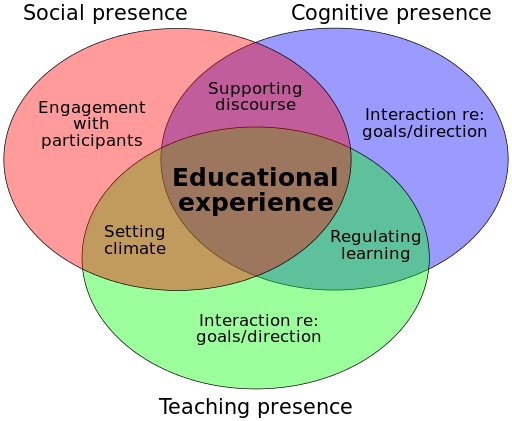

## Instructor's Guide for TWU Online

Whether you are new to teaching an online course at TWU, or you have taught online for 20 years, we hope this guide will provide support as you structure your content, plan for connections, and facilitate a welcome and inclusive learning experience for your learners.

### Structure

Intuitive course navigation and clear instructions are important in your online course design.  Below is a suggested way to organize your material in Moodle (or WordPress). 

[ui-accordion independent=false open=none]

[ui-accordion-item title="1. Course Overview"]
The Course Introduction page provides an overview of the course, including the **syllabus**, how to navigate the course, and tips for students for learning online.  

!!! Consider adding a personal welcome message or video from the instructor to connect with learners and welcome them into the course.  

[/ui-accordion-item]

[ui-accordion-item title="2. Schedule"]

Although you may have a detailed schedule in your syllabus, you may want to set up a page that details key information for each week, including:  
- key resources students need to read/watch;  
- important ungraded learning activities that will help them complete an assignment;
- information on which activities to complete before/after a class session.

[/ui-accordion-item]
[ui-accordion-item title="3. Course Notes"]

Online course vary in how they organize instructional materials.  This may be weekly, in one complete Course Book, separate Unit Books in Moodle, etc.  The key is that the navigation is intuitive, and students know where to access the information they need.

!!! In your first class, please take some time to show students how to navigate the course materials.
[/ui-accordion-item]
[ui-accordion-item title="4. Assessment"]

If you have several weeks or units in your course, you (& your students!) may find it helpful to have all assignment instructions and dropboxes in one section. As you review your assessment instructions, please check the following:

- Please ensure that the assignments have the detailed instructions, including grading criteria you will use to assess the quality of the work.
- Add the due dates in the Assignment Dropbox settings.
- Check that the Gradebook is set up correctly.  Please see the Online Learning article on [Gradebook](https://trinitywestern.teamdynamix.com/TDClient/1904/Portal/KB/?CategoryID=22747) for instructions.

[ui-accordion-item title="5. Community"]

How is Community promoted in TWU Online courses?  The Community tab is a section where you can keep announcements, ungraded discussion forums, and FAQ.  Please make this section work for you and your students!  The idea is to promote inclusion, connections between peers, and communication with the instructor.

You may want to find out what tools your students prefer to communicate with each other (Discord, Slack, Teams, etc.).  Please share your communication preferences, office hours, and other tips for succeeding in your course.
[/ui-accordion-item]
[/ui-accordion]

### Connection
Now that you have your basic structure set up for your online course, how do you design a quality online learning experience for your students?  Key to successful online learning is a connection - between learners, between the instructor and learners, and between the learner and the content.  See the graphic below as well as the [Community of Inquiry](https://coi.athabascau.ca/coi-model/) website for more details.

!!! Please note that our Instructional Design Team at TWU-OL is here to support you!  Whether you are developing a course for Global, or setting up your own online course, please reach out if you have questions about your course design.

[ui-accordion independent=false open=none]

[ui-accordion-item title="Connecting to Instructors"]
- Provide support for students throughout the course (e.g. through emails, assessment feedback, welcome videos, weekly debriefing, and other updates).
- Introduce yourselve to the class, welcoming students to the course and explaining key aspects of what to expect in the course.
- Throughout the course, provide various opportunities for formative feedback.

[/ui-accordion-item]

[ui-accordion-item title="Connecting to Course Content"]
!!! Note that if you have designed your course with an Instructional Designer, these are the quality standards used to ensure your students have a well designed course. 
#### Course Learning Outcomes
- The course learning outcomes should be measurable and reflect the course description and level of the course.
- Also include module/unit/week learning outcomes that are measurable and consistent with the course-level outcomes.
- There should be a clear relationship between the course/unit learning outcomes, learning activities, and assessments.
- All learning outcomes should be stated clearly and written from the learner’s perspective.

#### Course Materials
- The instructional materials (written/oral content, videos, graphics, readings, etc.), should support learners in achieving the learning outcomes.
- Course materials and resources should be up-to-date, relevant, and appropriate for the level of the course.
- Consider using a variety of instructional materials in the course (text, graphics, videos, interviews, activities). 
- Course design and instructional materials meet academic standards for Higher Education (online) learning.
- All third-party materials are identified, cited and permission requested if necessary.

#### Assessment
- The assessments are sequenced, varied, flexible, and appropriate to the content being assessed.
- The assessments measure the achievement of the course learning outcomes and are consistent with course activities and resources.
- The learner workload is appropriate and reasonable for the level and number of credits for the course.

#### Learning Activities
- Learning activities support learners in achieving the learning outcomes and completing assessments.
- Learning activities provide scaffolding opportunities for building foundational knowledge and skills within the course.

#### Educational Technology
- The technology used in the course supports the learning outcomes, activities and assessments.
- Tools promote student engagement and active learning.
- A variety of technology is used in the course.

[/ui-accordion-item]
[ui-accordion-item title="Connecting to Peers"]

- Ask your students to introduce themselves to the class.
- Learner interaction (student-instructor, student-student, student-content) should promotes a sense of community aligned with Trinity Western University core values.
- Learning activities should foster student-instructor, student-content, and if appropriate to the course, student-student interaction.
[/ui-accordion-item]
[/ui-accordion]

### Inclusion

All TWU Online courses should meet accessibility standards. Please connect with Trinity's [Accessibility Services](https://www.twu.ca/learning-commons/centre-accessible-learning/accessibility-services) and/or our [Online team](mailto:online@twu.ca) to help ensure all course materials are accessible and inclusive.

[ui-accordion independent=false open=none]

[ui-accordion-item title="Accessibility"]
- The course provides accessible text, videos and images for diverse learners.
- Instructions for accessing support (instructor, IT, library, student services), are clearly stated in the course overview and when appropriate, throughout the course.

[/ui-accordion-item]

[ui-accordion-item title="Inclusion"]
- Learners are able to participate in a peer support forum (e.g. Learning Café), for course-related questions or community-building activities.  
- The instructional materials are free of bias, culturally inclusive, and provide flexibility and choice.  
  
[/ui-accordion-item]
[/ui-accordion]

## Instructor To-Do List For New Course Sections

There are a few things you should do before the semester starts to ensure that your students have a smooth transition to studying with you.  
[ui-accordion independent=false open=none]

[ui-accordion-item title="To-Do List"]

✔️ Receive confirmation of course code and Moodle access info.

✔️ Import content from your previous cohort. If yours is a new course, the Online team can add you to the Master course shell so you can import from there to your new section. If importing from a previous course, delete items that you no longer need. See here for instructions.

✔️ Add a syllabus: You will need to change the dates in the syllabus, make sure it is a pdf version, get approval from the department chair, and upload it to Moodle on the Course Introduction tab.

✔️ Add a welcome message: Add an Announcement forum at the bottom of the Course Introduction page. to welcome your new students, tell them about yourself and how to reach you (e.g. email), and perhaps share an encouraging Bible verse or what interests you about this course. If you feel up to it, add a video welcome message!

✔️ Check the course materials: You may notice that this fully developed online course has a lot of material, including videos, unit writing, and external links. If possible, please check for broken links and send a message to our online team (elearning@twu.ca) so we can help you fix any errors.

✔️ Check the Assignment details and due dates: Due dates should be found in your course syllabus, but they may also be in your Discussion Forums and/or Assignment dropboxes. Please check that those dates are correct. Also add or edit the Assignment dropboxes (if they are missing). Confirm assessment details, such as due dates (can be added to the title of dropboxes if desired).

✔️ Check the Gradebook: Please double check that all assessment material is correct, including the percentages in the course Gradebook.

✔️ Prepare for Synchronous sessions: If you have synchronous Zoom Meetings in your course, you will need to become familiar with the following:

Scheduling class meetings
Recording Zoom Meetings
Adding the recorded session to Microsoft Stream
Embedding videos into Moodle See the following guide for details: Managing Videos | TWU Learning Environment Help Pages
✔️ Use Announcements for Weekly encouragement and review.

✔️ Course Visibility: Your course is visible to you as the instructor, but it is hidden from students. When you are ready, follow these instructions to make your course visible to students. Your course will move from the 'Future' tab on your dashboard to the 'In progress' tab on the date indicated in the 'Start date' field of the course settings.

See here for more info on setting up your course: [New Course Set Up](https://trinitywestern.teamdynamix.com/TDClient/1904/Portal/KB/ArticleDet?ID=141403)

[/ui-accordion-item]
[/ui-accordion]

## Online Support
TWU Online is here to support you and your learners! Please see the following resources to support you as you prepare for your course, as well as resources you can share with your students.

[ui-accordion independent=false open=none]

[ui-accordion-item title="Moodle Support"]
The Support Services at TWU have built an extensive Knowledge base, with instructions on serveral issues, including: 
-  [Creating a Course Announcement](https://trinitywestern.teamdynamix.com/TDClient/1904/Portal/KB/ArticleDet?ID=147930) 
-  [New Course Setup](https://trinitywestern.teamdynamix.com/TDClient/1904/Portal/KB/ArticleDet?ID=141403)
- [Importing Content from a Previous Cohort](https://trinitywestern.teamdynamix.com/TDClient/1904/Portal/KB/ArticleDet?ID=45140)
Moving Content Within Moodle
- [Showing or Hiding a Course](https://trinitywestern.teamdynamix.com/TDClient/1904/Portal/KB/ArticleDet?ID=141405)
-  [Creating Groups and Groupings](https://trinitywestern.teamdynamix.com/TDClient/1904/Portal/KB/ArticleDet?ID=26495)
- [Sending Mass Messages](https://trinitywestern.teamdynamix.com/TDClient/1904/Portal/KB/ArticleDet?ID=141489)
- [Adding Documents and Page Resources to Moodle](https://trinitywestern.teamdynamix.com/TDClient/1904/Portal/KB/ArticleDet?ID=24318)
- [Creating a Forum](https://trinitywestern.teamdynamix.com/TDClient/1904/Portal/KB/ArticleDet?ID=23923)
- [Creating an Assignment Dropbox](https://trinitywestern.teamdynamix.com/TDClient/1904/Portal/KB/ArticleDet?ID=24622)
- [EBSCO Curriculum Builder](https://trinitywestern.teamdynamix.com/TDClient/1904/Portal/KB/ArticleDet?ID=141525)
- [Quizzes](https://trinitywestern.teamdynamix.com/TDClient/1904/Portal/KB/?CategoryID=22750)
editing the Gradebook.
- [Turnitin](https://trinitywestern.teamdynamix.com/TDClient/1904/Portal/KB/ArticleDet?ID=141526)
!!! Please note that Turnitin.com cannot and does not detect plagiarism. If you use this company, please see this page and reconsider it's usefulness in detecting plagiarism in your course.

If you need support, please email [elearning@twu.ca](mailto:elearning@twu.ca).  

[/ui-accordion-item]
[ui-accordion-item title="Git Support (aka - "I can't seem to edit my course content!")"]

For some OL courses, you may have noticed that parts of your course are difficult to edit. This is because we use a different program (Git) to display your course content in Moodle. This allows for version control and course fidelity across your program.

Our TWU Online team can help you with any changes you want to make to the course materials.  Please email elearning@twu.ca or click on the following link to [Send a Bug report](https://github.com/TWUOnline/bug-tracking/issues/new?assignees=cmadland%2C+kmarjanovic%2C+MeeksonHundoo&labels=bug&template=bug_report.md&title=) to our team.

[/ui-accordion-item]
[ui-accordion-item title="Online Learning Resources for Students"]
 
If not already on your course Home Page, please direct your studnets to the [Online Learning Resources](https://www.twu.ca/academics/academic-support/online-learning-resources) webpage.

In particular, you may want to share the following links:
- [Tips for Success](https://www.twu.ca/academics/academic-support/online-learning-resources/online-learning-environment/tips-success)
- [Learning Online: Student Tips for Success](https://vimeo.com/493206161)
- [Data & Privacy](https://www.twu.ca/academics/academic-support/online-learning-resources/online-learning-environment/data-privacy)
!!! Please note that in this Data & Privacy section we caution students about Turnitin. If you use this company, please see this page and reconsider it's usefulness in detecting plagiarism in your course.

[/ui-accordion-item]
[/ui-accordion]