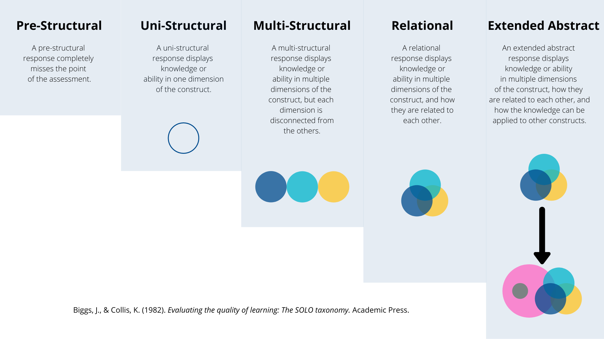

Assessment is fundamentally a process of reasoning from evidence (Pellegrino et al., 2001). The evidence is produced by learners as they create artifacts that demonstrate some degree or another of alignment with an intended learning outcome. This can come in the form of an answer to a quiz question, administering a medication, creating a website, recording an interview, conducting an experiment, writing or performing a play, singing a song, painting a landscape, teaching a class, executing a physical skill, programming an app, or any number of other tasks that might be imagined. The end result of this process is an inference related to what the learner knows, believes, or can do.

Pellegrino et al. (2001) describe this process of assessment in terms of a triangle, with each side of the triangle representing a critical component of the process (see figure 1).

> Figure 1. Assessment Triangle (Pellegrino et al., 2001)

## Cognition
The assessment of learning begins with a clearly defined construct or cognitive model of what is to be learned. This is, at minimum, articulated in a learning outcome during the design of the course, but ideally is situated within a larger view of the topic of the course. The process for situating a given construct within the topic of the course is called 'curriculum mapping', which involves identifying not only the topics of the course, but the prerequisite knowledge for learner success. For example, learners need to demonstrate competence in construct A before they will be able to demonstrate competence in construct B. 

## Observation

The second pillar of the assessment triangle is an observation of some sort. This requires a clear connection to the cognitive model of the construct through the identification of proficiency indicators. Instructors must understand what constitutes a competent demonstration of ability in relation to the construct. This is often operationalized as a rubric, which can tak ea number of forms. We recommend that rubrics be task neutral, allowing them to be reused in multiple contexts. A good example of a task neutral rubric is Biggs and Collis' (1982) SOLO Taxonomy, which outlines five levels of competence in relation to a wide variety of cognitive constructs: prestructural, unistructural, multistructural, relational, and extended abstract. 

SOLO stands for *Structure of the Observed Learning Outcome* and is a gauge to help you (and me) ensure that you are writing at an appropriate level.

#### Pre-Structural  
A pre-structural response completely ***misses the point*** of the assessment.

#### Uni-Structural  
A uni-strucutral response displays knowledge or ability in ***one dimension of the construct***.

#### Multi-Structural  
A multi-structural response displays knowledge or ability in ***multiple dimensions of the construct***, but each dimension is ***disconnected*** from the others.

#### Relational  
A relational response displays knowledge or ability in ***multiple dimensions of the construct, and how they are related to each other***.

#### Extended Abstract  
An extended abstract response displays knowledge or ability in ***multiple dimensions of the construct, how thy are related to each other, and how that construct can be applied to help us understand different constructs***.
## References

Biggs, J., & Collis, K. (1982). Evaluating the quality of learning: The SOLO taxonomy. Academic Press.

Pellegrino, J. W., Chudowsky, N., & Glaser, R. (2001). Knowing What Students Know: The Science and Design of Educational Assessment. National Academies Press. https://doi.org/10.17226/10019