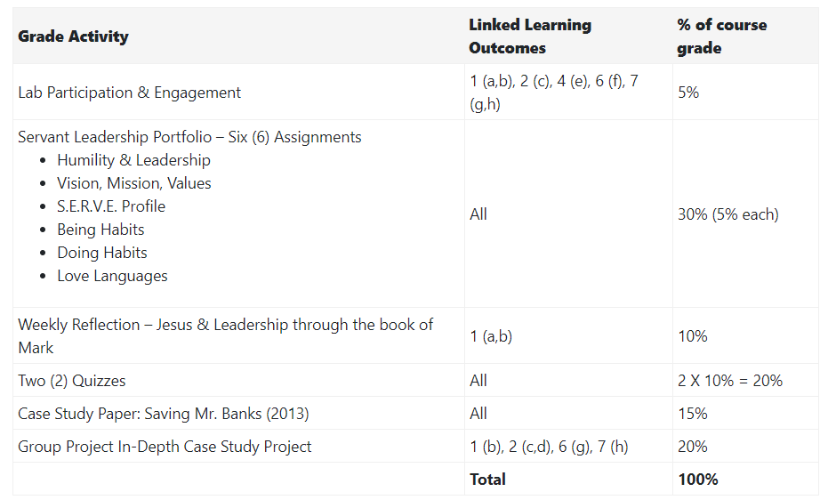

## Why Assess?
Think about why assessment is a part of your course.  How does it benefit you and your learners?

Assessment demonstrates whether, and to what degree, the learner has met the learning outcomes for the course. It often lets the instructor know what concepts students struggle with which informs their teaching.  Common assessments include tests, essays, discussions, but there are a number of other ways we can measure students’ understanding.
First, let’s focus on what assessment is.

### Understanding Assessment: Formative & Summative

In our courses, we often think first of the **summative assessments** – the final test, unit quiz, essay, etc. that sums of students' knowledge.  These assessments allow students to demonstrate their learning of the course and we give them a final grade.

**Formative assessments** involve giving feedback and helping students learn from the assessment.  This ‘forms’ students knowledge so they can further show their understanding of a topic.  For example, practice quizzes before a final exam, peer reviews of an essay before the final paper, reflective journals, 1 minute papers, muddiest point, etc.,  There are numerous effective formative activities to help students and instructors assess learning before being graded.

|                    | **Summative Assessment**                                                             | **Formative Assessment**                                              |
|--------------------|--------------------------------------------------------------------------------------|-----------------------------------------------------------------------|
| When               | At the end of a learning activity                                                    | During a learning activity                                            |
| Goal               | To make a decision                                                                   | To improve learning                                                   |
| Feedback           | Final judgement                                                                      | Return to material                                                    |
| Frame of Reference | Sometimes normative (comparing each student against all others); sometimes criterion | Always criterion (evaluating students according to the same criteria) |

*Table from [Wikipedia](https://en.wikipedia.org/wiki/Formative_assessment#cite_note-11) citing Charting your course: How to prepare to teach more effectively, Atwood, 2000.*

---
### FOR / OF / AS Learning
Assessment can also be *for, of,* and *as* learning.

! **Assessment for Learning**, a type of formative assessment, is utilized by teachers in order to gain an understanding of their students' knowledge and skills in order to guide instruction.

!!! **Assessment as learning** is also a formative assessment which focuses on teaching students the metacognitive processes to evaluate their own learning and make adjustments.

!!!! **Assessment of Learning** is a summative assessment used primarily to compare students and report progress.

*Source: UBC's [Assessment as Learning](http://etec.ctlt.ubc.ca/510wiki/Assessment_as_Learning)*

---

### Alignment in Course Design
So how do we choose formative and summative assessments for our course?  An important part of course design is checking that there is alignment between assessments and learning outcomes.  If your learning outcome asks students to compare two theories, for example, how do they show you they can do that?  Often instructors will have their assessments in mind before they write their learning outcomes.  Whatever process you have, make sure that your course learning outcomes are assessed in your assignments.  Try to include these connections in your syllabus, as in the example below:

### Learning Activities: Preparing for Assessments
One other alignment check that needs to be made in your course design is the connection between the assessments and the learning activities.  Learning activities are designed to help students engage with the course topics.  They are often ungraded and optional, so in order to motivate students to complete them, we need to emphasize the connections to the assignments and how the activities will help students succeed in their assessments.

Another reason to include learning activities in your online course is so that learners can practice the key concepts/questions and get *messy* with their learning.  Learning is a process, and activities allow for students to work through questions, organize their learning, explore solutions, and prepare for assessments.   

---
