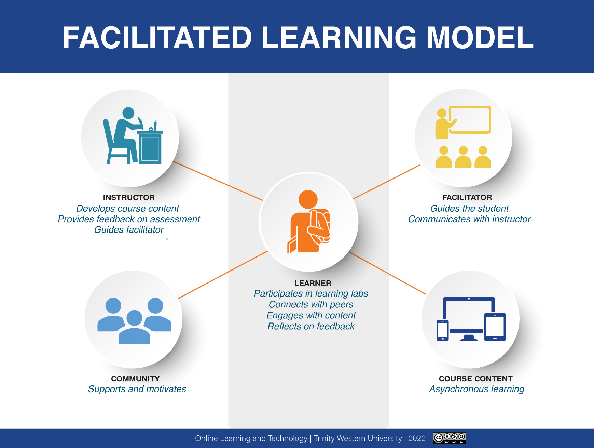

## Designing a Course for one of our FAR Centres?  Here's what you need to know...

### TWU FAR Centres
A FAR (Facilitated Academic Resources) Centre is a branch campus of Trinity Western University. There are FAR Centres located in Richmond, Chennai, Uganda, Cameroon, and more are in development.

TWU faculty have developed the courses with the support of the Online Teaching and Learning Team at TWU.  As the course is delivered, instructors will collaborate with a FAR Centre Facilitator, who will guide students through the courses in a Flipped Classroom model – both online and face-to-face (F2F).

### FAR Centre Learning Model
ONLINE: Students will engage in the online course, reading through the units, watching videos, participating in interactive learning activities (e.g. simulation, quizzes, interviews), and preparing for assessments.

FACE-TO-FACE: Students will also attend class on campus to engage with their peers and facilitators in an active learning approach. A TWU Facilitator will guide them through learning activities, helping them understand the course and prepare for assessments. Activities include discussions, group projects, debates, presentations, case studies, experiments, labs, and many more!

These learning activities (both online and F2F) will help students develop key 21st century skills, such as critical thinking, reflective learning, creativity, and collaboration.

Below are some more details on the roles and responsibilities of the facilitators and TWU faculty involved in FAR Centre projects.

### Facilitators
The Facilitator will be responsible for establishing and nurturing the day-to-day TWU academic and student life experience in a TWU micro-campus. The Facilitator will help students achieve program and course learning outcomes through effective learning facilitation and coaching.

Facilitators will guide students through TWU courses by:
- following the facilitation guide established by the faculty subject matter expert;  
- establishing a positive, goal oriented learning environment to ensure the attainment of learning outcomes;  
- developing a thorough understanding of each course and how to facilitate it effectively;  
- planning daily active learning activities as outlined in course materials and facilitation guides;  
- facilitating the exchange of assignments and feedback between students and faculty; and  
- maintaining accurate records of student attendance, assessments, and achievement.

In addition to facilitating courses, they will support students in their learning by:  
- coaching students in study strategies to effectively learn the course material;  
- guiding students to develop critical thinking skills;  
- supporting students as they learn the skills of academic writing for a North American context; and  
- providing formative feedback on student work.

A key component in a successful FAR Centre model is cooperation between the Facilitator and the TWU Faculty (course writer/instructor of record).
To ensure this collaboration, Facilitators will:  
- meet with the TWU Faculty before the course begins to discuss the course and expectations;  
- complete an evaluation of each course cohort;  
- establish and maintain a positive working relationship with Faculty; and  
- communicate clearly regarding student performance in class.

### TWU Faculty
The TWU Faculty (Instructor of Record) will likely also be the course writer, who has ensured that the course is fully developed. The faculty will meet with the facilitator before each course begins to address any course issues, and will be available to the facilitator to discuss issues raised throughout the term. The main responsibility of the TWU faculty is to mark all student assessments.

Through these FAR Centres, we want students to experience not only the high quality academic standards Trinity is known for, but we also want them to develop a sense of TWU culture through opportunities to engage students in community building activities. We hope to give students, facilitators, and faculty the opportunity to have transformational experiences – learning more about themselves, each other, and the world.
