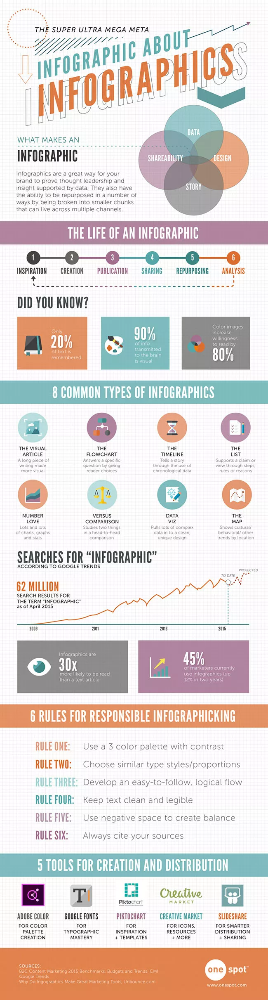

# Media at TWU Online

[ui-tabs position="top-left" active="0" theme="lite"]
[ui-tab title=Online Learning at TWU"]

intro?

[/ui-tab]
[ui-tab title="Graphics"]

## Considerations for Educational Graphics

Rather than utilizing text to illustrate their educational materials, many instructors choose to use graphics. It can be difficult for students to understand key concepts if a poor choice of graphics is used. Illustrations and or images that are effective can add more context and information.

It should be noted that visual aids, such as graphic organizers, pictures, maps, etc., not only convey information in a different format, but also have the ability to motivate and inspire learners.

**Benefits of utilizing graphics include:**

1. Keep learners' attention
2. Activation of prior knowledge
3. Helps learners develop mental models
4. Facilitates transfer of learning
5. Keeps learners engaged

Here are some things to consider when creating educational graphics.

- **Does the photo fill a purpose?**
- **Is the image of high quality?** To be useful, a graphic needs to show clearly, there are considerations of dimensions but also resolution and image quality.
- **Is the image use legal?**  When using an image in your course  Please be sure to credit the author of the image or look for images that are openly licensed and free to use.  The following are links that may prove useful in finding images:
	[ISO Republic photos](http://isorepublic.com/) (Creative Commons License) | [https://www.pexels.com/](https://www.pexels.com/) | [https://unsplash.com/](https://unsplash.com/) | [https://freerangestock.com/](https://freerangestock.com/).

Refer to this notion page to learn how to download and edit your images [https://www.notion.so/twuid/Instructions-for-Resizing-Images-3077fae9f3374d49bfe39a1d7b79ceed](https://www.notion.so/Instructions-for-Resizing-Images-3077fae9f3374d49bfe39a1d7b79ceed)

**A picture isn't clear enough, what about an infographic?**
When using visual data, charts, and statistics, infographics provide an easy way for people to digest information. Information can be transformed into graphics that are memorable, attention-grabbing, and even persuasive by using the right combination of color, proportion, and negative space.

- **Is it helpful?** When your students are having difficulty understanding key concepts in class, graphics can be used to assist in their understanding. This is something you should consider before beginning to design them. Using infographics to explain complex concepts is highly beneficial. For processes requiring a great deal of text to be described, the use of an icon or image can be beneficial. Ensure that the graphic addresses a specific issue before including it in the course materials, as meaningless graphics can distract from the content.

- **Do you want to create your own infographic?** There are many websites that provide a few free templates and even have editors that allow you to create an infographic. Here are some of these:

[https://www.canva.com/](https://www.canva.com/)

[https://piktochart.com/](https://piktochart.com/)

[https://venngage.com/](https://venngage.com/)

## Do you need help! That’s what we are here for 😊.

[/ui-tab]
[ui-tab title="Other Resources"]

Details

### testing titles

testing links
[https://www.canva.com/](https://www.canva.com/)

[/ui-tab]
[ui-tab title="Videos"]

## Videos

<iframe src="https://player.vimeo.com/video/702950788?h=801b22cb5e&amp;badge=0&amp;autopause=0&amp;player_id=0&amp;app_id=58479" frameborder="0" allow="autoplay; fullscreen; picture-in-picture" allowfullscreen style="position:absolute;top:0;left:0;width:100%;height:100%;" title="Communication Technologies"></iframe>

 

<iframe src="https://player.vimeo.com/video/702949944?h=d46428e2c1&amp;badge=0&amp;autopause=0&amp;player_id=0&amp;app_id=58479" frameborder="0" allow="autoplay; fullscreen; picture-in-picture" allowfullscreen style="position:absolute;top:0;left:0;width:100%;height:100%;" title="Persistent Spiritual Questions"></iframe>

 

<iframe src="https://player.vimeo.com/video/702949118?h=c242a28cb5&amp;badge=0&amp;autopause=0&amp;player_id=0&amp;app_id=58479" frameborder="0" allow="autoplay; fullscreen; picture-in-picture" allowfullscreen style="position:absolute;top:0;left:0;width:100%;height:100%;" title="Nursing Training - Sabina Lift"></iframe>

 

[/ui-tab]
[ui-tab title="Other Resources"]

Details

### testing titles

testing links
[https://www.canva.com/](https://www.canva.com/)

[/ui-tab]
[/ui-tabs]
